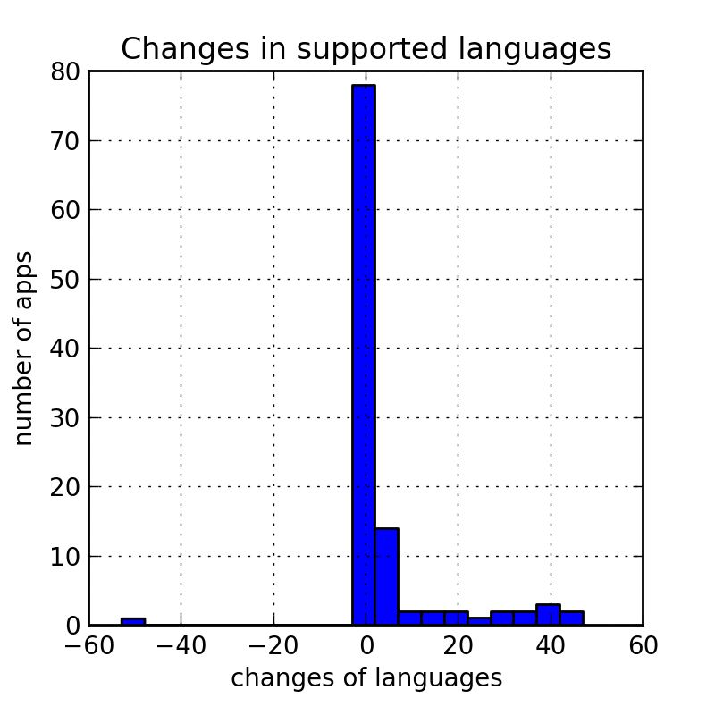

## Supported Languages

## Summary

|            |                         |
|------------|-------------------------|
| Min        |        -53              |
| Max        |        47               |
| Mean       |        4.09             |

* * *

* * *
## Data
<table border=0 cellpadding=0 cellspacing=0 width=2011 style='border-collapse:
 collapse;table-layout:fixed;width:2011pt'>
 <col width=261 style='mso-width-source:userset;mso-width-alt:11136;width:261pt'>
 <col width=110 style='mso-width-source:userset;mso-width-alt:4693;width:110pt'>
 <col width=106 style='mso-width-source:userset;mso-width-alt:4522;width:106pt'>
 <col width=1534 style='mso-width-source:userset;mso-width-alt:65450;
 width:1534pt'>
 <col width=0 span=85 style='display:none;mso-width-source:userset;mso-width-alt:
 0'>
 <tr height=12 style='height:12.0pt'>
  <td height=12 width=261 style='height:12.0pt;width:261pt'></td>
  <td width=110 style='width:110pt'></td>
  <td class=xl60 width=106 style='width:106pt'>total_lang</td>
  <td class=xl60 width=1534 style='border-left:none;width:1534pt'>lang_list</td>
 </tr>
 <tr height=12 style='height:12.0pt'>
  <td height=12 class=xl60 style='height:12.0pt'>package</td>
  <td class=xl60 style='border-left:none'>verc</td>
  <td colspan=2 style='mso-ignore:colspan'></td>
 </tr>
 <tr height=12 style='height:12.0pt'>
  <td height=12 class=xl60 style='height:12.0pt;border-top:none'>Game.NDK</td>
  <td class=xl60 style='border-top:none;border-left:none'>27</td>
  <td align=right>1</td>
  <td>[English]</td>
 </tr>
 <tr height=12 style='height:12.0pt'>
  <td height=12 class=xl60 style='height:12.0pt;border-top:none'>Game.SpeedMoto</td>
  <td class=xl60 style='border-top:none;border-left:none'>18</td>
  <td align=right>1</td>
  <td>[English]</td>
 </tr>
 <tr height=12 style='height:12.0pt'>
  <td rowspan=2 height=24 class=xl60 style='height:24.0pt;border-top:none'>Uxpp.UC</td>
  <td class=xl60 style='border-top:none;border-left:none'>86</td>
  <td align=right>2</td>
  <td>[Korean|English]</td>
 </tr>
 <tr height=12 style='height:12.0pt'>
  <td height=12 class=xl60 style='height:12.0pt;border-top:none;border-left:
  none'>112</td>
  <td align=right>2</td>
  <td>[Korean|English]</td>
 </tr>
 <tr height=12 style='height:12.0pt'>
  <td rowspan=2 height=24 class=xl60 style='height:24.0pt;border-top:none'>air.au.com.metro.DumbWaysToDie</td>
  <td class=xl60 style='border-top:none;border-left:none'>1004001</td>
  <td align=right>1</td>
  <td>[English]</td>
 </tr>
 <tr height=12 style='height:12.0pt'>
  <td height=12 class=xl60 style='height:12.0pt;border-top:none;border-left:
  none'>1004003</td>
  <td align=right>1</td>
  <td>[English]</td>
 </tr>
 <tr height=12 style='height:12.0pt'>
  <td rowspan=2 height=24 class=xl60 style='height:24.0pt;border-top:none'>air.com.playtika.slotomania</td>
  <td class=xl60 style='border-top:none;border-left:none'>1039000</td>
  <td align=right>15</td>
  <td>[Russian|Chinese|French|Polish|Portuguese|Turkish|Japanese|Swedish|Spanish;
  Castilian|Korean|Dutch; Flemish|Czech|Italian|German|English]</td>
 </tr>
 <tr height=12 style='height:12.0pt'>
  <td height=12 class=xl60 style='height:12.0pt;border-top:none;border-left:
  none'>1042000</td>
  <td align=right>15</td>
  <td>[Russian|Chinese|French|Polish|Portuguese|Turkish|Japanese|Swedish|Spanish;
  Castilian|Korean|Dutch; Flemish|Czech|Italian|German|English]</td>
 </tr>
 <tr height=12 style='height:12.0pt'>
  <td rowspan=2 height=24 class=xl60 style='height:24.0pt;border-top:none'>at.nerbrothers.SuperJump</td>
  <td class=xl60 style='border-top:none;border-left:none'>11</td>
  <td align=right>1</td>
  <td>[English]</td>
 </tr>
 <tr height=12 style='height:12.0pt'>
  <td height=12 class=xl60 style='height:12.0pt;border-top:none;border-left:
  none'>16</td>
  <td align=right>1</td>
  <td>[English]</td>
 </tr>
 <tr height=12 style='height:12.0pt'>
  <td rowspan=2 height=24 class=xl60 style='height:24.0pt;border-top:none'>atticlab.bodyscanner</td>
  <td class=xl60 style='border-top:none;border-left:none'>41</td>
  <td align=right>1</td>
  <td>[English]</td>
 </tr>
 <tr height=12 style='height:12.0pt'>
  <td height=12 class=xl60 style='height:12.0pt;border-top:none;border-left:
  none'>47</td>
  <td align=right>1</td>
  <td>[English]</td>
 </tr>
 <tr height=12 style='height:12.0pt'>
  <td rowspan=2 height=24 class=xl60 style='height:24.0pt;border-top:none'>br.com.rodrigokolb.realdrum</td>
  <td class=xl60 style='border-top:none;border-left:none'>20</td>
  <td align=right>14</td>
  <td>[Russian|French|Polish|Portuguese|Japanese|Swedish|Chinese|Spanish;
  Castilian|Korean|Danish|Dutch; Flemish|Italian|German|English]</td>
 </tr>
 <tr height=12 style='height:12.0pt'>
  <td height=12 class=xl60 style='height:12.0pt;border-top:none;border-left:
  none'>23</td>
  <td align=right>14</td>
  <td>[Russian|French|Polish|Portuguese|Japanese|Swedish|Chinese|Spanish;
  Castilian|Korean|Danish|Dutch; Flemish|Italian|German|English]</td>
 </tr>
 <tr height=12 style='height:12.0pt'>
  <td rowspan=2 height=24 class=xl60 style='height:24.0pt;border-top:none'>brain.age.analyzer</td>
  <td class=xl60 style='border-top:none;border-left:none'>52</td>
  <td align=right>10</td>
  <td>[Russian|Chinese|French|Polish|Japanese|Spanish;
  Castilian|Korean|Hebrew|Italian|English]</td>
 </tr>
 <tr height=12 style='height:12.0pt'>
  <td height=12 class=xl60 style='height:12.0pt;border-top:none;border-left:
  none'>53</td>
  <td align=right>10</td>
  <td>[Russian|Chinese|French|Polish|Japanese|Spanish;
  Castilian|Korean|Hebrew|Italian|English]</td>
 </tr>
 <tr height=12 style='height:12.0pt'>
  <td rowspan=2 height=24 class=xl60 style='height:24.0pt;border-top:none'>ch.smalltech.battery.free</td>
  <td class=xl60 style='border-top:none;border-left:none'>129</td>
  <td align=right>31</td>
  <td>[Romanian|Malay|Russian|Ukrainian|Chinese|French|Thai|Hindi|Polish|Portuguese|Arabic|Turkish|Japanese|Swedish|Slovak|Spanish;
  Castilian|Korean|Danish|Bokml- Norwegian; Norwegian Bokml|Dutch;
  Flemish|Czech|Bulgarian|Hungarian|Hebrew|Italian|Finnish|German|Vietnamese|Greek-
  Modern (1453-)|Serbian|English]</td>
 </tr>
 <tr height=12 style='height:12.0pt'>
  <td height=12 class=xl60 style='height:12.0pt;border-top:none;border-left:
  none'>131</td>
  <td align=right>31</td>
  <td>[Romanian|Malay|Russian|Ukrainian|Chinese|French|Thai|Hindi|Polish|Portuguese|Arabic|Turkish|Japanese|Swedish|Slovak|Spanish;
  Castilian|Korean|Danish|Bokml- Norwegian; Norwegian Bokml|Dutch;
  Flemish|Czech|Bulgarian|Hungarian|Hebrew|Italian|Finnish|German|Vietnamese|Greek-
  Modern (1453-)|Serbian|English]</td>
 </tr>
 <tr height=12 style='height:12.0pt'>
  <td rowspan=2 height=24 class=xl60 style='height:24.0pt;border-top:none'>ch.smalltech.ledflashlight.free</td>
  <td class=xl60 style='border-top:none;border-left:none'>156</td>
  <td align=right>31</td>
  <td>[Romanian|Malay|Russian|Ukrainian|Chinese|French|Thai|Hindi|Polish|Portuguese|Arabic|Turkish|Japanese|Swedish|Slovak|Spanish;
  Castilian|Korean|Danish|Bokml- Norwegian; Norwegian Bokml|Dutch;
  Flemish|Czech|Bulgarian|Hungarian|Hebrew|Italian|Finnish|German|Vietnamese|Greek-
  Modern (1453-)|Serbian|English]</td>
 </tr>
 <tr height=12 style='height:12.0pt'>
  <td height=12 class=xl60 style='height:12.0pt;border-top:none;border-left:
  none'>160</td>
  <td align=right>31</td>
  <td>[Romanian|Malay|Russian|Ukrainian|Chinese|French|Thai|Hindi|Polish|Portuguese|Arabic|Turkish|Japanese|Swedish|Slovak|Spanish;
  Castilian|Korean|Danish|Bokml- Norwegian; Norwegian Bokml|Dutch;
  Flemish|Czech|Bulgarian|Hungarian|Hebrew|Italian|Finnish|German|Vietnamese|Greek-
  Modern (1453-)|Serbian|English]</td>
 </tr>
 <tr height=12 style='height:12.0pt'>
  <td rowspan=2 height=24 class=xl60 style='height:24.0pt;border-top:none'>cn.jingling.motu.photowonder</td>
  <td class=xl60 style='border-top:none;border-left:none'>101</td>
  <td align=right>8</td>
  <td>[Malay|Chinese|Thai|Japanese|Korean|Indonesian|Vietnamese|English]</td>
 </tr>
 <tr height=12 style='height:12.0pt'>
  <td height=12 class=xl60 style='height:12.0pt;border-top:none;border-left:
  none'>106</td>
  <td align=right>8</td>
  <td>[Malay|Chinese|Thai|Japanese|Korean|Indonesian|Vietnamese|English]</td>
 </tr>
 <tr height=12 style='height:12.0pt'>
  <td rowspan=2 height=24 class=xl60 style='height:24.0pt;border-top:none'>cn.wps.moffice_eng</td>
  <td class=xl60 style='border-top:none;border-left:none'>65</td>
  <td align=right>2</td>
  <td>[Chinese|English]</td>
 </tr>
 <tr height=12 style='height:12.0pt'>
  <td height=12 class=xl60 style='height:12.0pt;border-top:none;border-left:
  none'>72</td>
  <td align=right>2</td>
  <td>[Chinese|English]</td>
 </tr>
 <tr height=12 style='height:12.0pt'>
  <td rowspan=2 height=24 class=xl60 style='height:24.0pt;border-top:none'>co.vine.android</td>
  <td class=xl60 style='border-top:none;border-left:none'>67</td>
  <td align=right>43</td>
  <td>[Romanian|Catalan;
  Valencian|Malay|Russian|Chinese|Ukrainian|Belarusian|Zulu|French|Estonian|Slovenian|Latvian|Thai|Hindi|Polish|Persian|Portuguese|English|Arabic|Turkish|Croatian|Afrikaans|Tagalog|Japanese|Spanish;
  Castilian|Swedish|Slovak|Korean|Danish|Bokml- Norwegian; Norwegian
  Bokml|Amharic|Dutch;
  Flemish|Czech|Swahili|Bulgarian|Lithuanian|Hungarian|Italian|Finnish|German|Vietnamese|Greek-
  Modern (1453-)|Serbian]</td>
 </tr>
 <tr height=12 style='height:12.0pt'>
  <td height=12 class=xl60 style='height:12.0pt;border-top:none;border-left:
  none'>1400110</td>
  <td align=right>43</td>
  <td>[Romanian|Catalan;
  Valencian|Malay|Russian|Chinese|Ukrainian|Belarusian|Zulu|French|Estonian|Slovenian|Latvian|English|Thai|Hindi|Polish|Persian|Portuguese|Arabic|Turkish|Croatian|Afrikaans|Tagalog|Japanese|Spanish;
  Castilian|Swedish|Slovak|Korean|Danish|Bokml- Norwegian; Norwegian
  Bokml|Amharic|Dutch;
  Flemish|Czech|Swahili|Bulgarian|Lithuanian|Hungarian|Italian|Finnish|German|Vietnamese|Greek-
  Modern (1453-)|Serbian]</td>
 </tr>
 <tr height=12 style='height:12.0pt'>
  <td rowspan=2 height=24 class=xl60 style='height:24.0pt;border-top:none'>com.PinballGame</td>
  <td class=xl60 style='border-top:none;border-left:none'>8</td>
  <td align=right>1</td>
  <td>[English]</td>
 </tr>
 <tr height=12 style='height:12.0pt'>
  <td height=12 class=xl60 style='height:12.0pt;border-top:none;border-left:
  none'>9</td>
  <td align=right>1</td>
  <td>[English]</td>
 </tr>
 <tr height=12 style='height:12.0pt'>
  <td rowspan=2 height=24 class=xl60 style='height:24.0pt;border-top:none'>com.RunnerGames.game.JewelsDeluxe_AD</td>
  <td class=xl60 style='border-top:none;border-left:none'>24</td>
  <td align=right>1</td>
  <td>[English]</td>
 </tr>
 <tr height=12 style='height:12.0pt'>
  <td height=12 class=xl60 style='height:12.0pt;border-top:none;border-left:
  none'>25</td>
  <td align=right>1</td>
  <td>[English]</td>
 </tr>
 <tr height=12 style='height:12.0pt'>
  <td rowspan=2 height=24 class=xl60 style='height:24.0pt;border-top:none'>com.StudioOnMars.CSPortable</td>
  <td class=xl60 style='border-top:none;border-left:none'>3020</td>
  <td align=right>3</td>
  <td>[Spanish; Castilian|Hebrew|English]</td>
 </tr>
 <tr height=12 style='height:12.0pt'>
  <td height=12 class=xl60 style='height:12.0pt;border-top:none;border-left:
  none'>3309</td>
  <td align=right>3</td>
  <td>[Spanish; Castilian|Hebrew|English]</td>
 </tr>
 <tr height=12 style='height:12.0pt'>
  <td rowspan=2 height=24 class=xl60 style='height:24.0pt;border-top:none'>com.UCMobile.intl</td>
  <td class=xl60 style='border-top:none;border-left:none'>88</td>
  <td align=right>8</td>
  <td>[Russian|French|Portuguese|Spanish;
  Castilian|English|Chinese|Indonesian|Vietnamese]</td>
 </tr>
 <tr height=12 style='height:12.0pt'>
  <td height=12 class=xl60 style='height:12.0pt;border-top:none;border-left:
  none'>89</td>
  <td align=right>8</td>
  <td>[Russian|French|Portuguese|Spanish;
  Castilian|English|Chinese|Indonesian|Vietnamese]</td>
 </tr>
 <tr height=12 style='height:12.0pt'>
  <td rowspan=2 height=24 class=xl60 style='height:24.0pt;border-top:none'>com.a0soft.gphone.aDataOnOff</td>
  <td class=xl60 style='border-top:none;border-left:none'>264</td>
  <td align=right>36</td>
  <td>[Romanian|Russian|Tamil|Ukrainian|French|Slovenian|Hindi|Polish|Persian|Macedonian|Portuguese|Arabic|Turkish|Croatian|Tagalog|Japanese|Swedish|Chinese|Slovak|Spanish;
  Castilian|Korean|Danish|Galician|Dutch;
  Flemish|Czech|Bulgarian|Lithuanian|Hungarian|Hebrew|Italian|Finnish|German|Vietnamese|Greek-
  Modern (1453-)|Serbian|English]</td>
 </tr>
 <tr height=12 style='height:12.0pt'>
  <td height=12 class=xl60 style='height:12.0pt;border-top:none;border-left:
  none'>274</td>
  <td align=right>37</td>
  <td>[Romanian|Russian|Tamil|Ukrainian|French|Slovenian|Thai|Hindi|Polish|Persian|Macedonian|Portuguese|Arabic|Turkish|Croatian|Tagalog|Japanese|Swedish|Chinese|Slovak|Spanish;
  Castilian|Korean|Danish|Galician|Dutch;
  Flemish|Czech|Bulgarian|Lithuanian|Hungarian|Hebrew|Italian|Finnish|German|Vietnamese|Greek-
  Modern (1453-)|Serbian|English]</td>
 </tr>
 <tr height=12 style='height:12.0pt'>
  <td rowspan=2 height=24 class=xl60 style='height:24.0pt;border-top:none'>com.a0soft.gphone.app2sd</td>
  <td class=xl60 style='border-top:none;border-left:none'>318</td>
  <td align=right>36</td>
  <td>[Romanian|Russian|Tamil|Ukrainian|French|Slovenian|Hindi|Polish|Persian|Macedonian|Portuguese|Arabic|Turkish|Croatian|Tagalog|Japanese|Swedish|Chinese|Slovak|Spanish;
  Castilian|Korean|Danish|Galician|Dutch;
  Flemish|Czech|Bulgarian|Lithuanian|Hungarian|Hebrew|Italian|Finnish|German|Vietnamese|Greek-
  Modern (1453-)|Serbian|English]</td>
 </tr>
 <tr height=12 style='height:12.0pt'>
  <td height=12 class=xl60 style='height:12.0pt;border-top:none;border-left:
  none'>321</td>
  <td align=right>37</td>
  <td>[Romanian|Russian|Tamil|Ukrainian|French|Slovenian|Thai|Hindi|Polish|Persian|Macedonian|Portuguese|Arabic|Turkish|Croatian|Tagalog|Japanese|Swedish|Chinese|Slovak|Spanish;
  Castilian|Korean|Danish|Galician|Dutch;
  Flemish|Czech|Bulgarian|Lithuanian|Hungarian|Hebrew|Italian|Finnish|German|Vietnamese|Greek-
  Modern (1453-)|Serbian|English]</td>
 </tr>
 <tr height=12 style='height:12.0pt'>
  <td rowspan=2 height=24 class=xl60 style='height:24.0pt;border-top:none'>com.accuweather.android</td>
  <td class=xl60 style='border-top:none;border-left:none'>41</td>
  <td align=right>45</td>
  <td>[Romanian|Catalan; Valencian|Malay|Russian|Chinese|Ukrainian|Spanish;
  Castilian|Belarusian|Zulu|French|Estonian|Slovenian|Latvian|Thai|Hindi|Polish|Persian|Portuguese|English|Arabic|Turkish|Croatian|Afrikaans|Tagalog|Japanese|Norwegian|Swedish|Slovak|Korean|Danish|Bokml-
  Norwegian; Norwegian Bokml|Amharic|Dutch;
  Flemish|Czech|Swahili|Indonesian|Bulgarian|Lithuanian|Hungarian|Italian|Finnish|German|Vietnamese|Greek-
  Modern (1453-)|Serbian]</td>
 </tr>
 <tr height=12 style='height:12.0pt'>
  <td height=12 class=xl60 style='height:12.0pt;border-top:none;border-left:
  none'>45</td>
  <td align=right>45</td>
  <td>[Romanian|Catalan; Valencian|Malay|Russian|Chinese|Ukrainian|Spanish;
  Castilian|Belarusian|Zulu|French|Estonian|Slovenian|Latvian|Thai|Hindi|Polish|Persian|Portuguese|English|Arabic|Turkish|Croatian|Afrikaans|Tagalog|Japanese|Norwegian|Swedish|Slovak|Korean|Danish|Bokml-
  Norwegian; Norwegian Bokml|Amharic|Dutch;
  Flemish|Czech|Swahili|Indonesian|Bulgarian|Lithuanian|Hungarian|Italian|Finnish|German|Vietnamese|Greek-
  Modern (1453-)|Serbian]</td>
 </tr>
 <tr height=12 style='height:12.0pt'>
  <td rowspan=2 height=24 class=xl60 style='height:24.0pt;border-top:none'>com.aceviral.angrygranrun</td>
  <td class=xl60 style='border-top:none;border-left:none'>21</td>
  <td align=right>3</td>
  <td>[Spanish; Castilian|Hebrew|English]</td>
 </tr>
 <tr height=12 style='height:12.0pt'>
  <td height=12 class=xl60 style='height:12.0pt;border-top:none;border-left:
  none'>24</td>
  <td align=right>3</td>
  <td>[Spanish; Castilian|Hebrew|English]</td>
 </tr>
 <tr height=12 style='height:12.0pt'>
  <td rowspan=2 height=24 class=xl60 style='height:24.0pt;border-top:none'>com.adobe.air</td>
  <td class=xl60 style='border-top:none;border-left:none'>3800087</td>
  <td align=right>15</td>
  <td>[Russian|Chinese|French|Polish|Portuguese|Turkish|Japanese|Swedish|Spanish;
  Castilian|Korean|Dutch; Flemish|Czech|Italian|German|English]</td>
 </tr>
 <tr height=12 style='height:12.0pt'>
  <td height=12 class=xl60 style='height:12.0pt;border-top:none;border-left:
  none'>3900138</td>
  <td align=right>15</td>
  <td>[Russian|Chinese|French|Polish|Portuguese|Turkish|Japanese|Swedish|Spanish;
  Castilian|Korean|Dutch; Flemish|Czech|Italian|German|English]</td>
 </tr>
 <tr height=12 style='height:12.0pt'>
  <td rowspan=2 height=24 class=xl60 style='height:24.0pt;border-top:none'>com.adobe.psmobile</td>
  <td class=xl60 style='border-top:none;border-left:none'>10</td>
  <td align=right>2</td>
  <td>[Japanese|English]</td>
 </tr>
 <tr height=12 style='height:12.0pt'>
  <td height=12 class=xl60 style='height:12.0pt;border-top:none;border-left:
  none'>12</td>
  <td align=right>49</td>
  <td>[Romanian|Catalan;
  Valencian|Malay|English|Russian|Chinese|Ukrainian|Belarusian|Zulu|French|Estonian|Slovenian|Latvian|Thai|Hindi|Polish|Persian|Portuguese|Armenian|Mongolian|Arabic|Turkish|Croatian|Georgian|Afrikaans|Tagalog|Japanese|Spanish;
  Castilian|Swedish|Slovak|Central Khmer|Korean|Danish|Bokml- Norwegian;
  Norwegian Bokml|Amharic|Dutch;
  Flemish|Czech|Swahili|Bulgarian|Lithuanian|Hungarian|Hebrew|Italian|Finnish|Lao|German|Vietnamese|Greek-
  Modern (1453-)|Serbian]</td>
 </tr>
 <tr height=12 style='height:12.0pt'>
  <td rowspan=2 height=24 class=xl60 style='height:24.0pt;border-top:none'>com.adobe.reader</td>
  <td class=xl60 style='border-top:none;border-left:none'>77969</td>
  <td align=right>16</td>
  <td>[Russian|Chinese|French|Polish|Portuguese|Turkish|English|Japanese|Swedish|Spanish;
  Castilian|Korean|Danish|Dutch; Flemish|Czech|Italian|German]</td>
 </tr>
 <tr height=12 style='height:12.0pt'>
  <td height=12 class=xl60 style='height:12.0pt;border-top:none;border-left:
  none'>85478</td>
  <td align=right>16</td>
  <td>[Russian|Chinese|French|Polish|Portuguese|Turkish|English|Japanese|Swedish|Spanish;
  Castilian|Korean|Danish|Dutch; Flemish|Czech|Italian|German]</td>
 </tr>
 <tr height=12 style='height:12.0pt'>
  <td rowspan=2 height=24 class=xl60 style='height:24.0pt;border-top:none'>com.advancedprocessmanager</td>
  <td class=xl60 style='border-top:none;border-left:none'>59</td>
  <td align=right>12</td>
  <td>[Russian|Chinese|French|Slovenian|Polish|Japanese|Spanish;
  Castilian|Korean|Dutch; Flemish|Italian|German|English]</td>
 </tr>
 <tr height=12 style='height:12.0pt'>
  <td height=12 class=xl60 style='height:12.0pt;border-top:none;border-left:
  none'>68</td>
  <td align=right>20</td>
  <td>[Russian|Chinese|French|Slovenian|Thai|Hindi|Polish|Portuguese|Arabic|Turkish|Japanese|Norwegian|Swedish|Spanish;
  Castilian|Korean|Dutch; Flemish|Italian|German|Vietnamese|English]</td>
 </tr>
 <tr height=12 style='height:12.0pt'>
  <td rowspan=2 height=24 class=xl60 style='height:24.0pt;border-top:none'>com.agilesoftresource</td>
  <td class=xl60 style='border-top:none;border-left:none'>131</td>
  <td align=right>18</td>
  <td>[Bosnian|Russian|Chinese|French|Polish|Portuguese|Arabic|Turkish|Croatian|Japanese|Swedish|Spanish;
  Castilian|Korean|Hebrew|Italian|German|Serbian|English]</td>
 </tr>
 <tr height=12 style='height:12.0pt'>
  <td height=12 class=xl60 style='height:12.0pt;border-top:none;border-left:
  none'>186537</td>
  <td align=right>18</td>
  <td>[Bosnian|Russian|Chinese|French|Polish|Portuguese|Arabic|Turkish|Croatian|Japanese|Swedish|Spanish;
  Castilian|Korean|Hebrew|Italian|German|Serbian|English]</td>
 </tr>
 <tr height=12 style='height:12.0pt'>
  <td rowspan=2 height=24 class=xl60 style='height:24.0pt;border-top:none'>com.aitype.android</td>
  <td class=xl60 style='border-top:none;border-left:none'>1994</td>
  <td align=right>37</td>
  <td>[Catalan;
  Valencian|Esperanto|Russian|French|Chinese|Ukrainian|Georgian|Slovenian|Latvian|Romansh|Thai|Polish|Persian|Portuguese|English|Arabic|Turkish|Japanese|Spanish;
  Castilian|Norwegian|Swedish|Slovak|Korean|Danish|Vietnamese|Bokml- Norwegian;
  Norwegian Bokml|Dutch;
  Flemish|Czech|Bulgarian|Lithuanian|Hungarian|Hebrew|Italian|Finnish|German|Greek-
  Modern (1453-)|Serbian]</td>
 </tr>
 <tr height=12 style='height:12.0pt'>
  <td height=12 class=xl60 style='height:12.0pt;border-top:none;border-left:
  none'>1999</td>
  <td align=right>37</td>
  <td>[Catalan;
  Valencian|Esperanto|Russian|French|Chinese|Ukrainian|Georgian|Slovenian|Latvian|Romansh|Thai|Polish|Persian|Portuguese|English|Arabic|Turkish|Japanese|Spanish;
  Castilian|Norwegian|Swedish|Slovak|Korean|Danish|Vietnamese|Bokml- Norwegian;
  Norwegian Bokml|Dutch;
  Flemish|Czech|Bulgarian|Lithuanian|Hungarian|Hebrew|Italian|Finnish|German|Greek-
  Modern (1453-)|Serbian]</td>
 </tr>
 <tr height=12 style='height:12.0pt'>
  <td rowspan=2 height=24 class=xl60 style='height:24.0pt;border-top:none'>com.alensw.PicFolder</td>
  <td class=xl60 style='border-top:none;border-left:none'>111</td>
  <td align=right>12</td>
  <td>[Russian|Chinese|French|Portuguese|Japanese|Swedish|Spanish;
  Castilian|Korean|Italian|German|Greek- Modern (1453-)|English]</td>
 </tr>
 <tr height=12 style='height:12.0pt'>
  <td height=12 class=xl60 style='height:12.0pt;border-top:none;border-left:
  none'>125</td>
  <td align=right>15</td>
  <td>[Russian|Chinese|French|Polish|Portuguese|Turkish|Japanese|Swedish|Spanish;
  Castilian|Korean|Hungarian|Italian|German|Greek- Modern (1453-)|English]</td>
 </tr>
 <tr height=12 style='height:12.0pt'>
  <td rowspan=2 height=24 class=xl60 style='height:24.0pt;border-top:none'>com.alienmanfc6.wheresmyandroid</td>
  <td class=xl60 style='border-top:none;border-left:none'>90</td>
  <td align=right>1</td>
  <td>[English]</td>
 </tr>
 <tr height=12 style='height:12.0pt'>
  <td height=12 class=xl60 style='height:12.0pt;border-top:none;border-left:
  none'>92</td>
  <td align=right>1</td>
  <td>[English]</td>
 </tr>
 <tr height=12 style='height:12.0pt'>
  <td rowspan=2 height=24 class=xl60 style='height:24.0pt;border-top:none'>com.amazon.mShop.android</td>
  <td class=xl60 style='border-top:none;border-left:none'>49</td>
  <td align=right>7</td>
  <td>[French|English|Japanese|Chinese|Spanish; Castilian|Italian|German]</td>
 </tr>
 <tr height=12 style='height:12.0pt'>
  <td height=12 class=xl60 style='height:12.0pt;border-top:none;border-left:
  none'>2801</td>
  <td align=right>7</td>
  <td>[English|French|Japanese|Chinese|Spanish; Castilian|Italian|German]</td>
 </tr>
 <tr height=12 style='height:12.0pt'>
  <td rowspan=2 height=24 class=xl60 style='height:24.0pt;border-top:none'>com.amazon.mp3</td>
  <td class=xl60 style='border-top:none;border-left:none'>2080310</td>
  <td align=right>6</td>
  <td>[French|English|Japanese|Spanish; Castilian|Italian|German]</td>
 </tr>
 <tr height=12 style='height:12.0pt'>
  <td height=12 class=xl60 style='height:12.0pt;border-top:none;border-left:
  none'>3002410</td>
  <td align=right>8</td>
  <td>[Chinese|French|Japanese|English|Spanish; Castilian|Czech|Italian|German]</td>
 </tr>
 <tr height=12 style='height:12.0pt'>
  <td rowspan=2 height=24 class=xl60 style='height:24.0pt;border-top:none'>com.amdroid.pedo.gas.flatulencia</td>
  <td class=xl60 style='border-top:none;border-left:none'>4</td>
  <td align=right>42</td>
  <td>[Romanian|Italian|Catalan;
  Valencian|English|Czech|Malay|Hindi|Japanese|Chinese|Ukrainian|French|Belarusian|Zulu|Hungarian|Estonian|Slovenian|Latvian|Korean|Thai|Spanish;
  Castilian|Persian|Arabic|Portuguese|Dutch;
  Flemish|Croatian|Danish|Afrikaans|Russian|Norwegian|Slovak|Greek- Modern
  (1453-)|Polish|Turkish|Swahili|German|Indonesian|Bulgarian|Lithuanian|Swedish|Finnish|Vietnamese|Serbian]</td>
 </tr>
 <tr height=12 style='height:12.0pt'>
  <td height=12 class=xl60 style='height:12.0pt;border-top:none;border-left:
  none'>6</td>
  <td align=right>42</td>
  <td>[Romanian|Italian|Catalan;
  Valencian|English|Czech|Malay|Hindi|Japanese|Chinese|Ukrainian|French|Belarusian|Zulu|Hungarian|Estonian|Slovenian|Latvian|Korean|Thai|Spanish;
  Castilian|Persian|Arabic|Portuguese|Dutch;
  Flemish|Croatian|Danish|Afrikaans|Russian|Norwegian|Slovak|Greek- Modern
  (1453-)|Polish|Turkish|Swahili|German|Indonesian|Bulgarian|Lithuanian|Swedish|Finnish|Vietnamese|Serbian]</td>
 </tr>
 <tr height=12 style='height:12.0pt'>
  <td rowspan=2 height=24 class=xl60 style='height:24.0pt;border-top:none'>com.android.chrome</td>
  <td class=xl60 style='border-top:none;border-left:none'>1547059</td>
  <td align=right>38</td>
  <td>[Romanian|Catalan;
  Valencian|Russian|Chinese|Ukrainian|French|Slovenian|Latvian|Thai|Hindi|Polish|Persian|English|Arabic|Portuguese|Turkish|Croatian|Tagalog|Japanese|Spanish;
  Castilian|Swedish|Slovak|Korean|Danish|Bokml- Norwegian; Norwegian
  Bokml|Amharic|Dutch;
  Flemish|Czech|Swahili|Bulgarian|Lithuanian|Hungarian|Italian|Finnish|German|Vietnamese|Greek-
  Modern (1453-)|Serbian]</td>
 </tr>
 <tr height=12 style='height:12.0pt'>
  <td height=12 class=xl60 style='height:12.0pt;border-top:none;border-left:
  none'>1650059</td>
  <td align=right>48</td>
  <td>[Romanian|Catalan;
  Valencian|Malay|English|Russian|Chinese|Ukrainian|Belarusian|Zulu|French|Estonian|Slovenian|Latvian|Thai|Hindi|Polish|Persian|Portuguese|Armenian|Mongolian|Arabic|Turkish|Croatian|Georgian|Afrikaans|Tagalog|Japanese|Spanish;
  Castilian|Swedish|Slovak|Central Khmer|Korean|Danish|Bokml- Norwegian;
  Norwegian Bokml|Amharic|Dutch;
  Flemish|Czech|Swahili|Bulgarian|Lithuanian|Hungarian|Italian|Finnish|Lao|German|Vietnamese|Greek-
  Modern (1453-)|Serbian]</td>
 </tr>
 <tr height=12 style='height:12.0pt'>
  <td rowspan=2 height=24 class=xl60 style='height:24.0pt;border-top:none'>com.androidwasabi.livewallpaper.dandelion</td>
  <td class=xl60 style='border-top:none;border-left:none'>42</td>
  <td align=right>24</td>
  <td>[Malay|Russian|Chinese|Ukrainian|French|Thai|Polish|Portuguese|Turkish|Japanese|Norwegian|Swedish|Spanish;
  Castilian|Korean|Danish|Dutch;
  Flemish|Czech|Hungarian|Italian|Finnish|German|Vietnamese|Greek- Modern
  (1453-)|English]</td>
 </tr>
 <tr height=12 style='height:12.0pt'>
  <td height=12 class=xl60 style='height:12.0pt;border-top:none;border-left:
  none'>44</td>
  <td align=right>26</td>
  <td>[Romanian|Malay|Russian|Chinese|Ukrainian|French|Thai|Polish|Portuguese|Turkish|Japanese|Norwegian|Swedish|Spanish;
  Castilian|Korean|Danish|Bokml- Norwegian; Norwegian Bokml|Dutch;
  Flemish|Czech|Hungarian|Italian|Finnish|German|Vietnamese|Greek- Modern (1453-)|English]</td>
 </tr>
 <tr height=12 style='height:12.0pt'>
  <td rowspan=2 height=24 class=xl60 style='height:24.0pt;border-top:none'>com.androidwasabi.livewallpaper.waterdrop</td>
  <td class=xl60 style='border-top:none;border-left:none'>28</td>
  <td align=right>24</td>
  <td>[Malay|Russian|Chinese|Ukrainian|French|Thai|Polish|Portuguese|Turkish|Japanese|Norwegian|Swedish|Spanish;
  Castilian|Korean|Danish|Dutch;
  Flemish|Czech|Hungarian|Italian|Finnish|German|Vietnamese|Greek- Modern
  (1453-)|English]</td>
 </tr>
 <tr height=12 style='height:12.0pt'>
  <td height=12 class=xl60 style='height:12.0pt;border-top:none;border-left:
  none'>30</td>
  <td align=right>26</td>
  <td>[Romanian|Malay|Russian|Chinese|Ukrainian|French|Thai|Polish|Portuguese|Turkish|Japanese|Norwegian|Swedish|Spanish;
  Castilian|Korean|Danish|Bokml- Norwegian; Norwegian Bokml|Dutch;
  Flemish|Czech|Hungarian|Italian|Finnish|German|Vietnamese|Greek- Modern (1453-)|English]</td>
 </tr>
 <tr height=12 style='height:12.0pt'>
  <td rowspan=2 height=24 class=xl60 style='height:24.0pt;border-top:none'>com.ansangha.drdriving</td>
  <td class=xl60 style='border-top:none;border-left:none'>12</td>
  <td align=right>44</td>
  <td>[Romanian|Catalan;
  Valencian|Malay|Russian|Chinese|Ukrainian|Belarusian|Zulu|French|Estonian|Slovenian|Latvian|Thai|Hindi|Polish|Persian|Portuguese|English|Arabic|Turkish|Croatian|Afrikaans|Tagalog|Japanese|Spanish;
  Castilian|Swedish|Slovak|Korean|Danish|Bokml- Norwegian; Norwegian
  Bokml|Amharic|Dutch;
  Flemish|Czech|Swahili|Bulgarian|Lithuanian|Hungarian|Hebrew|Italian|Finnish|German|Vietnamese|Greek-
  Modern (1453-)|Serbian]</td>
 </tr>
 <tr height=12 style='height:12.0pt'>
  <td height=12 class=xl60 style='height:12.0pt;border-top:none;border-left:
  none'>24</td>
  <td align=right>45</td>
  <td>[Romanian|Catalan;
  Valencian|Malay|Russian|Chinese|Ukrainian|Belarusian|Zulu|French|Estonian|Slovenian|Latvian|Thai|Hindi|Polish|Persian|Portuguese|English|Arabic|Turkish|Croatian|Afrikaans|Tagalog|Japanese|Spanish;
  Castilian|Swedish|Slovak|Korean|Danish|Bokml- Norwegian; Norwegian
  Bokml|Amharic|Dutch;
  Flemish|Czech|Swahili|Indonesian|Bulgarian|Lithuanian|Hungarian|Hebrew|Italian|Finnish|German|Vietnamese|Greek-
  Modern (1453-)|Serbian]</td>
 </tr>
 <tr height=12 style='height:12.0pt'>
  <td rowspan=2 height=24 class=xl60 style='height:24.0pt;border-top:none'>com.antivirus</td>
  <td class=xl60 style='border-top:none;border-left:none'>181729</td>
  <td align=right>16</td>
  <td>[Russian|French|Hindi|Polish|Portuguese|Arabic|Japanese|Chinese|Spanish;
  Castilian|Korean|Dutch; Flemish|Czech|Hebrew|Italian|German|English]</td>
 </tr>
 <tr height=12 style='height:12.0pt'>
  <td height=12 class=xl60 style='height:12.0pt;border-top:none;border-left:
  none'>186306</td>
  <td align=right>17</td>
  <td>[Russian|French|Hindi|Polish|Portuguese|Arabic|Turkish|Japanese|Chinese|Spanish;
  Castilian|Korean|Dutch; Flemish|Czech|Hebrew|Italian|German|English]</td>
 </tr>
 <tr height=12 style='height:12.0pt'>
  <td rowspan=2 height=24 class=xl60 style='height:24.0pt;border-top:none'>com.avast.android.mobilesecurity</td>
  <td class=xl60 style='border-top:none;border-left:none'>6158</td>
  <td align=right>44</td>
  <td>[Romanian|Catalan;
  Valencian|Malay|Russian|Chinese|Ukrainian|Belarusian|Zulu|French|Estonian|Slovenian|Latvian|Thai|Hindi|Polish|Persian|Portuguese|English|Arabic|Turkish|Croatian|Afrikaans|Tagalog|Japanese|Spanish;
  Castilian|Swedish|Slovak|Korean|Danish|Bokml- Norwegian; Norwegian
  Bokml|Amharic|Dutch;
  Flemish|Czech|Swahili|Bulgarian|Lithuanian|Hungarian|Hebrew|Italian|Finnish|German|Vietnamese|Greek-
  Modern (1453-)|Serbian]</td>
 </tr>
 <tr height=12 style='height:12.0pt'>
  <td height=12 class=xl60 style='height:12.0pt;border-top:none;border-left:
  none'>6572</td>
  <td align=right>44</td>
  <td>[Romanian|Catalan;
  Valencian|Malay|Russian|Chinese|Ukrainian|Belarusian|Zulu|French|Estonian|Slovenian|Latvian|Thai|Hindi|Polish|Persian|Portuguese|English|Arabic|Turkish|Croatian|Afrikaans|Tagalog|Japanese|Spanish;
  Castilian|Swedish|Slovak|Korean|Danish|Bokml- Norwegian; Norwegian
  Bokml|Amharic|Dutch;
  Flemish|Czech|Swahili|Bulgarian|Lithuanian|Hungarian|Hebrew|Italian|Finnish|German|Vietnamese|Greek-
  Modern (1453-)|Serbian]</td>
 </tr>
 <tr height=12 style='height:12.0pt'>
  <td rowspan=2 height=24 class=xl60 style='height:24.0pt;border-top:none'>com.bestcoolfungames.antsmasher</td>
  <td class=xl60 style='border-top:none;border-left:none'>7002</td>
  <td align=right>6</td>
  <td>[Russian|French|Portuguese|Japanese|Chinese|English]</td>
 </tr>
 <tr height=12 style='height:12.0pt'>
  <td height=12 class=xl60 style='height:12.0pt;border-top:none;border-left:
  none'>7007</td>
  <td align=right>6</td>
  <td>[Russian|French|Portuguese|Japanese|Chinese|English]</td>
 </tr>
 <tr height=12 style='height:12.0pt'>
  <td rowspan=2 height=24 class=xl60 style='height:24.0pt;border-top:none'>com.cleanmaster.mguard</td>
  <td class=xl60 style='border-top:none;border-left:none'>30700303</td>
  <td align=right>24</td>
  <td>[Romanian|Russian|Chinese|Ukrainian|French|Thai|Polish|Portuguese|Arabic|Turkish|Croatian|Japanese|Slovak|Spanish;
  Castilian|Korean|Bokml- Norwegian; Norwegian Bokml|Dutch;
  Flemish|Czech|Hungarian|Italian|German|Vietnamese|Greek- Modern
  (1453-)|English]</td>
 </tr>
 <tr height=12 style='height:12.0pt'>
  <td height=12 class=xl60 style='height:12.0pt;border-top:none;border-left:
  none'>30860498</td>
  <td align=right>26</td>
  <td>[Romanian|Malay|Russian|Chinese|Ukrainian|French|Thai|Hindi|Polish|Portuguese|Arabic|Turkish|Croatian|Japanese|Spanish;
  Castilian|Slovak|Korean|Bokml- Norwegian; Norwegian Bokml|Dutch;
  Flemish|Czech|Hungarian|Italian|German|Vietnamese|Greek- Modern (1453-)|English]</td>
 </tr>
 <tr height=12 style='height:12.0pt'>
  <td rowspan=2 height=24 class=xl60 style='height:24.0pt;border-top:none'>com.creativemobile.DragRacing</td>
  <td class=xl60 style='border-top:none;border-left:none'>85</td>
  <td align=right>7</td>
  <td>[Russian|Portuguese|Chinese|Korean|Italian|German|English]</td>
 </tr>
 <tr height=12 style='height:12.0pt'>
  <td height=12 class=xl60 style='height:12.0pt;border-top:none;border-left:
  none'>90</td>
  <td align=right>43</td>
  <td>[Romanian|Catalan;
  Valencian|Malay|Russian|Chinese|Ukrainian|Belarusian|Zulu|French|Estonian|Slovenian|Latvian|Thai|Hindi|Polish|Persian|Portuguese|English|Arabic|Turkish|Croatian|Afrikaans|Tagalog|Japanese|Spanish;
  Castilian|Swedish|Slovak|Korean|Danish|Bokml- Norwegian; Norwegian
  Bokml|Amharic|Dutch;
  Flemish|Czech|Swahili|Bulgarian|Lithuanian|Hungarian|Italian|Finnish|German|Vietnamese|Greek-
  Modern (1453-)|Serbian]</td>
 </tr>
 <tr height=12 style='height:12.0pt'>
  <td rowspan=2 height=24 class=xl60 style='height:24.0pt;border-top:none'>com.devuni.flashlight</td>
  <td class=xl60 style='border-top:none;border-left:none'>139</td>
  <td align=right>42</td>
  <td>[Kazakh|Romanian|Catalan;
  Valencian|Malay|Bosnian|Russian|Chinese|Ukrainian|French|Estonian|Slovenian|Latvian|Thai|Hindi|Polish|Icelandic|Macedonian|Portuguese|Turkish|Croatian|Tagalog|Japanese|Swedish|Albanian|Slovak|Spanish;
  Castilian|Korean|Danish|Bokml- Norwegian; Norwegian Bokml|Dutch;
  Flemish|Czech|Bengali|Bulgarian|Lithuanian|Hungarian|Italian|Finnish|German|Vietnamese|Greek-
  Modern (1453-)|Serbian|English]</td>
 </tr>
 <tr height=12 style='height:12.0pt'>
  <td height=12 class=xl60 style='height:12.0pt;border-top:none;border-left:
  none'>141</td>
  <td align=right>42</td>
  <td>[Kazakh|Romanian|Catalan;
  Valencian|Malay|Bosnian|Russian|Chinese|Ukrainian|French|Estonian|Slovenian|Latvian|Thai|Hindi|Polish|Icelandic|Macedonian|Portuguese|Turkish|Croatian|Tagalog|Japanese|Swedish|Albanian|Slovak|Spanish;
  Castilian|Korean|Danish|Bokml- Norwegian; Norwegian Bokml|Dutch;
  Flemish|Czech|Bengali|Bulgarian|Lithuanian|Hungarian|Italian|Finnish|German|Vietnamese|Greek-
  Modern (1453-)|Serbian|English]</td>
 </tr>
 <tr height=12 style='height:12.0pt'>
  <td rowspan=2 height=24 class=xl60 style='height:24.0pt;border-top:none'>com.disney.WMWLite</td>
  <td class=xl60 style='border-top:none;border-left:none'>17</td>
  <td align=right>9</td>
  <td>[Russian|French|Japanese|Chinese|Spanish;
  Castilian|Korean|Italian|German|English]</td>
 </tr>
 <tr height=12 style='height:12.0pt'>
  <td height=12 class=xl60 style='height:12.0pt;border-top:none;border-left:
  none'>19</td>
  <td align=right>10</td>
  <td>[Russian|French|Japanese|Chinese|Spanish;
  Castilian|Korean|Hebrew|Italian|German|English]</td>
 </tr>
 <tr height=12 style='height:12.0pt'>
  <td rowspan=2 height=24 class=xl60 style='height:24.0pt;border-top:none'>com.dropbox.android</td>
  <td class=xl60 style='border-top:none;border-left:none'>231004</td>
  <td align=right>13</td>
  <td>[Malay|German|Russian|Chinese|French|Japanese|Polish|Spanish;
  Castilian|Portuguese|Italian|Korean|Indonesian|English]</td>
 </tr>
 <tr height=12 style='height:12.0pt'>
  <td height=12 class=xl60 style='height:12.0pt;border-top:none;border-left:
  none'>231104</td>
  <td align=right>44</td>
  <td>[Romanian|Catalan;
  Valencian|Malay|German|Russian|Chinese|Ukrainian|Belarusian|Zulu|French|Estonian|Slovenian|Latvian|Japanese|Thai|Hindi|Polish|Spanish;
  Castilian|Persian|Portuguese|English|Arabic|Turkish|Croatian|Afrikaans|Tagalog|Italian|Swedish|Slovak|Korean|Danish|Bokml-
  Norwegian; Norwegian Bokml|Amharic|Dutch;
  Flemish|Czech|Swahili|Indonesian|Bulgarian|Lithuanian|Hungarian|Finnish|Vietnamese|Greek-
  Modern (1453-)|Serbian]</td>
 </tr>
 <tr height=12 style='height:12.0pt'>
  <td rowspan=2 height=24 class=xl60 style='height:24.0pt;border-top:none'>com.ebay.mobile</td>
  <td class=xl60 style='border-top:none;border-left:none'>43</td>
  <td align=right>5</td>
  <td>[English|French|Spanish; Castilian|Italian|German]</td>
 </tr>
 <tr height=12 style='height:12.0pt'>
  <td height=12 class=xl60 style='height:12.0pt;border-top:none;border-left:
  none'>46</td>
  <td align=right>43</td>
  <td>[Romanian|Catalan;
  Valencian|Malay|English|Russian|Chinese|Ukrainian|Belarusian|Zulu|French|Estonian|Slovenian|Latvian|Thai|Hindi|Polish|Persian|Portuguese|Arabic|Turkish|Croatian|Afrikaans|Tagalog|Japanese|Spanish;
  Castilian|Swedish|Slovak|Korean|Danish|Bokml- Norwegian; Norwegian
  Bokml|Amharic|Dutch;
  Flemish|Czech|Swahili|Bulgarian|Lithuanian|Hungarian|Italian|Finnish|German|Vietnamese|Greek-
  Modern (1453-)|Serbian]</td>
 </tr>
 <tr height=12 style='height:12.0pt'>
  <td rowspan=2 height=24 class=xl60 style='height:24.0pt;border-top:none'>com.facebook.katana</td>
  <td class=xl60 style='border-top:none;border-left:none'>258882</td>
  <td align=right>26</td>
  <td>[Malay|Russian|Chinese|French|Thai|Polish|Spanish;
  Castilian|Portuguese|Arabic|Turkish|Afrikaans|Tagalog|Japanese|Swedish|Korean|Danish|Bokml-
  Norwegian; Norwegian Bokml|Dutch;
  Flemish|Czech|Indonesian|Italian|Finnish|German|Vietnamese|Greek- Modern (1453-)|English]</td>
 </tr>
 <tr height=12 style='height:12.0pt'>
  <td height=12 class=xl60 style='height:12.0pt;border-top:none;border-left:
  none'>666397</td>
  <td align=right>52</td>
  <td>[Romanian|Catalan;
  Valencian|Malay|Russian|Tamil|Chinese|Ukrainian|Belarusian|Zulu|French|Estonian|Slovenian|Latvian|Thai|Hindi|Polish|Spanish;
  Castilian|Persian|Portuguese|English|Arabic|Panjabi;
  Punjabi|Turkish|Croatian|Afrikaans|Kannada|Tagalog|Japanese|Gujarati|Swedish|Slovak|Korean|Danish|Bokml-
  Norwegian; Norwegian Bokml|Telugu|Amharic|Dutch;
  Flemish|Czech|Swahili|Malayalam|Indonesian|Bengali|Bulgarian|Lithuanian|Hungarian|Italian|Marathi|Finnish|German|Vietnamese|Greek-
  Modern (1453-)|Serbian]</td>
 </tr>
 <tr height=12 style='height:12.0pt'>
  <td rowspan=2 height=24 class=xl60 style='height:24.0pt;border-top:none'>com.facebook.orca</td>
  <td class=xl60 style='border-top:none;border-left:none'>295612</td>
  <td align=right>35</td>
  <td>[Malay|Russian|Tamil|Chinese|French|Thai|Hindi|Polish|Spanish;
  Castilian|Portuguese|Arabic|Panjabi;
  Punjabi|Turkish|Afrikaans|Kannada|Tagalog|Japanese|Gujarati|Swedish|Korean|Danish|Bokml-
  Norwegian; Norwegian Bokml|Telugu|Dutch; Flemish|Czech|Malayalam|Indonesian|Bengali|Italian|Marathi|Finnish|German|Vietnamese|Greek-
  Modern (1453-)|English]</td>
 </tr>
 <tr height=12 style='height:12.0pt'>
  <td height=12 class=xl60 style='height:12.0pt;border-top:none;border-left:
  none'>906963</td>
  <td align=right>52</td>
  <td>[Romanian|Catalan;
  Valencian|Malay|Russian|Tamil|Chinese|Ukrainian|Belarusian|Zulu|French|Estonian|Slovenian|Latvian|Thai|Hindi|Polish|Spanish;
  Castilian|Persian|Portuguese|English|Arabic|Panjabi;
  Punjabi|Turkish|Croatian|Afrikaans|Kannada|Tagalog|Japanese|Gujarati|Swedish|Slovak|Korean|Danish|Bokml-
  Norwegian; Norwegian Bokml|Telugu|Amharic|Dutch;
  Flemish|Czech|Swahili|Malayalam|Indonesian|Bengali|Bulgarian|Lithuanian|Hungarian|Italian|Marathi|Finnish|German|Vietnamese|Greek-
  Modern (1453-)|Serbian]</td>
 </tr>
 <tr height=12 style='height:12.0pt'>
  <td rowspan=2 height=24 class=xl60 style='height:24.0pt;border-top:none'>com.gameloft.android.ANMP.GloftDMHM</td>
  <td class=xl60 style='border-top:none;border-left:none'>110</td>
  <td align=right>13</td>
  <td>[Russian|Chinese|French|Polish|Portuguese|Turkish|Japanese|Spanish;
  Castilian|Korean|Hebrew|Italian|German|English]</td>
 </tr>
 <tr height=12 style='height:12.0pt'>
  <td height=12 class=xl60 style='height:12.0pt;border-top:none;border-left:
  none'>15022</td>
  <td align=right>44</td>
  <td>[Romanian|Catalan;
  Valencian|Malay|Russian|Chinese|Ukrainian|Belarusian|Zulu|French|Estonian|Slovenian|Latvian|Thai|Hindi|Polish|Persian|Portuguese|English|Arabic|Turkish|Croatian|Afrikaans|Tagalog|Japanese|Spanish;
  Castilian|Swedish|Slovak|Korean|Danish|Bokml- Norwegian; Norwegian
  Bokml|Amharic|Dutch;
  Flemish|Czech|Swahili|Bulgarian|Lithuanian|Hungarian|Hebrew|Italian|Finnish|German|Vietnamese|Greek-
  Modern (1453-)|Serbian]</td>
 </tr>
 <tr height=12 style='height:12.0pt'>
  <td rowspan=2 height=24 class=xl60 style='height:24.0pt;border-top:none'>com.gamestar.pianoperfect</td>
  <td class=xl60 style='border-top:none;border-left:none'>614</td>
  <td align=right>2</td>
  <td>[Chinese|English]</td>
 </tr>
 <tr height=12 style='height:12.0pt'>
  <td height=12 class=xl60 style='height:12.0pt;border-top:none;border-left:
  none'>619</td>
  <td align=right>43</td>
  <td>[Romanian|Catalan;
  Valencian|Malay|Russian|Chinese|Ukrainian|Belarusian|Zulu|French|Estonian|Slovenian|Latvian|Thai|Hindi|Polish|Persian|Portuguese|English|Arabic|Turkish|Croatian|Afrikaans|Tagalog|Japanese|Spanish;
  Castilian|Swedish|Slovak|Korean|Danish|Bokml- Norwegian; Norwegian
  Bokml|Amharic|Dutch;
  Flemish|Czech|Swahili|Bulgarian|Lithuanian|Hungarian|Italian|Finnish|German|Vietnamese|Greek-
  Modern (1453-)|Serbian]</td>
 </tr>
 <tr height=12 style='height:12.0pt'>
  <td rowspan=2 height=24 class=xl60 style='height:24.0pt;border-top:none'>com.gau.go.launcherex</td>
  <td class=xl60 style='border-top:none;border-left:none'>267</td>
  <td align=right>5</td>
  <td>[Russian|Chinese|Spanish; Castilian|Korean|English]</td>
 </tr>
 <tr height=12 style='height:12.0pt'>
  <td height=12 class=xl60 style='height:12.0pt;border-top:none;border-left:
  none'>303</td>
  <td align=right>5</td>
  <td>[Russian|Chinese|Spanish; Castilian|Korean|English]</td>
 </tr>
 <tr height=12 style='height:12.0pt'>
  <td rowspan=2 height=24 class=xl60 style='height:24.0pt;border-top:none'>com.google.android.apps.books</td>
  <td class=xl60 style='border-top:none;border-left:none'>20921</td>
  <td align=right>43</td>
  <td>[Romanian|Catalan;
  Valencian|Malay|Russian|Chinese|Ukrainian|Belarusian|Zulu|French|Estonian|Slovenian|Latvian|Thai|Hindi|Polish|Persian|Portuguese|English|Arabic|Turkish|Croatian|Afrikaans|Tagalog|Japanese|Spanish;
  Castilian|Swedish|Slovak|Korean|Danish|Bokml- Norwegian; Norwegian
  Bokml|Amharic|Dutch;
  Flemish|Czech|Swahili|Bulgarian|Lithuanian|Hungarian|Italian|Finnish|German|Vietnamese|Greek-
  Modern (1453-)|Serbian]</td>
 </tr>
 <tr height=12 style='height:12.0pt'>
  <td height=12 class=xl60 style='height:12.0pt;border-top:none;border-left:
  none'>30015</td>
  <td align=right>43</td>
  <td>[Romanian|Catalan;
  Valencian|Malay|Russian|Chinese|Ukrainian|Belarusian|Zulu|French|Estonian|Slovenian|Latvian|Thai|Hindi|Polish|Persian|Portuguese|English|Arabic|Turkish|Croatian|Afrikaans|Tagalog|Japanese|Spanish;
  Castilian|Swedish|Slovak|Korean|Danish|Bokml- Norwegian; Norwegian
  Bokml|Amharic|Dutch;
  Flemish|Czech|Swahili|Bulgarian|Lithuanian|Hungarian|Italian|Finnish|German|Vietnamese|Greek-
  Modern (1453-)|Serbian]</td>
 </tr>
 <tr height=12 style='height:12.0pt'>
  <td rowspan=2 height=24 class=xl60 style='height:24.0pt;border-top:none'>com.google.android.apps.docs</td>
  <td class=xl60 style='border-top:none;border-left:none'>1222832</td>
  <td align=right>38</td>
  <td>[Romanian|Catalan;
  Valencian|Chinese|Czech|Hindi|Persian|Russian|Danish|Latvian|Croatian|Ukrainian|Slovak|Arabic|French|Polish|Slovenian|Spanish;
  Castilian|Thai|English|German|Dutch;
  Flemish|Portuguese|Bulgarian|Italian|Turkish|Swedish|Tagalog|Japanese|Norwegian|Finnish|Korean|Bokml-
  Norwegian; Norwegian Bokml|Vietnamese|Indonesian|Hungarian|Greek- Modern
  (1453-)|Lithuanian|Serbian]</td>
 </tr>
 <tr height=12 style='height:12.0pt'>
  <td height=12 class=xl60 style='height:12.0pt;border-top:none;border-left:
  none'>1246114</td>
  <td align=right>40</td>
  <td>[Romanian|Catalan;
  Valencian|Chinese|Czech|Hindi|English|Persian|Russian|Danish|Latvian|Croatian|Ukrainian|Slovak|Arabic|French|Polish|Slovenian|Spanish;
  Castilian|Thai|German|Dutch;
  Flemish|Portuguese|Bulgarian|Italian|Turkish|Swedish|Tagalog|Japanese|Norwegian|Central
  Khmer|Finnish|Korean|Bokml- Norwegian; Norwegian
  Bokml|Vietnamese|Indonesian|Hungarian|Greek- Modern
  (1453-)|Lithuanian|Lao|Serbian]</td>
 </tr>
 <tr height=12 style='height:12.0pt'>
  <td rowspan=2 height=24 class=xl60 style='height:24.0pt;border-top:none'>com.google.android.apps.magazines</td>
  <td class=xl60 style='border-top:none;border-left:none'>131402010</td>
  <td align=right>45</td>
  <td>[Romanian|Catalan;
  Valencian|Malay|Russian|Chinese|Ukrainian|Belarusian|Zulu|French|Estonian|Slovenian|Latvian|Thai|Hindi|Polish|Persian|Portuguese|English|Arabic|Turkish|Croatian|Afrikaans|Tagalog|Japanese|Spanish;
  Castilian|Norwegian|Swedish|Slovak|Korean|Danish|Bokml- Norwegian; Norwegian
  Bokml|Amharic|Dutch;
  Flemish|Czech|Swahili|Indonesian|Bulgarian|Lithuanian|Hungarian|Italian|Finnish|German|Vietnamese|Greek-
  Modern (1453-)|Serbian]</td>
 </tr>
 <tr height=12 style='height:12.0pt'>
  <td height=12 class=xl60 style='height:12.0pt;border-top:none;border-left:
  none'>133231515</td>
  <td align=right>45</td>
  <td>[Romanian|Catalan;
  Valencian|Malay|English|Russian|Chinese|Ukrainian|Belarusian|Zulu|French|Estonian|Slovenian|Latvian|Thai|Hindi|Polish|Persian|Portuguese|Arabic|Turkish|Croatian|Afrikaans|Tagalog|Japanese|Spanish;
  Castilian|Norwegian|Swedish|Slovak|Korean|Danish|Bokml- Norwegian; Norwegian
  Bokml|Amharic|Dutch;
  Flemish|Czech|Swahili|Indonesian|Bulgarian|Lithuanian|Hungarian|Italian|Finnish|German|Vietnamese|Greek-
  Modern (1453-)|Serbian]</td>
 </tr>
 <tr height=12 style='height:12.0pt'>
  <td rowspan=2 height=24 class=xl60 style='height:24.0pt;border-top:none'>com.google.android.apps.maps</td>
  <td class=xl60 style='border-top:none;border-left:none'>701000803</td>
  <td align=right>46</td>
  <td>[Romanian|Catalan;
  Valencian|Malay|Russian|Chinese|Ukrainian|Belarusian|Zulu|French|Estonian|Slovenian|Hebrew|Latvian|Japanese|Thai|Hindi|Polish|Spanish;
  Castilian|Persian|Portuguese|English|Arabic|Turkish|Croatian|Afrikaans|Tagalog|Norwegian|Swedish|Slovak|Korean|Danish|Bokml-
  Norwegian; Norwegian Bokml|Amharic|Dutch;
  Flemish|Czech|Swahili|Indonesian|Bulgarian|Lithuanian|Hungarian|Italian|Finnish|German|Vietnamese|Greek-
  Modern (1453-)|Serbian]</td>
 </tr>
 <tr height=12 style='height:12.0pt'>
  <td height=12 class=xl60 style='height:12.0pt;border-top:none;border-left:
  none'>704001103</td>
  <td align=right>46</td>
  <td>[Romanian|Catalan;
  Valencian|Malay|Russian|Chinese|Ukrainian|Belarusian|Zulu|French|Estonian|Slovenian|Hebrew|Latvian|Japanese|Thai|Hindi|Polish|Spanish;
  Castilian|Persian|Portuguese|English|Arabic|Turkish|Croatian|Afrikaans|Tagalog|Norwegian|Swedish|Slovak|Korean|Danish|Bokml-
  Norwegian; Norwegian Bokml|Amharic|Dutch;
  Flemish|Czech|Swahili|Indonesian|Bulgarian|Lithuanian|Hungarian|Italian|Finnish|German|Vietnamese|Greek-
  Modern (1453-)|Serbian]</td>
 </tr>
 <tr height=12 style='height:12.0pt'>
  <td rowspan=2 height=24 class=xl60 style='height:24.0pt;border-top:none'>com.google.android.apps.plus</td>
  <td class=xl60 style='border-top:none;border-left:none'>410508092</td>
  <td align=right>44</td>
  <td>[Romanian|Catalan;
  Valencian|Malay|Russian|Chinese|Ukrainian|Belarusian|Zulu|French|Estonian|Slovenian|Latvian|Thai|Hindi|Polish|Persian|Portuguese|English|Arabic|Turkish|Croatian|Afrikaans|Tagalog|Japanese|Spanish;
  Castilian|Swedish|Slovak|Korean|Danish|Bokml- Norwegian; Norwegian
  Bokml|Amharic|Dutch;
  Flemish|Czech|Swahili|Indonesian|Bulgarian|Lithuanian|Hungarian|Italian|Finnish|German|Vietnamese|Greek-
  Modern (1453-)|Serbian]</td>
 </tr>
 <tr height=12 style='height:12.0pt'>
  <td height=12 class=xl60 style='height:12.0pt;border-top:none;border-left:
  none'>413009748</td>
  <td align=right>49</td>
  <td>[Romanian|Chinese|Turkish|Catalan;
  Valencian|German|Portuguese|Malay|English|Russian|Serbian|Zulu|Korean|Ukrainian|Finnish|Belarusian|Dutch;
  Flemish|Swedish|French|Estonian|Slovenian|Greek- Modern
  (1453-)|Latvian|Czech|Japanese|Thai|Spanish; Castilian|Hindi|Polish|Persian|Armenian|Mongolian|Arabic|Croatian|Georgian|Hungarian|Afrikaans|Tagalog|Indonesian|Slovak|Central
  Khmer|Danish|Vietnamese|Bokml- Norwegian; Norwegian
  Bokml|Amharic|Swahili|Italian|Bulgarian|Lithuanian|Lao]</td>
 </tr>
 <tr height=12 style='height:12.0pt'>
  <td rowspan=2 height=24 class=xl60 style='height:24.0pt;border-top:none'>com.google.android.apps.translate</td>
  <td class=xl60 style='border-top:none;border-left:none'>30000023</td>
  <td align=right>50</td>
  <td>[Romanian|Catalan;
  Valencian|Malay|Armenian|Russian|Chinese|Ukrainian|Zulu|French|Estonian|Georgian|Slovenian|Latvian|Thai|Hindi|Polish|Mongolian|Persian|Portuguese|Lao|English|Arabic|Turkish|Croatian|Afrikaans|Tagalog|Japanese|Spanish;
  Castilian|Norwegian|Swedish|Slovak|Korean|Danish|Bokml- Norwegian; Norwegian
  Bokml|Amharic|Dutch; Flemish|Czech|Swahili|Indonesian|Bulgarian|Central
  Khmer|Lithuanian|Hungarian|Hebrew|Italian|Finnish|German|Vietnamese|Greek-
  Modern (1453-)|Serbian]</td>
 </tr>
 <tr height=12 style='height:12.0pt'>
  <td height=12 class=xl60 style='height:12.0pt;border-top:none;border-left:
  none'>30000028</td>
  <td align=right>50</td>
  <td>[Romanian|Catalan;
  Valencian|Malay|Armenian|Russian|Chinese|Ukrainian|Zulu|French|Estonian|Georgian|Slovenian|Latvian|Thai|Hindi|Polish|Mongolian|Persian|Portuguese|Lao|English|Arabic|Turkish|Croatian|Afrikaans|Tagalog|Japanese|Spanish;
  Castilian|Norwegian|Swedish|Slovak|Korean|Danish|Bokml- Norwegian; Norwegian
  Bokml|Amharic|Dutch; Flemish|Czech|Swahili|Indonesian|Bulgarian|Central
  Khmer|Lithuanian|Hungarian|Hebrew|Italian|Finnish|German|Vietnamese|Greek-
  Modern (1453-)|Serbian]</td>
 </tr>
 <tr height=12 style='height:12.0pt'>
  <td rowspan=2 height=24 class=xl60 style='height:24.0pt;border-top:none'>com.google.android.gm</td>
  <td class=xl60 style='border-top:none;border-left:none'>986</td>
  <td align=right>44</td>
  <td>[Czech|Belarusian|Romanian|Catalan;
  Valencian|Finnish|Latvian|Malay|Zulu|Russian|Swedish|Persian|Vietnamese|Bulgarian|Chinese|Ukrainian|Slovenian|Hungarian|Italian|Slovak|French|Estonian|English|Bokml-
  Norwegian; Norwegian Bokml|Romansh|Thai|Serbian|Hindi|Polish|Portuguese|Arabic|Afrikaans|Turkish|Croatian|German|Tagalog|Greek-
  Modern (1453-)|Korean|Japanese|Spanish; Castilian|Dutch;
  Flemish|Danish|Lithuanian|Swahili|Amharic]</td>
 </tr>
 <tr height=12 style='height:12.0pt'>
  <td height=12 class=xl60 style='height:12.0pt;border-top:none;border-left:
  none'>4600370</td>
  <td align=right>44</td>
  <td>[Czech|Belarusian|Romanian|Catalan;
  Valencian|Finnish|Latvian|Malay|Zulu|Russian|Swedish|Persian|Vietnamese|Bulgarian|Chinese|Ukrainian|Slovenian|Hungarian|Italian|Slovak|French|Estonian|English|Bokml-
  Norwegian; Norwegian Bokml|Romansh|Thai|Serbian|Hindi|Polish|Portuguese|Arabic|Afrikaans|Turkish|Croatian|German|Tagalog|Greek-
  Modern (1453-)|Korean|Japanese|Spanish; Castilian|Dutch;
  Flemish|Danish|Lithuanian|Swahili|Amharic]</td>
 </tr>
 <tr height=12 style='height:12.0pt'>
  <td rowspan=2 height=24 class=xl60 style='height:24.0pt;border-top:none'>com.google.android.googlequicksearchbox</td>
  <td class=xl60 style='border-top:none;border-left:none'>300301080</td>
  <td align=right>49</td>
  <td>[Czech|Belarusian|Swahili|Romanian|Dutch; Flemish|Catalan;
  Valencian|Bulgarian|Finnish|Malay|English|Latvian|Lithuanian|Zulu|Russian|Swedish|Portuguese|Persian|Vietnamese|German|Ukrainian|Georgian|Chinese|Slovenian|Hungarian|Amharic|Mongolian|Italian|Slovak|Tagalog|Serbian|French|Estonian|Danish|Lao|Japanese|Bokml-
  Norwegian; Norwegian Bokml|Romansh|Central Khmer|Thai|Hindi|Polish|Spanish;
  Castilian|Armenian|Arabic|Afrikaans|Turkish|Croatian|Korean|Greek- Modern
  (1453-)]</td>
 </tr>
 <tr height=12 style='height:12.0pt'>
  <td height=12 class=xl60 style='height:12.0pt;border-top:none;border-left:
  none'>300301240</td>
  <td align=right>49</td>
  <td>[Czech|Belarusian|Swahili|Romanian|Dutch; Flemish|Catalan;
  Valencian|Bulgarian|Finnish|Malay|English|Latvian|Lithuanian|Zulu|Russian|Swedish|Portuguese|Persian|Vietnamese|German|Ukrainian|Georgian|Chinese|Slovenian|Hungarian|Amharic|Mongolian|Italian|Slovak|Tagalog|Serbian|French|Estonian|Danish|Lao|Japanese|Bokml-
  Norwegian; Norwegian Bokml|Romansh|Central Khmer|Thai|Hindi|Polish|Spanish;
  Castilian|Armenian|Arabic|Afrikaans|Turkish|Croatian|Korean|Greek- Modern
  (1453-)]</td>
 </tr>
 <tr height=12 style='height:12.0pt'>
  <td rowspan=2 height=24 class=xl60 style='height:24.0pt;border-top:none'>com.google.android.music</td>
  <td class=xl60 style='border-top:none;border-left:none'>1109</td>
  <td align=right>44</td>
  <td>[Slovak|Danish|Belarusian|Polish|Romanian|Catalan;
  Valencian|Swahili|Tagalog|French|Zulu|Swedish|Ukrainian|Portuguese|Afrikaans|Bulgarian|Russian|Malay|Croatian|Latvian|Vietnamese|Chinese|German|Serbian|Dutch;
  Flemish|Bokml- Norwegian; Norwegian Bokml|Persian|Hindi|Korean|Estonian|Slovenian|Spanish;
  Castilian|Hungarian|Lithuanian|Romansh|Thai|Turkish|English|Arabic|Finnish|Japanese|Italian|Greek-
  Modern (1453-)|Amharic|Czech]</td>
 </tr>
 <tr height=12 style='height:12.0pt'>
  <td height=12 class=xl60 style='height:12.0pt;border-top:none;border-left:
  none'>1316</td>
  <td align=right>49</td>
  <td>[Slovak|Danish|Belarusian|Polish|Romanian|Catalan;
  Valencian|Swahili|Tagalog|French|Zulu|Swedish|Ukrainian|Portuguese|Afrikaans|Bulgarian|Estonian|Russian|Malay|Croatian|Latvian|Vietnamese|Chinese|English|German|Serbian|Dutch;
  Flemish|Bokml- Norwegian; Norwegian
  Bokml|Persian|Hindi|Korean|Slovenian|Spanish;
  Castilian|Hungarian|Lithuanian|Romansh|Thai|Turkish|Armenian|Mongolian|Arabic|Finnish|Japanese|Georgian|Italian|Greek-
  Modern (1453-)|Amharic|Czech|Central Khmer|Lao]</td>
 </tr>
 <tr height=12 style='height:12.0pt'>
  <td rowspan=2 height=24 class=xl60 style='height:24.0pt;border-top:none'>com.google.android.talk</td>
  <td class=xl60 style='border-top:none;border-left:none'>757001</td>
  <td align=right>43</td>
  <td>[Romanian|Catalan;
  Valencian|Chinese|Czech|Malay|Hindi|Persian|Russian|Danish|Latvian|Croatian|Ukrainian|Belarusian|Slovak|Zulu|Arabic|French|Polish|Estonian|Slovenian|Spanish;
  Castilian|Thai|English|German|Dutch; Flemish|Portuguese|Bulgarian|Afrikaans|Italian|Turkish|Swahili|Swedish|Tagalog|Japanese|Finnish|Korean|Bokml-
  Norwegian; Norwegian Bokml|Amharic|Vietnamese|Hungarian|Greek- Modern
  (1453-)|Lithuanian|Serbian]</td>
 </tr>
 <tr height=12 style='height:12.0pt'>
  <td height=12 class=xl60 style='height:12.0pt;border-top:none;border-left:
  none'>20217130</td>
  <td align=right>48</td>
  <td>[Romanian|Catalan;
  Valencian|Chinese|Mongolian|Czech|Estonian|Malay|Hindi|English|Persian|Russian|Danish|Latvian|Croatian|Armenian|Ukrainian|Belarusian|Slovak|Central
  Khmer|Zulu|Arabic|French|Polish|Slovenian|Spanish;
  Castilian|Thai|German|Dutch; Flemish|Lao|Portuguese|Bulgarian|Afrikaans|Italian|Turkish|Swahili|Georgian|Swedish|Tagalog|Japanese|Finnish|Korean|Bokml-
  Norwegian; Norwegian Bokml|Amharic|Vietnamese|Hungarian|Greek- Modern
  (1453-)|Lithuanian|Serbian]</td>
 </tr>
 <tr height=12 style='height:12.0pt'>
  <td rowspan=2 height=24 class=xl60 style='height:24.0pt;border-top:none'>com.google.android.videos</td>
  <td class=xl60 style='border-top:none;border-left:none'>26091</td>
  <td align=right>15</td>
  <td>[English|Russian|Chinese|French|Thai|Polish|Portuguese|Arabic|Turkish|Japanese|Spanish;
  Castilian|Korean|Dutch; Flemish|Italian|German]</td>
 </tr>
 <tr height=12 style='height:12.0pt'>
  <td height=12 class=xl60 style='height:12.0pt;border-top:none;border-left:
  none'>30251</td>
  <td align=right>16</td>
  <td>[Catalan;
  Valencian|English|Russian|Chinese|French|Thai|Polish|Portuguese|Arabic|Turkish|Japanese|Spanish;
  Castilian|Korean|Dutch; Flemish|Italian|German]</td>
 </tr>
 <tr height=12 style='height:12.0pt'>
  <td rowspan=2 height=24 class=xl60 style='height:24.0pt;border-top:none'>com.google.android.youtube</td>
  <td class=xl60 style='border-top:none;border-left:none'>5021</td>
  <td align=right>44</td>
  <td>[Romanian|Catalan;
  Valencian|Malay|Russian|Chinese|Ukrainian|Belarusian|Zulu|French|Estonian|Slovenian|Latvian|Romansh|Thai|Hindi|Polish|Persian|Portuguese|English|Arabic|Turkish|Croatian|Afrikaans|Tagalog|Japanese|Spanish;
  Castilian|Swedish|Slovak|Korean|Danish|Bokml- Norwegian; Norwegian
  Bokml|Amharic|Dutch;
  Flemish|Czech|Swahili|Bulgarian|Lithuanian|Hungarian|Italian|Finnish|German|Vietnamese|Greek-
  Modern (1453-)|Serbian]</td>
 </tr>
 <tr height=12 style='height:12.0pt'>
  <td height=12 class=xl60 style='height:12.0pt;border-top:none;border-left:
  none'>5324</td>
  <td align=right>44</td>
  <td>[Romanian|Catalan;
  Valencian|Malay|English|Russian|Chinese|Ukrainian|Belarusian|Zulu|French|Estonian|Slovenian|Latvian|Romansh|Thai|Hindi|Polish|Persian|Portuguese|Arabic|Turkish|Croatian|Afrikaans|Tagalog|Japanese|Spanish;
  Castilian|Swedish|Slovak|Korean|Danish|Bokml- Norwegian; Norwegian
  Bokml|Amharic|Dutch;
  Flemish|Czech|Swahili|Bulgarian|Lithuanian|Hungarian|Italian|Finnish|German|Vietnamese|Greek-
  Modern (1453-)|Serbian]</td>
 </tr>
 <tr height=12 style='height:12.0pt'>
  <td rowspan=2 height=24 class=xl60 style='height:24.0pt;border-top:none'>com.google.earth</td>
  <td class=xl60 style='border-top:none;border-left:none'>13140170</td>
  <td align=right>40</td>
  <td>[Spanish; Castilian|Romanian|Catalan;
  Valencian|Malay|Russian|Chinese|Ukrainian|French|Slovenian|Latvian|Thai|Hindi|Polish|Persian|English|Arabic|Portuguese|Turkish|Croatian|Tagalog|Japanese|Norwegian|Swedish|Slovak|Korean|Danish|Bokml-
  Norwegian; Norwegian Bokml|Dutch;
  Flemish|Czech|Indonesian|Bulgarian|Lithuanian|Hungarian|Hebrew|Italian|Finnish|German|Vietnamese|Greek-
  Modern (1453-)|Serbian]</td>
 </tr>
 <tr height=12 style='height:12.0pt'>
  <td height=12 class=xl60 style='height:12.0pt;border-top:none;border-left:
  none'>13294050</td>
  <td align=right>46</td>
  <td>[Spanish; Castilian|Romanian|Catalan;
  Valencian|Malay|Russian|Chinese|Ukrainian|Belarusian|Zulu|French|Estonian|Slovenian|Latvian|Thai|Hindi|Polish|Persian|Portuguese|English|Arabic|Turkish|Croatian|Afrikaans|Tagalog|Japanese|Norwegian|Swedish|Slovak|Korean|Danish|Bokml-
  Norwegian; Norwegian Bokml|Amharic|Dutch;
  Flemish|Czech|Swahili|Indonesian|Bulgarian|Lithuanian|Hungarian|Hebrew|Italian|Finnish|German|Vietnamese|Greek-
  Modern (1453-)|Serbian]</td>
 </tr>
 <tr height=12 style='height:12.0pt'>
  <td rowspan=2 height=24 class=xl60 style='height:24.0pt;border-top:none'>com.halfbrick.jetpackjoyride</td>
  <td class=xl60 style='border-top:none;border-left:none'>1526</td>
  <td align=right>6</td>
  <td>[French|Chinese|Spanish; Castilian|Italian|German|English]</td>
 </tr>
 <tr height=12 style='height:12.0pt'>
  <td height=12 class=xl60 style='height:12.0pt;border-top:none;border-left:
  none'>1600</td>
  <td align=right>6</td>
  <td>[French|Chinese|Spanish; Castilian|Italian|German|English]</td>
 </tr>
 <tr height=12 style='height:12.0pt'>
  <td rowspan=2 height=24 class=xl60 style='height:24.0pt;border-top:none'>com.imangi.templerun2</td>
  <td class=xl60 style='border-top:none;border-left:none'>12</td>
  <td align=right>44</td>
  <td>[Romanian|Catalan;
  Valencian|Malay|Russian|Chinese|Ukrainian|Belarusian|Zulu|French|Estonian|Slovenian|Latvian|Thai|Hindi|Polish|Persian|Portuguese|English|Arabic|Turkish|Croatian|Afrikaans|Tagalog|Japanese|Spanish;
  Castilian|Swedish|Slovak|Korean|Danish|Bokml- Norwegian; Norwegian
  Bokml|Amharic|Dutch;
  Flemish|Czech|Swahili|Bulgarian|Lithuanian|Hungarian|Hebrew|Italian|Finnish|German|Vietnamese|Greek-
  Modern (1453-)|Serbian]</td>
 </tr>
 <tr height=12 style='height:12.0pt'>
  <td height=12 class=xl60 style='height:12.0pt;border-top:none;border-left:
  none'>14</td>
  <td align=right>44</td>
  <td>[Romanian|Catalan;
  Valencian|Malay|Russian|Chinese|Ukrainian|Belarusian|Zulu|French|Estonian|Slovenian|Latvian|Thai|Hindi|Polish|Persian|Portuguese|English|Arabic|Turkish|Croatian|Afrikaans|Tagalog|Japanese|Spanish;
  Castilian|Swedish|Slovak|Korean|Danish|Bokml- Norwegian; Norwegian
  Bokml|Amharic|Dutch;
  Flemish|Czech|Swahili|Bulgarian|Lithuanian|Hungarian|Hebrew|Italian|Finnish|German|Vietnamese|Greek-
  Modern (1453-)|Serbian]</td>
 </tr>
 <tr height=12 style='height:12.0pt'>
  <td rowspan=2 height=24 class=xl60 style='height:24.0pt;border-top:none'>com.instagram.android</td>
  <td class=xl60 style='border-top:none;border-left:none'>639564</td>
  <td align=right>25</td>
  <td>[Malay|Russian|Chinese|Spanish;
  Castilian|French|Thai|Polish|Portuguese|Turkish|Afrikaans|Tagalog|Japanese|Swedish|Korean|Danish|Bokml-
  Norwegian; Norwegian Bokml|Dutch;
  Flemish|Czech|Indonesian|Hebrew|Italian|Finnish|German|Greek- Modern
  (1453-)|English]</td>
 </tr>
 <tr height=12 style='height:12.0pt'>
  <td height=12 class=xl60 style='height:12.0pt;border-top:none;border-left:
  none'>824805</td>
  <td align=right>25</td>
  <td>[Malay|Russian|Chinese|Spanish;
  Castilian|French|Thai|Polish|Portuguese|Turkish|Afrikaans|Tagalog|Japanese|Swedish|Korean|Danish|Bokml-
  Norwegian; Norwegian Bokml|Dutch;
  Flemish|Czech|Indonesian|Hebrew|Italian|Finnish|German|Greek- Modern
  (1453-)|English]</td>
 </tr>
 <tr height=12 style='height:12.0pt'>
  <td rowspan=2 height=24 class=xl60 style='height:24.0pt;border-top:none'>com.jb.gosms</td>
  <td class=xl60 style='border-top:none;border-left:none'>154</td>
  <td align=right>6</td>
  <td>[Malay|Chinese|French|Korean|German|English]</td>
 </tr>
 <tr height=12 style='height:12.0pt'>
  <td height=12 class=xl60 style='height:12.0pt;border-top:none;border-left:
  none'>170</td>
  <td align=right>6</td>
  <td>[Malay|Chinese|French|Korean|German|English]</td>
 </tr>
 <tr height=12 style='height:12.0pt'>
  <td rowspan=2 height=24 class=xl60 style='height:24.0pt;border-top:none'>com.jiubang.goscreenlock</td>
  <td class=xl60 style='border-top:none;border-left:none'>325</td>
  <td align=right>17</td>
  <td>[Russian|Chinese|Ukrainian|French|Polish|Portuguese|Turkish|Japanese|Spanish;
  Castilian|Korean|Dutch; Flemish|Bulgarian|Italian|German|Greek- Modern
  (1453-)|Serbian|English]</td>
 </tr>
 <tr height=12 style='height:12.0pt'>
  <td height=12 class=xl60 style='height:12.0pt;border-top:none;border-left:
  none'>337</td>
  <td align=right>17</td>
  <td>[Russian|Chinese|Ukrainian|French|Polish|Portuguese|Turkish|Japanese|Spanish;
  Castilian|Korean|Dutch; Flemish|Bulgarian|Italian|German|Greek- Modern
  (1453-)|Serbian|English]</td>
 </tr>
 <tr height=12 style='height:12.0pt'>
  <td rowspan=2 height=24 class=xl60 style='height:24.0pt;border-top:none'>com.kakao.talk</td>
  <td class=xl60 style='border-top:none;border-left:none'>129</td>
  <td align=right>12</td>
  <td>[Spanish;
  Castilian|Turkish|Korean|Chinese|Thai|Japanese|Italian|Vietnamese|French|Portuguese|German|English]</td>
 </tr>
 <tr height=12 style='height:12.0pt'>
  <td height=12 class=xl60 style='height:12.0pt;border-top:none;border-left:
  none'>138</td>
  <td align=right>12</td>
  <td>[Spanish;
  Castilian|Turkish|Korean|Chinese|Thai|Japanese|Italian|Vietnamese|French|Portuguese|German|English]</td>
 </tr>
 <tr height=12 style='height:12.0pt'>
  <td rowspan=2 height=24 class=xl60 style='height:24.0pt;border-top:none'>com.kiloo.subwaysurf</td>
  <td class=xl60 style='border-top:none;border-left:none'>32</td>
  <td align=right>3</td>
  <td>[Spanish; Castilian|Hebrew|English]</td>
 </tr>
 <tr height=12 style='height:12.0pt'>
  <td height=12 class=xl60 style='height:12.0pt;border-top:none;border-left:
  none'>36</td>
  <td align=right>3</td>
  <td>[Spanish; Castilian|Hebrew|English]</td>
 </tr>
 <tr height=12 style='height:12.0pt'>
  <td rowspan=2 height=24 class=xl60 style='height:24.0pt;border-top:none'>com.king.candycrushsaga</td>
  <td class=xl60 style='border-top:none;border-left:none'>101601</td>
  <td align=right>3</td>
  <td>[Spanish; Castilian|Hebrew|English]</td>
 </tr>
 <tr height=12 style='height:12.0pt'>
  <td height=12 class=xl60 style='height:12.0pt;border-top:none;border-left:
  none'>102101</td>
  <td align=right>3</td>
  <td>[Spanish; Castilian|Hebrew|English]</td>
 </tr>
 <tr height=12 style='height:12.0pt'>
  <td rowspan=2 height=24 class=xl60 style='height:24.0pt;border-top:none'>com.lookout</td>
  <td class=xl60 style='border-top:none;border-left:none'>81910</td>
  <td align=right>10</td>
  <td>[Russian|Chinese|French|Polish|Portuguese|English|Japanese|Spanish;
  Castilian|Korean|German]</td>
 </tr>
 <tr height=12 style='height:12.0pt'>
  <td height=12 class=xl60 style='height:12.0pt;border-top:none;border-left:
  none'>82800</td>
  <td align=right>43</td>
  <td>[Romanian|Catalan;
  Valencian|Malay|Russian|Chinese|Ukrainian|Belarusian|Zulu|French|Estonian|Slovenian|Latvian|Thai|Hindi|Polish|Persian|Portuguese|English|Arabic|Turkish|Croatian|Afrikaans|Tagalog|Japanese|Spanish;
  Castilian|Swedish|Slovak|Korean|Danish|Bokml- Norwegian; Norwegian
  Bokml|Amharic|Dutch;
  Flemish|Czech|Swahili|Bulgarian|Lithuanian|Hungarian|Italian|Finnish|German|Vietnamese|Greek-
  Modern (1453-)|Serbian]</td>
 </tr>
 <tr height=12 style='height:12.0pt'>
  <td rowspan=2 height=24 class=xl60 style='height:24.0pt;border-top:none'>com.melodis.midomiMusicIdentifier.freemium</td>
  <td class=xl60 style='border-top:none;border-left:none'>10560</td>
  <td align=right>45</td>
  <td>[Romanian|Catalan;
  Valencian|Malay|Russian|Chinese|Ukrainian|Belarusian|Zulu|French|Estonian|Slovenian|Latvian|Thai|Hindi|Polish|Persian|Portuguese|English|Arabic|Turkish|Croatian|Afrikaans|Tagalog|Japanese|Spanish;
  Castilian|Norwegian|Swedish|Slovak|Korean|Danish|Bokml- Norwegian; Norwegian
  Bokml|Amharic|Dutch;
  Flemish|Czech|Swahili|Bulgarian|Lithuanian|Hungarian|Hebrew|Italian|Finnish|German|Vietnamese|Greek-
  Modern (1453-)|Serbian]</td>
 </tr>
 <tr height=12 style='height:12.0pt'>
  <td height=12 class=xl60 style='height:12.0pt;border-top:none;border-left:
  none'>10591</td>
  <td align=right>45</td>
  <td>[Romanian|Catalan;
  Valencian|Malay|Russian|Chinese|Ukrainian|Belarusian|Zulu|French|Estonian|Slovenian|Latvian|Thai|Hindi|Polish|Persian|Portuguese|English|Arabic|Turkish|Croatian|Afrikaans|Tagalog|Japanese|Spanish;
  Castilian|Norwegian|Swedish|Slovak|Korean|Danish|Bokml- Norwegian; Norwegian
  Bokml|Amharic|Dutch;
  Flemish|Czech|Swahili|Bulgarian|Lithuanian|Hungarian|Hebrew|Italian|Finnish|German|Vietnamese|Greek-
  Modern (1453-)|Serbian]</td>
 </tr>
 <tr height=12 style='height:12.0pt'>
  <td rowspan=2 height=24 class=xl60 style='height:24.0pt;border-top:none'>com.metago.astro</td>
  <td class=xl60 style='border-top:none;border-left:none'>525</td>
  <td align=right>11</td>
  <td>[Russian|Chinese|French|Portuguese|Japanese|Spanish;
  Castilian|Korean|Hebrew|Italian|German|English]</td>
 </tr>
 <tr height=12 style='height:12.0pt'>
  <td height=12 class=xl60 style='height:12.0pt;border-top:none;border-left:
  none'>564</td>
  <td align=right>49</td>
  <td>[Romanian|Catalan;
  Valencian|Malay|English|Russian|Chinese|Ukrainian|Belarusian|Zulu|French|Estonian|Slovenian|Latvian|Thai|Hindi|Polish|Persian|Portuguese|Armenian|Mongolian|Arabic|Turkish|Croatian|Georgian|Afrikaans|Tagalog|Japanese|Spanish;
  Castilian|Swedish|Slovak|Central Khmer|Korean|Danish|Bokml- Norwegian;
  Norwegian Bokml|Amharic|Dutch;
  Flemish|Czech|Swahili|Bulgarian|Lithuanian|Hungarian|Hebrew|Italian|Finnish|Lao|German|Vietnamese|Greek-
  Modern (1453-)|Serbian]</td>
 </tr>
 <tr height=12 style='height:12.0pt'>
  <td rowspan=2 height=24 class=xl60 style='height:24.0pt;border-top:none'>com.mxtech.videoplayer.ad</td>
  <td class=xl60 style='border-top:none;border-left:none'>63</td>
  <td align=right>42</td>
  <td>[Romanian|Catalan;
  Valencian|Armenian|Russian|Tamil|Chinese|Ukrainian|French|Estonian|Georgian|Slovenian|Latvian|Polish|Mongolian|Persian|Portuguese|Arabic|Turkish|Croatian|Japanese|Norwegian|Swedish|Slovak|Uighur;
  Uyghur|Spanish; Castilian|Korean|Danish|Kurdish|Dutch;
  Flemish|Czech|Bengali|Bulgarian|Lithuanian|Hungarian|Italian|Marathi|Finnish|German|Vietnamese|Greek-
  Modern (1453-)|Serbian|English]</td>
 </tr>
 <tr height=12 style='height:12.0pt'>
  <td height=12 class=xl60 style='height:12.0pt;border-top:none;border-left:
  none'>65</td>
  <td align=right>42</td>
  <td>[Romanian|Catalan;
  Valencian|Armenian|Russian|Tamil|Chinese|Ukrainian|French|Estonian|Georgian|Slovenian|Latvian|Polish|Mongolian|Persian|Portuguese|Arabic|Turkish|Croatian|Japanese|Norwegian|Swedish|Slovak|Uighur;
  Uyghur|Spanish; Castilian|Korean|Danish|Kurdish|Dutch;
  Flemish|Czech|Bengali|Bulgarian|Lithuanian|Hungarian|Italian|Marathi|Finnish|German|Vietnamese|Greek-
  Modern (1453-)|Serbian|English]</td>
 </tr>
 <tr height=12 style='height:12.0pt'>
  <td rowspan=2 height=24 class=xl60 style='height:24.0pt;border-top:none'>com.netflix.mediaclient</td>
  <td class=xl60 style='border-top:none;border-left:none'>950</td>
  <td align=right>9</td>
  <td>[French|Portuguese|English|Swedish|Spanish; Castilian|Danish|Bokml-
  Norwegian; Norwegian Bokml|Dutch; Flemish|Finnish]</td>
 </tr>
 <tr height=12 style='height:12.0pt'>
  <td height=12 class=xl60 style='height:12.0pt;border-top:none;border-left:
  none'>1042</td>
  <td align=right>9</td>
  <td>[French|Portuguese|English|Swedish|Spanish; Castilian|Danish|Bokml-
  Norwegian; Norwegian Bokml|Dutch; Flemish|Finnish]</td>
 </tr>
 <tr height=12 style='height:12.0pt'>
  <td rowspan=2 height=24 class=xl60 style='height:24.0pt;border-top:none'>com.outfit7.talkingtom</td>
  <td class=xl60 style='border-top:none;border-left:none'>52</td>
  <td align=right>11</td>
  <td>[Russian|French|Portuguese|Arabic|Japanese|Chinese|Spanish;
  Castilian|Korean|Italian|German|English]</td>
 </tr>
 <tr height=12 style='height:12.0pt'>
  <td height=12 class=xl60 style='height:12.0pt;border-top:none;border-left:
  none'>63</td>
  <td align=right>12</td>
  <td>[Russian|French|Portuguese|Arabic|Turkish|Japanese|Chinese|Spanish;
  Castilian|Korean|Italian|German|English]</td>
 </tr>
 <tr height=12 style='height:12.0pt'>
  <td rowspan=2 height=24 class=xl60 style='height:24.0pt;border-top:none'>com.outfit7.talkingtom2free</td>
  <td class=xl60 style='border-top:none;border-left:none'>32</td>
  <td align=right>11</td>
  <td>[Russian|French|Portuguese|Arabic|Japanese|Chinese|Spanish;
  Castilian|Korean|Italian|German|English]</td>
 </tr>
 <tr height=12 style='height:12.0pt'>
  <td height=12 class=xl60 style='height:12.0pt;border-top:none;border-left:
  none'>73</td>
  <td align=right>12</td>
  <td>[Russian|French|Portuguese|Arabic|Turkish|Japanese|Chinese|Spanish;
  Castilian|Korean|Italian|German|English]</td>
 </tr>
 <tr height=12 style='height:12.0pt'>
  <td rowspan=2 height=24 class=xl60 style='height:24.0pt;border-top:none'>com.pandora.android</td>
  <td class=xl60 style='border-top:none;border-left:none'>44</td>
  <td align=right>1</td>
  <td>[English]</td>
 </tr>
 <tr height=12 style='height:12.0pt'>
  <td height=12 class=xl60 style='height:12.0pt;border-top:none;border-left:
  none'>5005</td>
  <td align=right>3</td>
  <td>[Spanish; Castilian|Hebrew|English]</td>
 </tr>
 <tr height=12 style='height:12.0pt'>
  <td rowspan=2 height=24 class=xl60 style='height:24.0pt;border-top:none'>com.picsart.studio</td>
  <td class=xl60 style='border-top:none;border-left:none'>68</td>
  <td align=right>45</td>
  <td>[Romanian|Catalan;
  Valencian|Malay|Armenian|Russian|Chinese|Ukrainian|Belarusian|Zulu|French|Estonian|Slovenian|Latvian|Thai|Hindi|Polish|Persian|Portuguese|English|Arabic|Turkish|Croatian|Afrikaans|Tagalog|Japanese|Spanish;
  Castilian|Swedish|Slovak|Korean|Danish|Bokml- Norwegian; Norwegian
  Bokml|Amharic|Dutch;
  Flemish|Czech|Swahili|Bulgarian|Lithuanian|Hungarian|Hebrew|Italian|Finnish|German|Vietnamese|Greek-
  Modern (1453-)|Serbian]</td>
 </tr>
 <tr height=12 style='height:12.0pt'>
  <td height=12 class=xl60 style='height:12.0pt;border-top:none;border-left:
  none'>79</td>
  <td align=right>45</td>
  <td>[Romanian|Catalan;
  Valencian|Malay|Armenian|Russian|Chinese|Ukrainian|Belarusian|Zulu|French|Estonian|Slovenian|Latvian|Thai|Hindi|Polish|Persian|Portuguese|English|Arabic|Turkish|Croatian|Afrikaans|Tagalog|Japanese|Spanish;
  Castilian|Swedish|Slovak|Korean|Danish|Bokml- Norwegian; Norwegian
  Bokml|Amharic|Dutch;
  Flemish|Czech|Swahili|Bulgarian|Lithuanian|Hungarian|Hebrew|Italian|Finnish|German|Vietnamese|Greek-
  Modern (1453-)|Serbian]</td>
 </tr>
 <tr height=12 style='height:12.0pt'>
  <td rowspan=2 height=24 class=xl60 style='height:24.0pt;border-top:none'>com.rechild.advancedtaskkiller</td>
  <td class=xl60 style='border-top:none;border-left:none'>103</td>
  <td align=right>1</td>
  <td>[English]</td>
 </tr>
 <tr height=12 style='height:12.0pt'>
  <td height=12 class=xl60 style='height:12.0pt;border-top:none;border-left:
  none'>10203</td>
  <td align=right>1</td>
  <td>[English]</td>
 </tr>
 <tr height=12 style='height:12.0pt'>
  <td rowspan=2 height=24 class=xl60 style='height:24.0pt;border-top:none'>com.roidapp.photogrid</td>
  <td class=xl60 style='border-top:none;border-left:none'>101</td>
  <td align=right>10</td>
  <td>[Chinese|French|Thai|Arabic|Turkish|Japanese|Spanish;
  Castilian|Korean|German|English]</td>
 </tr>
 <tr height=12 style='height:12.0pt'>
  <td height=12 class=xl60 style='height:12.0pt;border-top:none;border-left:
  none'>125</td>
  <td align=right>27</td>
  <td>[Romanian|Malay|Russian|Chinese|Ukrainian|French|Thai|Hindi|Polish|Persian|Portuguese|Arabic|Turkish|Croatian|Japanese|Slovak|Spanish;
  Castilian|Korean|Bokml- Norwegian; Norwegian Bokml|Dutch;
  Flemish|Czech|Hungarian|Italian|German|Vietnamese|Greek- Modern
  (1453-)|English]</td>
 </tr>
 <tr height=12 style='height:12.0pt'>
  <td rowspan=2 height=24 class=xl60 style='height:24.0pt;border-top:none'>com.rovio.angrybirds</td>
  <td class=xl60 style='border-top:none;border-left:none'>3410</td>
  <td align=right>1</td>
  <td>[English]</td>
 </tr>
 <tr height=12 style='height:12.0pt'>
  <td height=12 class=xl60 style='height:12.0pt;border-top:none;border-left:
  none'>4000</td>
  <td align=right>1</td>
  <td>[English]</td>
 </tr>
 <tr height=12 style='height:12.0pt'>
  <td rowspan=2 height=24 class=xl60 style='height:24.0pt;border-top:none'>com.rovio.angrybirdsrio</td>
  <td class=xl60 style='border-top:none;border-left:none'>1700</td>
  <td align=right>1</td>
  <td>[English]</td>
 </tr>
 <tr height=12 style='height:12.0pt'>
  <td height=12 class=xl60 style='height:12.0pt;border-top:none;border-left:
  none'>1800</td>
  <td align=right>3</td>
  <td>[Spanish; Castilian|Hebrew|English]</td>
 </tr>
 <tr height=12 style='height:12.0pt'>
  <td rowspan=2 height=24 class=xl60 style='height:24.0pt;border-top:none'>com.rovio.angrybirdsspace.ads</td>
  <td class=xl60 style='border-top:none;border-left:none'>1520</td>
  <td align=right>1</td>
  <td>[English]</td>
 </tr>
 <tr height=12 style='height:12.0pt'>
  <td height=12 class=xl60 style='height:12.0pt;border-top:none;border-left:
  none'>1650</td>
  <td align=right>1</td>
  <td>[English]</td>
 </tr>
 <tr height=12 style='height:12.0pt'>
  <td rowspan=2 height=24 class=xl60 style='height:24.0pt;border-top:none'>com.rovio.angrybirdsstarwars.ads.iap</td>
  <td class=xl60 style='border-top:none;border-left:none'>1300</td>
  <td align=right>1</td>
  <td>[English]</td>
 </tr>
 <tr height=12 style='height:12.0pt'>
  <td height=12 class=xl60 style='height:12.0pt;border-top:none;border-left:
  none'>1410</td>
  <td align=right>1</td>
  <td>[English]</td>
 </tr>
 <tr height=12 style='height:12.0pt'>
  <td rowspan=2 height=24 class=xl60 style='height:24.0pt;border-top:none'>com.samsung.swift.app.kiesair</td>
  <td class=xl60 style='border-top:none;border-left:none'>23132</td>
  <td align=right>62</td>
  <td>[Kazakh|Romanian|Basque|Catalan;
  Valencian|English|Irish|Malay|Azerbaijani|Armenian|Russian|Tamil|Ukrainian|Assamese|French|Estonian|Georgian|Slovenian|Latvian|Thai|Hindi|Polish|Persian|Icelandic|Macedonian|Portuguese|Arabic|Panjabi;
  Punjabi|Turkish|Croatian|Kannada|Urdu|Japanese|Gujarati|Spanish;
  Castilian|Norwegian|Chinese|Swedish|Slovak|Korean|Danish|Galician|Bokml-
  Norwegian; Norwegian Bokml|Telugu|Dutch; Flemish|Czech|Malayalam|Sinhala;
  Sinhalese|Indonesian|Bengali|Bulgarian|Lithuanian|Hungarian|Hebrew|Italian|Nepali|Marathi|Finnish|Oriya|German|Vietnamese|Greek-
  Modern (1453-)|Serbian]</td>
 </tr>
 <tr height=12 style='height:12.0pt'>
  <td height=12 class=xl60 style='height:12.0pt;border-top:none;border-left:
  none'>23180</td>
  <td align=right>62</td>
  <td>[Kazakh|Romanian|Basque|Catalan;
  Valencian|English|Irish|Malay|Azerbaijani|Armenian|Russian|Tamil|Ukrainian|Assamese|French|Estonian|Georgian|Slovenian|Latvian|Thai|Hindi|Polish|Persian|Icelandic|Macedonian|Portuguese|Arabic|Panjabi;
  Punjabi|Turkish|Croatian|Kannada|Urdu|Japanese|Gujarati|Spanish;
  Castilian|Norwegian|Chinese|Swedish|Slovak|Korean|Danish|Galician|Bokml-
  Norwegian; Norwegian Bokml|Telugu|Dutch; Flemish|Czech|Malayalam|Sinhala;
  Sinhalese|Indonesian|Bengali|Bulgarian|Lithuanian|Hungarian|Hebrew|Italian|Nepali|Marathi|Finnish|Oriya|German|Vietnamese|Greek-
  Modern (1453-)|Serbian]</td>
 </tr>
 <tr height=12 style='height:12.0pt'>
  <td rowspan=2 height=24 class=xl60 style='height:24.0pt;border-top:none'>com.sec.chaton</td>
  <td class=xl60 style='border-top:none;border-left:none'>207103000</td>
  <td align=right>53</td>
  <td>[Kazakh|Romanian|Catalan;
  Valencian|English|Malay|Azerbaijani|Armenian|Russian|Tamil|Chinese|Ukrainian|French|Estonian|Georgian|Slovenian|Latvian|Thai|Hindi|Polish|Persian|Icelandic|Macedonian|Portuguese|Arabic|Panjabi;
  Punjabi|Turkish|Croatian|Kannada|Urdu|Japanese|Gujarati|Spanish;
  Castilian|Swedish|Slovak|Uzbek|Korean|Danish|Bokml- Norwegian; Norwegian
  Bokml|Telugu|Dutch;
  Flemish|Czech|Malayalam|Bengali|Bulgarian|Lithuanian|Hungarian|Italian|Marathi|Finnish|German|Vietnamese|Greek-
  Modern (1453-)|Serbian]</td>
 </tr>
 <tr height=12 style='height:12.0pt'>
  <td height=12 class=xl60 style='height:12.0pt;border-top:none;border-left:
  none'>302115000</td>
  <td align=right>0</td>
  <td>[]</td>
 </tr>
 <tr height=12 style='height:12.0pt'>
  <td rowspan=2 height=24 class=xl60 style='height:24.0pt;border-top:none'>com.sec.spp.push</td>
  <td class=xl60 style='border-top:none;border-left:none'>36</td>
  <td align=right>51</td>
  <td>[Kazakh|Romanian|Catalan;
  Valencian|English|Irish|Malay|Russian|Tamil|Chinese|Ukrainian|French|Estonian|Georgian|Slovenian|Latvian|Thai|Hindi|Polish|Persian|Icelandic|Macedonian|Portuguese|Arabic|Panjabi;
  Punjabi|Turkish|Croatian|Kannada|Urdu|Japanese|Gujarati|Spanish;
  Castilian|Swedish|Slovak|Korean|Danish|Bokml- Norwegian; Norwegian
  Bokml|Telugu|Dutch;
  Flemish|Czech|Malayalam|Bengali|Bulgarian|Lithuanian|Hungarian|Italian|Marathi|Finnish|German|Vietnamese|Greek-
  Modern (1453-)|Serbian]</td>
 </tr>
 <tr height=12 style='height:12.0pt'>
  <td height=12 class=xl60 style='height:12.0pt;border-top:none;border-left:
  none'>46</td>
  <td align=right>51</td>
  <td>[Kazakh|Romanian|Catalan;
  Valencian|English|Irish|Malay|Russian|Tamil|Chinese|Ukrainian|French|Estonian|Georgian|Slovenian|Latvian|Thai|Hindi|Polish|Persian|Icelandic|Macedonian|Portuguese|Arabic|Panjabi;
  Punjabi|Turkish|Croatian|Kannada|Urdu|Japanese|Gujarati|Spanish;
  Castilian|Swedish|Slovak|Korean|Danish|Bokml- Norwegian; Norwegian
  Bokml|Telugu|Dutch;
  Flemish|Czech|Malayalam|Bengali|Bulgarian|Lithuanian|Hungarian|Italian|Marathi|Finnish|German|Vietnamese|Greek-
  Modern (1453-)|Serbian]</td>
 </tr>
 <tr height=12 style='height:12.0pt'>
  <td rowspan=2 height=24 class=xl60 style='height:24.0pt;border-top:none'>com.sgiggle.production</td>
  <td class=xl60 style='border-top:none;border-left:none'>68</td>
  <td align=right>51</td>
  <td>[Romanian|Catalan;
  Valencian|Malay|English|Russian|Chinese|Ukrainian|Belarusian|Zulu|French|Estonian|Slovenian|Latvian|Thai|Hindi|Polish|Persian|Portuguese|Armenian|Mongolian|Arabic|Dutch;
  Flemish|Turkish|Croatian|Georgian|Afrikaans|Tagalog|Japanese|Spanish;
  Castilian|Norwegian|Swedish|Slovak|Central Khmer|Korean|Danish|Bokml-
  Norwegian; Norwegian
  Bokml|Amharic|Czech|Swahili|Indonesian|Bulgarian|Serbian|Lithuanian|Hungarian|Hebrew|Italian|Finnish|Lao|German|Vietnamese|Greek-
  Modern (1453-)]</td>
 </tr>
 <tr height=12 style='height:12.0pt'>
  <td height=12 class=xl60 style='height:12.0pt;border-top:none;border-left:
  none'>1386724633</td>
  <td align=right>51</td>
  <td>[Romanian|Catalan;
  Valencian|Malay|English|Russian|Chinese|Ukrainian|Belarusian|Zulu|French|Estonian|Slovenian|Latvian|Thai|Hindi|Polish|Persian|Portuguese|Armenian|Mongolian|Arabic|Dutch;
  Flemish|Turkish|Croatian|Georgian|Afrikaans|Tagalog|Japanese|Spanish;
  Castilian|Norwegian|Swedish|Slovak|Central Khmer|Korean|Danish|Bokml-
  Norwegian; Norwegian
  Bokml|Amharic|Czech|Swahili|Indonesian|Bulgarian|Serbian|Lithuanian|Hungarian|Hebrew|Italian|Finnish|Lao|German|Vietnamese|Greek-
  Modern (1453-)]</td>
 </tr>
 <tr height=12 style='height:12.0pt'>
  <td rowspan=2 height=24 class=xl60 style='height:24.0pt;border-top:none'>com.shootbubble.bubbledexlue</td>
  <td class=xl60 style='border-top:none;border-left:none'>12</td>
  <td align=right>1</td>
  <td>[English]</td>
 </tr>
 <tr height=12 style='height:12.0pt'>
  <td height=12 class=xl60 style='height:12.0pt;border-top:none;border-left:
  none'>14</td>
  <td align=right>1</td>
  <td>[English]</td>
 </tr>
 <tr height=12 style='height:12.0pt'>
  <td rowspan=2 height=24 class=xl60 style='height:24.0pt;border-top:none'>com.skype.raider</td>
  <td class=xl60 style='border-top:none;border-left:none'>67130946</td>
  <td align=right>18</td>
  <td>[Russian|Chinese|French|Estonian|Polish|Portuguese|English|Japanese|Swedish|Spanish;
  Castilian|Korean|Danish|Bokml- Norwegian; Norwegian Bokml|Dutch;
  Flemish|Bulgarian|Italian|Finnish|German]</td>
 </tr>
 <tr height=12 style='height:12.0pt'>
  <td height=12 class=xl60 style='height:12.0pt;border-top:none;border-left:
  none'>67405411</td>
  <td align=right>32</td>
  <td>[Romanian|Catalan;
  Valencian|Russian|Chinese|Ukrainian|French|Estonian|Slovenian|Latvian|Polish|Portuguese|English|Turkish|Croatian|Japanese|Swedish|Slovak|Spanish;
  Castilian|Korean|Danish|Bokml- Norwegian; Norwegian Bokml|Dutch;
  Flemish|Czech|Bulgarian|Lithuanian|Hungarian|Italian|Finnish|German|Vietnamese|Greek-
  Modern (1453-)|Serbian]</td>
 </tr>
 <tr height=12 style='height:12.0pt'>
  <td rowspan=2 height=24 class=xl60 style='height:24.0pt;border-top:none'>com.socialnmobile.dictapps.notepad.color.note</td>
  <td class=xl60 style='border-top:none;border-left:none'>172</td>
  <td align=right>11</td>
  <td>[Russian|Chinese|French|Portuguese|Arabic|Japanese|Spanish;
  Castilian|Korean|Italian|German|English]</td>
 </tr>
 <tr height=12 style='height:12.0pt'>
  <td height=12 class=xl60 style='height:12.0pt;border-top:none;border-left:
  none'>190</td>
  <td align=right>12</td>
  <td>[Russian|Chinese|French|Portuguese|Arabic|Turkish|Japanese|Spanish;
  Castilian|Korean|Italian|German|English]</td>
 </tr>
 <tr height=12 style='height:12.0pt'>
  <td rowspan=2 height=24 class=xl60 style='height:24.0pt;border-top:none'>com.surpax.ledflashlight.panel</td>
  <td class=xl60 style='border-top:none;border-left:none'>3</td>
  <td align=right>10</td>
  <td>[Italian|Japanese|Chinese|French|Korean|Spanish; Castilian|Dutch;
  Flemish|Portuguese|German|English]</td>
 </tr>
 <tr height=12 style='height:12.0pt'>
  <td height=12 class=xl60 style='height:12.0pt;border-top:none;border-left:
  none'>4</td>
  <td align=right>10</td>
  <td>[Italian|Japanese|Chinese|French|Korean|Spanish; Castilian|Dutch;
  Flemish|Portuguese|German|English]</td>
 </tr>
 <tr height=12 style='height:12.0pt'>
  <td rowspan=2 height=24 class=xl60 style='height:24.0pt;border-top:none'>com.tencent.mm</td>
  <td class=xl60 style='border-top:none;border-left:none'>351</td>
  <td align=right>16</td>
  <td>[Malay|Russian|Chinese|Thai|Hindi|Polish|Portuguese|Arabic|Turkish|English|Japanese|Spanish;
  Castilian|Korean|Italian|German|Vietnamese]</td>
 </tr>
 <tr height=12 style='height:12.0pt'>
  <td height=12 class=xl60 style='height:12.0pt;border-top:none;border-left:
  none'>355</td>
  <td align=right>17</td>
  <td>[Malay|Russian|Chinese|French|Thai|Hindi|Polish|Portuguese|Arabic|Turkish|English|Japanese|Spanish;
  Castilian|Korean|Italian|German|Vietnamese]</td>
 </tr>
 <tr height=12 style='height:12.0pt'>
  <td rowspan=2 height=24 class=xl60 style='height:24.0pt;border-top:none'>com.twitter.android</td>
  <td class=xl60 style='border-top:none;border-left:none'>421</td>
  <td align=right>43</td>
  <td>[Romanian|Arabic|Catalan;
  Valencian|Persian|Malay|Russian|Chinese|Ukrainian|Belarusian|Zulu|French|Estonian|Slovenian|Latvian|Thai|Hindi|Polish|Portuguese|English|Turkish|Croatian|Afrikaans|Tagalog|Japanese|Spanish;
  Castilian|Swedish|Slovak|Korean|Danish|Bokml- Norwegian; Norwegian
  Bokml|Amharic|Dutch;
  Flemish|Czech|Swahili|Bulgarian|Lithuanian|Hungarian|Italian|Finnish|German|Vietnamese|Greek-
  Modern (1453-)|Serbian]</td>
 </tr>
 <tr height=12 style='height:12.0pt'>
  <td height=12 class=xl60 style='height:12.0pt;border-top:none;border-left:
  none'>3000517</td>
  <td align=right>43</td>
  <td>[Romanian|Arabic|Catalan;
  Valencian|Persian|Malay|Russian|Chinese|Ukrainian|Belarusian|Zulu|French|Estonian|Slovenian|Latvian|Thai|Hindi|Polish|Portuguese|English|Turkish|Croatian|Afrikaans|Tagalog|Japanese|Spanish;
  Castilian|Swedish|Slovak|Korean|Danish|Bokml- Norwegian; Norwegian
  Bokml|Amharic|Dutch;
  Flemish|Czech|Swahili|Bulgarian|Lithuanian|Hungarian|Italian|Finnish|German|Vietnamese|Greek-
  Modern (1453-)|Serbian]</td>
 </tr>
 <tr height=12 style='height:12.0pt'>
  <td rowspan=2 height=24 class=xl60 style='height:24.0pt;border-top:none'>com.viber.voip</td>
  <td class=xl60 style='border-top:none;border-left:none'>37</td>
  <td align=right>33</td>
  <td>[Romanian|Catalan;
  Valencian|Malay|Russian|Chinese|Ukrainian|French|Thai|Hindi|Polish|Portuguese|Arabic|Turkish|Croatian|Tagalog|Japanese|Swedish|Slovak|Spanish;
  Castilian|Korean|Danish|Bokml- Norwegian; Norwegian Bokml|Dutch;
  Flemish|Czech|Indonesian|Hungarian|Hebrew|Italian|Finnish|German|Vietnamese|Greek-
  Modern (1453-)|English]</td>
 </tr>
 <tr height=12 style='height:12.0pt'>
  <td height=12 class=xl60 style='height:12.0pt;border-top:none;border-left:
  none'>47</td>
  <td align=right>45</td>
  <td>[Romanian|Catalan;
  Valencian|Malay|Russian|Chinese|Ukrainian|Belarusian|Zulu|French|Estonian|Slovenian|Latvian|Thai|Hindi|Polish|Persian|Portuguese|English|Arabic|Turkish|Croatian|Afrikaans|Tagalog|Japanese|Spanish;
  Castilian|Swedish|Slovak|Korean|Danish|Bokml- Norwegian; Norwegian
  Bokml|Amharic|Dutch;
  Flemish|Czech|Swahili|Indonesian|Bulgarian|Lithuanian|Hungarian|Hebrew|Italian|Finnish|German|Vietnamese|Greek-
  Modern (1453-)|Serbian]</td>
 </tr>
 <tr height=12 style='height:12.0pt'>
  <td rowspan=2 height=24 class=xl60 style='height:24.0pt;border-top:none'>com.whatsapp</td>
  <td class=xl60 style='border-top:none;border-left:none'>48235</td>
  <td align=right>48</td>
  <td>[Romanian|Basque|Catalan;
  Valencian|Malay|Persian|Russian|Chinese|Ukrainian|Belarusian|Zulu|Arabic|French|Estonian|Slovenian|Latvian|Thai|Hindi|Polish|Portuguese|Hebrew|English|Turkish|Croatian|Afrikaans|Tagalog|Japanese|Spanish;
  Castilian|Swedish|Albanian|Bokml- Norwegian; Norwegian
  Bokml|Slovak|Korean|Danish|Galician|Amharic|Dutch;
  Flemish|Czech|Swahili|Indonesian|Bulgarian|Lithuanian|Hungarian|Italian|Finnish|German|Vietnamese|Greek-
  Modern (1453-)|Serbian]</td>
 </tr>
 <tr height=12 style='height:12.0pt'>
  <td height=12 class=xl60 style='height:12.0pt;border-top:none;border-left:
  none'>48348</td>
  <td align=right>49</td>
  <td>[Romanian|Basque|Catalan;
  Valencian|Malay|Persian|Russian|Chinese|Ukrainian|Belarusian|Zulu|Arabic|French|Estonian|Slovenian|Latvian|Thai|Hindi|Polish|Macedonian|Portuguese|Hebrew|English|Turkish|Croatian|Afrikaans|Tagalog|Japanese|Spanish;
  Castilian|Swedish|Albanian|Bokml- Norwegian; Norwegian
  Bokml|Slovak|Korean|Danish|Galician|Amharic|Dutch;
  Flemish|Czech|Swahili|Indonesian|Bulgarian|Lithuanian|Hungarian|Italian|Finnish|German|Vietnamese|Greek-
  Modern (1453-)|Serbian]</td>
 </tr>
 <tr height=12 style='height:12.0pt'>
  <td rowspan=2 height=24 class=xl60 style='height:24.0pt;border-top:none'>com.yahoo.mobile.client.android.mail</td>
  <td class=xl60 style='border-top:none;border-left:none'>1310622</td>
  <td align=right>21</td>
  <td>[Romanian|Malay|English|Russian|Chinese|Spanish;
  Castilian|French|Polish|Portuguese|Dutch; Flemish|Danish|Japanese|Bokml-
  Norwegian; Norwegian Bokml|Greek- Modern
  (1453-)|Korean|Turkish|Indonesian|Italian|Swedish|German|Vietnamese]</td>
 </tr>
 <tr height=12 style='height:12.0pt'>
  <td height=12 class=xl60 style='height:12.0pt;border-top:none;border-left:
  none'>1311682</td>
  <td align=right>21</td>
  <td>[Romanian|Malay|English|Russian|Chinese|Spanish;
  Castilian|French|Polish|Portuguese|Dutch; Flemish|Danish|Japanese|Bokml-
  Norwegian; Norwegian Bokml|Greek- Modern
  (1453-)|Korean|Turkish|Indonesian|Italian|Swedish|German|Vietnamese]</td>
 </tr>
 <tr height=12 style='height:12.0pt'>
  <td rowspan=2 height=24 class=xl60 style='height:24.0pt;border-top:none'>com.zeptolab.ctr.ads</td>
  <td class=xl60 style='border-top:none;border-left:none'>22</td>
  <td align=right>1</td>
  <td>[English]</td>
 </tr>
 <tr height=12 style='height:12.0pt'>
  <td height=12 class=xl60 style='height:12.0pt;border-top:none;border-left:
  none'>30</td>
  <td align=right>43</td>
  <td>[Romanian|Catalan;
  Valencian|Malay|Russian|Chinese|Ukrainian|Belarusian|Zulu|French|Estonian|Slovenian|Latvian|Thai|Hindi|Polish|Persian|Portuguese|English|Arabic|Turkish|Croatian|Afrikaans|Tagalog|Japanese|Spanish;
  Castilian|Swedish|Slovak|Korean|Danish|Bokml- Norwegian; Norwegian
  Bokml|Amharic|Dutch;
  Flemish|Czech|Swahili|Bulgarian|Lithuanian|Hungarian|Italian|Finnish|German|Vietnamese|Greek-
  Modern (1453-)|Serbian]</td>
 </tr>
 <tr height=12 style='height:12.0pt'>
  <td rowspan=2 height=24 class=xl60 style='height:24.0pt;border-top:none'>flipboard.app</td>
  <td class=xl60 style='border-top:none;border-left:none'>607</td>
  <td align=right>10</td>
  <td>[French|English|Portuguese|Japanese|Chinese|Spanish;
  Castilian|Korean|Dutch; Flemish|Italian|German]</td>
 </tr>
 <tr height=12 style='height:12.0pt'>
  <td height=12 class=xl60 style='height:12.0pt;border-top:none;border-left:
  none'>2025</td>
  <td align=right>14</td>
  <td>[Arabic|English|Russian|French|Hindi|Spanish;
  Castilian|Portuguese|Japanese|Chinese|Korean|Dutch;
  Flemish|Hebrew|Italian|German]</td>
 </tr>
 <tr height=12 style='height:12.0pt'>
  <td rowspan=2 height=24 class=xl60 style='height:24.0pt;border-top:none'>goldenshorestechnologies.brightestflashlight.free</td>
  <td class=xl60 style='border-top:none;border-left:none'>26</td>
  <td align=right>43</td>
  <td>[Romanian|Catalan;
  Valencian|Malay|Bosnian|English|Russian|Tamil|Chinese|Ukrainian|French|Slovenian|Latvian|Thai|Hindi|Polish|Portuguese|Arabic|Turkish|Croatian|Tagalog|Japanese|Norwegian|Swedish|Slovak|Spanish;
  Castilian|Korean|Danish|Bokml- Norwegian; Norwegian Bokml|Dutch;
  Flemish|Czech|Swahili|Indonesian|Bulgarian|Central
  Khmer|Lithuanian|Hungarian|Hebrew|Italian|Finnish|German|Vietnamese|Greek-
  Modern (1453-)|Serbian]</td>
 </tr>
 <tr height=12 style='height:12.0pt'>
  <td height=12 class=xl60 style='height:12.0pt;border-top:none;border-left:
  none'>27</td>
  <td align=right>43</td>
  <td>[Romanian|Catalan;
  Valencian|Malay|Bosnian|English|Russian|Tamil|Chinese|Ukrainian|French|Slovenian|Latvian|Thai|Hindi|Polish|Portuguese|Arabic|Turkish|Croatian|Tagalog|Japanese|Norwegian|Swedish|Slovak|Spanish;
  Castilian|Korean|Danish|Bokml- Norwegian; Norwegian Bokml|Dutch;
  Flemish|Czech|Swahili|Indonesian|Bulgarian|Central
  Khmer|Lithuanian|Hungarian|Hebrew|Italian|Finnish|German|Vietnamese|Greek-
  Modern (1453-)|Serbian]</td>
 </tr>
 <tr height=12 style='height:12.0pt'>
  <td rowspan=2 height=24 class=xl60 style='height:24.0pt;border-top:none'>jp.naver.line.android</td>
  <td class=xl60 style='border-top:none;border-left:none'>125</td>
  <td align=right>15</td>
  <td>[Malay|Russian|Chinese|French|Thai|English|Arabic|Portuguese|Turkish|Japanese|Spanish;
  Castilian|Korean|Italian|German|Vietnamese]</td>
 </tr>
 <tr height=12 style='height:12.0pt'>
  <td height=12 class=xl60 style='height:12.0pt;border-top:none;border-left:
  none'>135</td>
  <td align=right>15</td>
  <td>[Malay|Russian|Chinese|French|Thai|English|Arabic|Portuguese|Turkish|Japanese|Spanish;
  Castilian|Korean|Italian|German|Vietnamese]</td>
 </tr>
 <tr height=12 style='height:12.0pt'>
  <td rowspan=2 height=24 class=xl60 style='height:24.0pt;border-top:none'>me.pou.app</td>
  <td class=xl60 style='border-top:none;border-left:none'>132</td>
  <td align=right>17</td>
  <td>[Romanian|Catalan;
  Valencian|French|Polish|Portuguese|Arabic|Chinese|Slovak|Spanish;
  Castilian|Korean|Danish|Dutch;
  Flemish|Czech|Hungarian|Italian|German|English]</td>
 </tr>
 <tr height=12 style='height:12.0pt'>
  <td height=12 class=xl60 style='height:12.0pt;border-top:none;border-left:
  none'>157</td>
  <td align=right>17</td>
  <td>[Romanian|Catalan;
  Valencian|French|Polish|Portuguese|Arabic|Chinese|Slovak|Spanish;
  Castilian|Korean|Danish|Dutch;
  Flemish|Czech|Hungarian|Italian|German|English]</td>
 </tr>
 <tr height=12 style='height:12.0pt'>
  <td rowspan=2 height=24 class=xl60 style='height:24.0pt;border-top:none'>net.zedge.android</td>
  <td class=xl60 style='border-top:none;border-left:none'>30500</td>
  <td align=right>3</td>
  <td>[Spanish; Castilian|Bokml- Norwegian; Norwegian Bokml|English]</td>
 </tr>
 <tr height=12 style='height:12.0pt'>
  <td height=12 class=xl60 style='height:12.0pt;border-top:none;border-left:
  none'>40005</td>
  <td align=right>3</td>
  <td>[Spanish; Castilian|Bokml- Norwegian; Norwegian Bokml|English]</td>
 </tr>
 <tr height=12 style='height:12.0pt'>
  <td rowspan=2 height=24 class=xl60 style='height:24.0pt;border-top:none'>org.mozilla.firefox</td>
  <td class=xl60 style='border-top:none;border-left:none'>2013073011</td>
  <td align=right>19</td>
  <td>[Russian|Chinese|French|Polish|Spanish;
  Castilian|Portuguese|Turkish|Japanese|Bokml- Norwegian; Norwegian
  Bokml|Slovak|Korean|Danish|Dutch;
  Flemish|Czech|Hungarian|Italian|Finnish|German|English]</td>
 </tr>
 <tr height=12 style='height:12.0pt'>
  <td height=12 class=xl60 style='height:12.0pt;border-top:none;border-left:
  none'>2013120507</td>
  <td align=right>24</td>
  <td>[Romanian|Catalan;
  Valencian|Irish|Russian|Chinese|Ukrainian|French|Polish|Spanish;
  Castilian|English|Portuguese|Turkish|Japanese|Bokml- Norwegian; Norwegian
  Bokml|Slovak|Korean|Danish|Dutch;
  Flemish|Czech|Hungarian|Italian|Swedish|Finnish|German]</td>
 </tr>
 <tr height=12 style='height:12.0pt'>
  <td rowspan=2 height=24 class=xl60 style='height:24.0pt;border-top:none'>tunein.player</td>
  <td class=xl60 style='border-top:none;border-left:none'>68</td>
  <td align=right>44</td>
  <td>[Romanian|Catalan;
  Valencian|Malay|Russian|Chinese|Ukrainian|Belarusian|Zulu|French|Estonian|Slovenian|Latvian|Thai|Hindi|Polish|Persian|Portuguese|English|Arabic|Turkish|Croatian|Afrikaans|Tagalog|Japanese|Spanish;
  Castilian|Swedish|Slovak|Korean|Danish|Bokml- Norwegian; Norwegian
  Bokml|Amharic|Dutch;
  Flemish|Czech|Swahili|Bulgarian|Lithuanian|Hungarian|Hebrew|Italian|Finnish|German|Vietnamese|Greek-
  Modern (1453-)|Serbian]</td>
 </tr>
 <tr height=12 style='height:12.0pt'>
  <td height=12 class=xl60 style='height:12.0pt;border-top:none;border-left:
  none'>116</td>
  <td align=right>44</td>
  <td>[Romanian|Catalan;
  Valencian|Malay|Russian|Chinese|Ukrainian|Belarusian|Zulu|French|Estonian|Slovenian|Latvian|Thai|Hindi|Polish|Persian|Portuguese|English|Arabic|Turkish|Croatian|Afrikaans|Tagalog|Japanese|Spanish;
  Castilian|Swedish|Slovak|Korean|Danish|Bokml- Norwegian; Norwegian
  Bokml|Amharic|Dutch;
  Flemish|Czech|Swahili|Bulgarian|Lithuanian|Hungarian|Hebrew|Italian|Finnish|German|Vietnamese|Greek-
  Modern (1453-)|Serbian]</td>
 </tr>
 <tr height=12 style='height:12.0pt'>
  <td rowspan=2 height=24 class=xl60 style='height:24.0pt;border-top:none'>vStudio.Android.Camera360</td>
  <td class=xl60 style='border-top:none;border-left:none'>422</td>
  <td align=right>3</td>
  <td>[Chinese|Thai|English]</td>
 </tr>
 <tr height=12 style='height:12.0pt'>
  <td height=12 class=xl60 style='height:12.0pt;border-top:none;border-left:
  none'>434</td>
  <td align=right>3</td>
  <td>[Chinese|Thai|English]</td>
 </tr>
 <tr height=12 style='height:12.0pt'>
  <td height=12 colspan=4 style='height:12.0pt;mso-ignore:colspan'></td>
 </tr>
</table>
