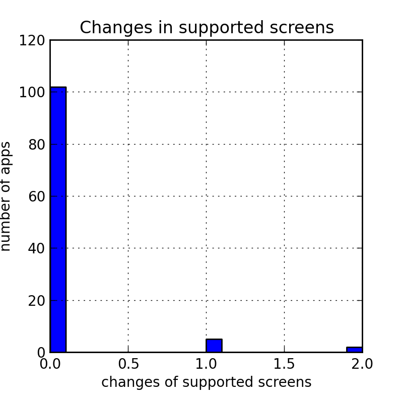
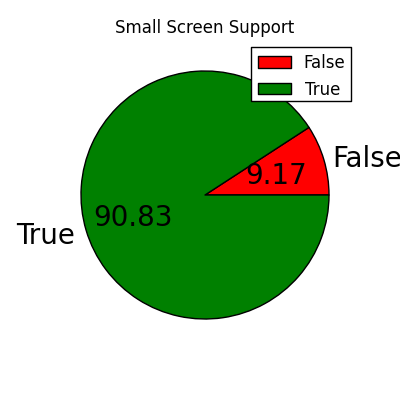
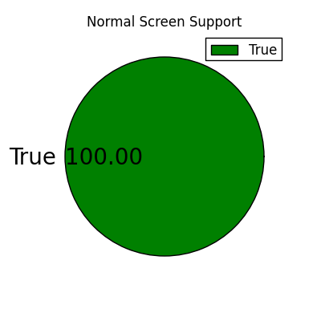
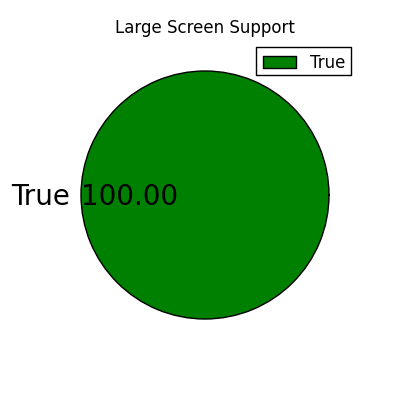
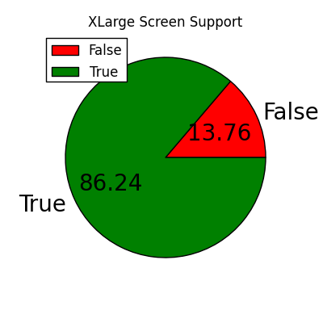

## Supported Screen Sizes

## Summary

|            |                         |
|------------|-------------------------|
| Min        |          0              |
| Max        |          2              |
| Mean       |         0.08            |
| std        |         0.33            |

* * *
### Changes in Supported Screen Sizes:

* * *
### Supported Screen Sizes:

* * *
## Data
<table border=0 cellpadding=0 cellspacing=0 width=729 style='border-collapse:
 collapse;table-layout:fixed;width:729pt'>
 <col width=290 style='mso-width-source:userset;mso-width-alt:12373;width:290pt'>
 <col width=96 style='mso-width-source:userset;mso-width-alt:4096;width:96pt'>
 <col width=83 style='mso-width-source:userset;mso-width-alt:3541;width:83pt'>
 <col width=65 span=4 style='width:65pt'>
 <tr height=12 style='height:12.0pt'>
  <td height=12 width=290 style='height:12.0pt;width:290pt'></td>
  <td width=96 style='width:96pt'></td>
  <td class=xl60 width=83 style='width:83pt'>total_screens</td>
  <td class=xl60 width=65 style='border-left:none;width:65pt'>small</td>
  <td class=xl60 width=65 style='border-left:none;width:65pt'>normal</td>
  <td class=xl60 width=65 style='border-left:none;width:65pt'>large</td>
  <td class=xl60 width=65 style='border-left:none;width:65pt'>xlarge</td>
 </tr>
 <tr height=12 style='height:12.0pt'>
  <td height=12 class=xl60 style='height:12.0pt'>package</td>
  <td class=xl60 style='border-left:none'>verc</td>
  <td colspan=5 style='mso-ignore:colspan'></td>
 </tr>
 <tr height=12 style='height:12.0pt'>
  <td height=12 class=xl60 style='height:12.0pt;border-top:none'>Game.NDK</td>
  <td class=xl60 style='border-top:none;border-left:none'>27</td>
  <td align=right>3</td>
  <td align=center>TRUE</td>
  <td align=center>TRUE</td>
  <td align=center>TRUE</td>
  <td align=center>FALSE</td>
 </tr>
 <tr height=12 style='height:12.0pt'>
  <td height=12 class=xl60 style='height:12.0pt;border-top:none'>Game.SpeedMoto</td>
  <td class=xl60 style='border-top:none;border-left:none'>18</td>
  <td align=right>3</td>
  <td align=center>TRUE</td>
  <td align=center>TRUE</td>
  <td align=center>TRUE</td>
  <td align=center>FALSE</td>
 </tr>
 <tr height=12 style='height:12.0pt'>
  <td rowspan=2 height=24 class=xl60 style='height:24.0pt;border-top:none'>Uxpp.UC</td>
  <td class=xl60 style='border-top:none;border-left:none'>86</td>
  <td align=right>4</td>
  <td align=center>TRUE</td>
  <td align=center>TRUE</td>
  <td align=center>TRUE</td>
  <td align=center>TRUE</td>
 </tr>
 <tr height=12 style='height:12.0pt'>
  <td height=12 class=xl60 style='height:12.0pt;border-top:none;border-left:
  none'>112</td>
  <td align=right>4</td>
  <td align=center>TRUE</td>
  <td align=center>TRUE</td>
  <td align=center>TRUE</td>
  <td align=center>TRUE</td>
 </tr>
 <tr height=12 style='height:12.0pt'>
  <td rowspan=2 height=24 class=xl60 style='height:24.0pt;border-top:none'>air.au.com.metro.DumbWaysToDie</td>
  <td class=xl60 style='border-top:none;border-left:none'>1004001</td>
  <td align=right>3</td>
  <td align=center>FALSE</td>
  <td align=center>TRUE</td>
  <td align=center>TRUE</td>
  <td align=center>TRUE</td>
 </tr>
 <tr height=12 style='height:12.0pt'>
  <td height=12 class=xl60 style='height:12.0pt;border-top:none;border-left:
  none'>1004003</td>
  <td align=right>3</td>
  <td align=center>FALSE</td>
  <td align=center>TRUE</td>
  <td align=center>TRUE</td>
  <td align=center>TRUE</td>
 </tr>
 <tr height=12 style='height:12.0pt'>
  <td rowspan=2 height=24 class=xl60 style='height:24.0pt;border-top:none'>air.com.playtika.slotomania</td>
  <td class=xl60 style='border-top:none;border-left:none'>1039000</td>
  <td align=right>4</td>
  <td align=center>TRUE</td>
  <td align=center>TRUE</td>
  <td align=center>TRUE</td>
  <td align=center>TRUE</td>
 </tr>
 <tr height=12 style='height:12.0pt'>
  <td height=12 class=xl60 style='height:12.0pt;border-top:none;border-left:
  none'>1042000</td>
  <td align=right>4</td>
  <td align=center>TRUE</td>
  <td align=center>TRUE</td>
  <td align=center>TRUE</td>
  <td align=center>TRUE</td>
 </tr>
 <tr height=12 style='height:12.0pt'>
  <td rowspan=2 height=24 class=xl60 style='height:24.0pt;border-top:none'>at.nerbrothers.SuperJump</td>
  <td class=xl60 style='border-top:none;border-left:none'>11</td>
  <td align=right>3</td>
  <td align=center>TRUE</td>
  <td align=center>TRUE</td>
  <td align=center>TRUE</td>
  <td align=center>FALSE</td>
 </tr>
 <tr height=12 style='height:12.0pt'>
  <td height=12 class=xl60 style='height:12.0pt;border-top:none;border-left:
  none'>16</td>
  <td align=right>3</td>
  <td align=center>TRUE</td>
  <td align=center>TRUE</td>
  <td align=center>TRUE</td>
  <td align=center>FALSE</td>
 </tr>
 <tr height=12 style='height:12.0pt'>
  <td rowspan=2 height=24 class=xl60 style='height:24.0pt;border-top:none'>atticlab.bodyscanner</td>
  <td class=xl60 style='border-top:none;border-left:none'>41</td>
  <td align=right>4</td>
  <td align=center>TRUE</td>
  <td align=center>TRUE</td>
  <td align=center>TRUE</td>
  <td align=center>TRUE</td>
 </tr>
 <tr height=12 style='height:12.0pt'>
  <td height=12 class=xl60 style='height:12.0pt;border-top:none;border-left:
  none'>47</td>
  <td align=right>4</td>
  <td align=center>TRUE</td>
  <td align=center>TRUE</td>
  <td align=center>TRUE</td>
  <td align=center>TRUE</td>
 </tr>
 <tr height=12 style='height:12.0pt'>
  <td rowspan=2 height=24 class=xl60 style='height:24.0pt;border-top:none'>br.com.rodrigokolb.realdrum</td>
  <td class=xl60 style='border-top:none;border-left:none'>20</td>
  <td align=right>3</td>
  <td align=center>TRUE</td>
  <td align=center>TRUE</td>
  <td align=center>TRUE</td>
  <td align=center>FALSE</td>
 </tr>
 <tr height=12 style='height:12.0pt'>
  <td height=12 class=xl60 style='height:12.0pt;border-top:none;border-left:
  none'>23</td>
  <td align=right>3</td>
  <td align=center>TRUE</td>
  <td align=center>TRUE</td>
  <td align=center>TRUE</td>
  <td align=center>FALSE</td>
 </tr>
 <tr height=12 style='height:12.0pt'>
  <td rowspan=2 height=24 class=xl60 style='height:24.0pt;border-top:none'>brain.age.analyzer</td>
  <td class=xl60 style='border-top:none;border-left:none'>52</td>
  <td align=right>4</td>
  <td align=center>TRUE</td>
  <td align=center>TRUE</td>
  <td align=center>TRUE</td>
  <td align=center>TRUE</td>
 </tr>
 <tr height=12 style='height:12.0pt'>
  <td height=12 class=xl60 style='height:12.0pt;border-top:none;border-left:
  none'>53</td>
  <td align=right>4</td>
  <td align=center>TRUE</td>
  <td align=center>TRUE</td>
  <td align=center>TRUE</td>
  <td align=center>TRUE</td>
 </tr>
 <tr height=12 style='height:12.0pt'>
  <td rowspan=2 height=24 class=xl60 style='height:24.0pt;border-top:none'>ch.smalltech.battery.free</td>
  <td class=xl60 style='border-top:none;border-left:none'>129</td>
  <td align=right>4</td>
  <td align=center>TRUE</td>
  <td align=center>TRUE</td>
  <td align=center>TRUE</td>
  <td align=center>TRUE</td>
 </tr>
 <tr height=12 style='height:12.0pt'>
  <td height=12 class=xl60 style='height:12.0pt;border-top:none;border-left:
  none'>131</td>
  <td align=right>4</td>
  <td align=center>TRUE</td>
  <td align=center>TRUE</td>
  <td align=center>TRUE</td>
  <td align=center>TRUE</td>
 </tr>
 <tr height=12 style='height:12.0pt'>
  <td rowspan=2 height=24 class=xl60 style='height:24.0pt;border-top:none'>ch.smalltech.ledflashlight.free</td>
  <td class=xl60 style='border-top:none;border-left:none'>156</td>
  <td align=right>4</td>
  <td align=center>TRUE</td>
  <td align=center>TRUE</td>
  <td align=center>TRUE</td>
  <td align=center>TRUE</td>
 </tr>
 <tr height=12 style='height:12.0pt'>
  <td height=12 class=xl60 style='height:12.0pt;border-top:none;border-left:
  none'>160</td>
  <td align=right>4</td>
  <td align=center>TRUE</td>
  <td align=center>TRUE</td>
  <td align=center>TRUE</td>
  <td align=center>TRUE</td>
 </tr>
 <tr height=12 style='height:12.0pt'>
  <td rowspan=2 height=24 class=xl60 style='height:24.0pt;border-top:none'>cn.jingling.motu.photowonder</td>
  <td class=xl60 style='border-top:none;border-left:none'>101</td>
  <td align=right>4</td>
  <td align=center>TRUE</td>
  <td align=center>TRUE</td>
  <td align=center>TRUE</td>
  <td align=center>TRUE</td>
 </tr>
 <tr height=12 style='height:12.0pt'>
  <td height=12 class=xl60 style='height:12.0pt;border-top:none;border-left:
  none'>106</td>
  <td align=right>4</td>
  <td align=center>TRUE</td>
  <td align=center>TRUE</td>
  <td align=center>TRUE</td>
  <td align=center>TRUE</td>
 </tr>
 <tr height=12 style='height:12.0pt'>
  <td rowspan=2 height=24 class=xl60 style='height:24.0pt;border-top:none'>cn.wps.moffice_eng</td>
  <td class=xl60 style='border-top:none;border-left:none'>65</td>
  <td align=right>4</td>
  <td align=center>TRUE</td>
  <td align=center>TRUE</td>
  <td align=center>TRUE</td>
  <td align=center>TRUE</td>
 </tr>
 <tr height=12 style='height:12.0pt'>
  <td height=12 class=xl60 style='height:12.0pt;border-top:none;border-left:
  none'>72</td>
  <td align=right>4</td>
  <td align=center>TRUE</td>
  <td align=center>TRUE</td>
  <td align=center>TRUE</td>
  <td align=center>TRUE</td>
 </tr>
 <tr height=12 style='height:12.0pt'>
  <td rowspan=2 height=24 class=xl60 style='height:24.0pt;border-top:none'>co.vine.android</td>
  <td class=xl60 style='border-top:none;border-left:none'>67</td>
  <td align=right>4</td>
  <td align=center>TRUE</td>
  <td align=center>TRUE</td>
  <td align=center>TRUE</td>
  <td align=center>TRUE</td>
 </tr>
 <tr height=12 style='height:12.0pt'>
  <td height=12 class=xl60 style='height:12.0pt;border-top:none;border-left:
  none'>1400110</td>
  <td align=right>4</td>
  <td align=center>TRUE</td>
  <td align=center>TRUE</td>
  <td align=center>TRUE</td>
  <td align=center>TRUE</td>
 </tr>
 <tr height=12 style='height:12.0pt'>
  <td rowspan=2 height=24 class=xl60 style='height:24.0pt;border-top:none'>com.PinballGame</td>
  <td class=xl60 style='border-top:none;border-left:none'>8</td>
  <td align=right>3</td>
  <td align=center>TRUE</td>
  <td align=center>TRUE</td>
  <td align=center>TRUE</td>
  <td align=center>FALSE</td>
 </tr>
 <tr height=12 style='height:12.0pt'>
  <td height=12 class=xl60 style='height:12.0pt;border-top:none;border-left:
  none'>9</td>
  <td align=right>4</td>
  <td align=center>TRUE</td>
  <td align=center>TRUE</td>
  <td align=center>TRUE</td>
  <td align=center>TRUE</td>
 </tr>
 <tr height=12 style='height:12.0pt'>
  <td rowspan=2 height=24 class=xl60 style='height:24.0pt;border-top:none'>com.RunnerGames.game.JewelsDeluxe_AD</td>
  <td class=xl60 style='border-top:none;border-left:none'>24</td>
  <td align=right>3</td>
  <td align=center>TRUE</td>
  <td align=center>TRUE</td>
  <td align=center>TRUE</td>
  <td align=center>FALSE</td>
 </tr>
 <tr height=12 style='height:12.0pt'>
  <td height=12 class=xl60 style='height:12.0pt;border-top:none;border-left:
  none'>25</td>
  <td align=right>3</td>
  <td align=center>TRUE</td>
  <td align=center>TRUE</td>
  <td align=center>TRUE</td>
  <td align=center>FALSE</td>
 </tr>
 <tr height=12 style='height:12.0pt'>
  <td rowspan=2 height=24 class=xl60 style='height:24.0pt;border-top:none'>com.StudioOnMars.CSPortable</td>
  <td class=xl60 style='border-top:none;border-left:none'>3020</td>
  <td align=right>4</td>
  <td align=center>TRUE</td>
  <td align=center>TRUE</td>
  <td align=center>TRUE</td>
  <td align=center>TRUE</td>
 </tr>
 <tr height=12 style='height:12.0pt'>
  <td height=12 class=xl60 style='height:12.0pt;border-top:none;border-left:
  none'>3309</td>
  <td align=right>4</td>
  <td align=center>TRUE</td>
  <td align=center>TRUE</td>
  <td align=center>TRUE</td>
  <td align=center>TRUE</td>
 </tr>
 <tr height=12 style='height:12.0pt'>
  <td rowspan=2 height=24 class=xl60 style='height:24.0pt;border-top:none'>com.UCMobile.intl</td>
  <td class=xl60 style='border-top:none;border-left:none'>88</td>
  <td align=right>3</td>
  <td align=center>TRUE</td>
  <td align=center>TRUE</td>
  <td align=center>TRUE</td>
  <td align=center>FALSE</td>
 </tr>
 <tr height=12 style='height:12.0pt'>
  <td height=12 class=xl60 style='height:12.0pt;border-top:none;border-left:
  none'>89</td>
  <td align=right>3</td>
  <td align=center>TRUE</td>
  <td align=center>TRUE</td>
  <td align=center>TRUE</td>
  <td align=center>FALSE</td>
 </tr>
 <tr height=12 style='height:12.0pt'>
  <td rowspan=2 height=24 class=xl60 style='height:24.0pt;border-top:none'>com.a0soft.gphone.aDataOnOff</td>
  <td class=xl60 style='border-top:none;border-left:none'>264</td>
  <td align=right>4</td>
  <td align=center>TRUE</td>
  <td align=center>TRUE</td>
  <td align=center>TRUE</td>
  <td align=center>TRUE</td>
 </tr>
 <tr height=12 style='height:12.0pt'>
  <td height=12 class=xl60 style='height:12.0pt;border-top:none;border-left:
  none'>274</td>
  <td align=right>4</td>
  <td align=center>TRUE</td>
  <td align=center>TRUE</td>
  <td align=center>TRUE</td>
  <td align=center>TRUE</td>
 </tr>
 <tr height=12 style='height:12.0pt'>
  <td rowspan=2 height=24 class=xl60 style='height:24.0pt;border-top:none'>com.a0soft.gphone.app2sd</td>
  <td class=xl60 style='border-top:none;border-left:none'>318</td>
  <td align=right>4</td>
  <td align=center>TRUE</td>
  <td align=center>TRUE</td>
  <td align=center>TRUE</td>
  <td align=center>TRUE</td>
 </tr>
 <tr height=12 style='height:12.0pt'>
  <td height=12 class=xl60 style='height:12.0pt;border-top:none;border-left:
  none'>321</td>
  <td align=right>4</td>
  <td align=center>TRUE</td>
  <td align=center>TRUE</td>
  <td align=center>TRUE</td>
  <td align=center>TRUE</td>
 </tr>
 <tr height=12 style='height:12.0pt'>
  <td rowspan=2 height=24 class=xl60 style='height:24.0pt;border-top:none'>com.accuweather.android</td>
  <td class=xl60 style='border-top:none;border-left:none'>41</td>
  <td align=right>4</td>
  <td align=center>TRUE</td>
  <td align=center>TRUE</td>
  <td align=center>TRUE</td>
  <td align=center>TRUE</td>
 </tr>
 <tr height=12 style='height:12.0pt'>
  <td height=12 class=xl60 style='height:12.0pt;border-top:none;border-left:
  none'>45</td>
  <td align=right>4</td>
  <td align=center>TRUE</td>
  <td align=center>TRUE</td>
  <td align=center>TRUE</td>
  <td align=center>TRUE</td>
 </tr>
 <tr height=12 style='height:12.0pt'>
  <td rowspan=2 height=24 class=xl60 style='height:24.0pt;border-top:none'>com.aceviral.angrygranrun</td>
  <td class=xl60 style='border-top:none;border-left:none'>21</td>
  <td align=right>4</td>
  <td align=center>TRUE</td>
  <td align=center>TRUE</td>
  <td align=center>TRUE</td>
  <td align=center>TRUE</td>
 </tr>
 <tr height=12 style='height:12.0pt'>
  <td height=12 class=xl60 style='height:12.0pt;border-top:none;border-left:
  none'>24</td>
  <td align=right>4</td>
  <td align=center>TRUE</td>
  <td align=center>TRUE</td>
  <td align=center>TRUE</td>
  <td align=center>TRUE</td>
 </tr>
 <tr height=12 style='height:12.0pt'>
  <td rowspan=2 height=24 class=xl60 style='height:24.0pt;border-top:none'>com.adobe.air</td>
  <td class=xl60 style='border-top:none;border-left:none'>3800087</td>
  <td align=right>4</td>
  <td align=center>TRUE</td>
  <td align=center>TRUE</td>
  <td align=center>TRUE</td>
  <td align=center>TRUE</td>
 </tr>
 <tr height=12 style='height:12.0pt'>
  <td height=12 class=xl60 style='height:12.0pt;border-top:none;border-left:
  none'>3900138</td>
  <td align=right>4</td>
  <td align=center>TRUE</td>
  <td align=center>TRUE</td>
  <td align=center>TRUE</td>
  <td align=center>TRUE</td>
 </tr>
 <tr height=12 style='height:12.0pt'>
  <td rowspan=2 height=24 class=xl60 style='height:24.0pt;border-top:none'>com.adobe.psmobile</td>
  <td class=xl60 style='border-top:none;border-left:none'>10</td>
  <td align=right>3</td>
  <td align=center>TRUE</td>
  <td align=center>TRUE</td>
  <td align=center>TRUE</td>
  <td align=center>FALSE</td>
 </tr>
 <tr height=12 style='height:12.0pt'>
  <td height=12 class=xl60 style='height:12.0pt;border-top:none;border-left:
  none'>12</td>
  <td align=right>4</td>
  <td align=center>TRUE</td>
  <td align=center>TRUE</td>
  <td align=center>TRUE</td>
  <td align=center>TRUE</td>
 </tr>
 <tr height=12 style='height:12.0pt'>
  <td rowspan=2 height=24 class=xl60 style='height:24.0pt;border-top:none'>com.adobe.reader</td>
  <td class=xl60 style='border-top:none;border-left:none'>77969</td>
  <td align=right>4</td>
  <td align=center>TRUE</td>
  <td align=center>TRUE</td>
  <td align=center>TRUE</td>
  <td align=center>TRUE</td>
 </tr>
 <tr height=12 style='height:12.0pt'>
  <td height=12 class=xl60 style='height:12.0pt;border-top:none;border-left:
  none'>85478</td>
  <td align=right>4</td>
  <td align=center>TRUE</td>
  <td align=center>TRUE</td>
  <td align=center>TRUE</td>
  <td align=center>TRUE</td>
 </tr>
 <tr height=12 style='height:12.0pt'>
  <td rowspan=2 height=24 class=xl60 style='height:24.0pt;border-top:none'>com.advancedprocessmanager</td>
  <td class=xl60 style='border-top:none;border-left:none'>59</td>
  <td align=right>4</td>
  <td align=center>TRUE</td>
  <td align=center>TRUE</td>
  <td align=center>TRUE</td>
  <td align=center>TRUE</td>
 </tr>
 <tr height=12 style='height:12.0pt'>
  <td height=12 class=xl60 style='height:12.0pt;border-top:none;border-left:
  none'>68</td>
  <td align=right>4</td>
  <td align=center>TRUE</td>
  <td align=center>TRUE</td>
  <td align=center>TRUE</td>
  <td align=center>TRUE</td>
 </tr>
 <tr height=12 style='height:12.0pt'>
  <td rowspan=2 height=24 class=xl60 style='height:24.0pt;border-top:none'>com.agilesoftresource</td>
  <td class=xl60 style='border-top:none;border-left:none'>131</td>
  <td align=right>4</td>
  <td align=center>TRUE</td>
  <td align=center>TRUE</td>
  <td align=center>TRUE</td>
  <td align=center>TRUE</td>
 </tr>
 <tr height=12 style='height:12.0pt'>
  <td height=12 class=xl60 style='height:12.0pt;border-top:none;border-left:
  none'>186537</td>
  <td align=right>4</td>
  <td align=center>TRUE</td>
  <td align=center>TRUE</td>
  <td align=center>TRUE</td>
  <td align=center>TRUE</td>
 </tr>
 <tr height=12 style='height:12.0pt'>
  <td rowspan=2 height=24 class=xl60 style='height:24.0pt;border-top:none'>com.aitype.android</td>
  <td class=xl60 style='border-top:none;border-left:none'>1994</td>
  <td align=right>3</td>
  <td align=center>TRUE</td>
  <td align=center>TRUE</td>
  <td align=center>TRUE</td>
  <td align=center>FALSE</td>
 </tr>
 <tr height=12 style='height:12.0pt'>
  <td height=12 class=xl60 style='height:12.0pt;border-top:none;border-left:
  none'>1999</td>
  <td align=right>3</td>
  <td align=center>TRUE</td>
  <td align=center>TRUE</td>
  <td align=center>TRUE</td>
  <td align=center>FALSE</td>
 </tr>
 <tr height=12 style='height:12.0pt'>
  <td rowspan=2 height=24 class=xl60 style='height:24.0pt;border-top:none'>com.alensw.PicFolder</td>
  <td class=xl60 style='border-top:none;border-left:none'>111</td>
  <td align=right>4</td>
  <td align=center>TRUE</td>
  <td align=center>TRUE</td>
  <td align=center>TRUE</td>
  <td align=center>TRUE</td>
 </tr>
 <tr height=12 style='height:12.0pt'>
  <td height=12 class=xl60 style='height:12.0pt;border-top:none;border-left:
  none'>125</td>
  <td align=right>4</td>
  <td align=center>TRUE</td>
  <td align=center>TRUE</td>
  <td align=center>TRUE</td>
  <td align=center>TRUE</td>
 </tr>
 <tr height=12 style='height:12.0pt'>
  <td rowspan=2 height=24 class=xl60 style='height:24.0pt;border-top:none'>com.alienmanfc6.wheresmyandroid</td>
  <td class=xl60 style='border-top:none;border-left:none'>90</td>
  <td align=right>4</td>
  <td align=center>TRUE</td>
  <td align=center>TRUE</td>
  <td align=center>TRUE</td>
  <td align=center>TRUE</td>
 </tr>
 <tr height=12 style='height:12.0pt'>
  <td height=12 class=xl60 style='height:12.0pt;border-top:none;border-left:
  none'>92</td>
  <td align=right>4</td>
  <td align=center>TRUE</td>
  <td align=center>TRUE</td>
  <td align=center>TRUE</td>
  <td align=center>TRUE</td>
 </tr>
 <tr height=12 style='height:12.0pt'>
  <td rowspan=2 height=24 class=xl60 style='height:24.0pt;border-top:none'>com.amazon.mShop.android</td>
  <td class=xl60 style='border-top:none;border-left:none'>49</td>
  <td align=right>3</td>
  <td align=center>TRUE</td>
  <td align=center>TRUE</td>
  <td align=center>TRUE</td>
  <td align=center>FALSE</td>
 </tr>
 <tr height=12 style='height:12.0pt'>
  <td height=12 class=xl60 style='height:12.0pt;border-top:none;border-left:
  none'>2801</td>
  <td align=right>3</td>
  <td align=center>TRUE</td>
  <td align=center>TRUE</td>
  <td align=center>TRUE</td>
  <td align=center>FALSE</td>
 </tr>
 <tr height=12 style='height:12.0pt'>
  <td rowspan=2 height=24 class=xl60 style='height:24.0pt;border-top:none'>com.amazon.mp3</td>
  <td class=xl60 style='border-top:none;border-left:none'>2080310</td>
  <td align=right>3</td>
  <td align=center>FALSE</td>
  <td align=center>TRUE</td>
  <td align=center>TRUE</td>
  <td align=center>TRUE</td>
 </tr>
 <tr height=12 style='height:12.0pt'>
  <td height=12 class=xl60 style='height:12.0pt;border-top:none;border-left:
  none'>3002410</td>
  <td align=right>3</td>
  <td align=center>FALSE</td>
  <td align=center>TRUE</td>
  <td align=center>TRUE</td>
  <td align=center>TRUE</td>
 </tr>
 <tr height=12 style='height:12.0pt'>
  <td rowspan=2 height=24 class=xl60 style='height:24.0pt;border-top:none'>com.amdroid.pedo.gas.flatulencia</td>
  <td class=xl60 style='border-top:none;border-left:none'>4</td>
  <td align=right>4</td>
  <td align=center>TRUE</td>
  <td align=center>TRUE</td>
  <td align=center>TRUE</td>
  <td align=center>TRUE</td>
 </tr>
 <tr height=12 style='height:12.0pt'>
  <td height=12 class=xl60 style='height:12.0pt;border-top:none;border-left:
  none'>6</td>
  <td align=right>4</td>
  <td align=center>TRUE</td>
  <td align=center>TRUE</td>
  <td align=center>TRUE</td>
  <td align=center>TRUE</td>
 </tr>
 <tr height=12 style='height:12.0pt'>
  <td rowspan=2 height=24 class=xl60 style='height:24.0pt;border-top:none'>com.android.chrome</td>
  <td class=xl60 style='border-top:none;border-left:none'>1547059</td>
  <td align=right>4</td>
  <td align=center>TRUE</td>
  <td align=center>TRUE</td>
  <td align=center>TRUE</td>
  <td align=center>TRUE</td>
 </tr>
 <tr height=12 style='height:12.0pt'>
  <td height=12 class=xl60 style='height:12.0pt;border-top:none;border-left:
  none'>1650059</td>
  <td align=right>4</td>
  <td align=center>TRUE</td>
  <td align=center>TRUE</td>
  <td align=center>TRUE</td>
  <td align=center>TRUE</td>
 </tr>
 <tr height=12 style='height:12.0pt'>
  <td rowspan=2 height=24 class=xl60 style='height:24.0pt;border-top:none'>com.androidwasabi.livewallpaper.dandelion</td>
  <td class=xl60 style='border-top:none;border-left:none'>42</td>
  <td align=right>3</td>
  <td align=center>TRUE</td>
  <td align=center>TRUE</td>
  <td align=center>TRUE</td>
  <td align=center>FALSE</td>
 </tr>
 <tr height=12 style='height:12.0pt'>
  <td height=12 class=xl60 style='height:12.0pt;border-top:none;border-left:
  none'>44</td>
  <td align=right>4</td>
  <td align=center>TRUE</td>
  <td align=center>TRUE</td>
  <td align=center>TRUE</td>
  <td align=center>TRUE</td>
 </tr>
 <tr height=12 style='height:12.0pt'>
  <td rowspan=2 height=24 class=xl60 style='height:24.0pt;border-top:none'>com.androidwasabi.livewallpaper.waterdrop</td>
  <td class=xl60 style='border-top:none;border-left:none'>28</td>
  <td align=right>3</td>
  <td align=center>TRUE</td>
  <td align=center>TRUE</td>
  <td align=center>TRUE</td>
  <td align=center>FALSE</td>
 </tr>
 <tr height=12 style='height:12.0pt'>
  <td height=12 class=xl60 style='height:12.0pt;border-top:none;border-left:
  none'>30</td>
  <td align=right>4</td>
  <td align=center>TRUE</td>
  <td align=center>TRUE</td>
  <td align=center>TRUE</td>
  <td align=center>TRUE</td>
 </tr>
 <tr height=12 style='height:12.0pt'>
  <td rowspan=2 height=24 class=xl60 style='height:24.0pt;border-top:none'>com.ansangha.drdriving</td>
  <td class=xl60 style='border-top:none;border-left:none'>12</td>
  <td align=right>4</td>
  <td align=center>TRUE</td>
  <td align=center>TRUE</td>
  <td align=center>TRUE</td>
  <td align=center>TRUE</td>
 </tr>
 <tr height=12 style='height:12.0pt'>
  <td height=12 class=xl60 style='height:12.0pt;border-top:none;border-left:
  none'>24</td>
  <td align=right>4</td>
  <td align=center>TRUE</td>
  <td align=center>TRUE</td>
  <td align=center>TRUE</td>
  <td align=center>TRUE</td>
 </tr>
 <tr height=12 style='height:12.0pt'>
  <td rowspan=2 height=24 class=xl60 style='height:24.0pt;border-top:none'>com.antivirus</td>
  <td class=xl60 style='border-top:none;border-left:none'>181729</td>
  <td align=right>4</td>
  <td align=center>TRUE</td>
  <td align=center>TRUE</td>
  <td align=center>TRUE</td>
  <td align=center>TRUE</td>
 </tr>
 <tr height=12 style='height:12.0pt'>
  <td height=12 class=xl60 style='height:12.0pt;border-top:none;border-left:
  none'>186306</td>
  <td align=right>4</td>
  <td align=center>TRUE</td>
  <td align=center>TRUE</td>
  <td align=center>TRUE</td>
  <td align=center>TRUE</td>
 </tr>
 <tr height=12 style='height:12.0pt'>
  <td rowspan=2 height=24 class=xl60 style='height:24.0pt;border-top:none'>com.avast.android.mobilesecurity</td>
  <td class=xl60 style='border-top:none;border-left:none'>6158</td>
  <td align=right>4</td>
  <td align=center>TRUE</td>
  <td align=center>TRUE</td>
  <td align=center>TRUE</td>
  <td align=center>TRUE</td>
 </tr>
 <tr height=12 style='height:12.0pt'>
  <td height=12 class=xl60 style='height:12.0pt;border-top:none;border-left:
  none'>6572</td>
  <td align=right>4</td>
  <td align=center>TRUE</td>
  <td align=center>TRUE</td>
  <td align=center>TRUE</td>
  <td align=center>TRUE</td>
 </tr>
 <tr height=12 style='height:12.0pt'>
  <td rowspan=2 height=24 class=xl60 style='height:24.0pt;border-top:none'>com.bestcoolfungames.antsmasher</td>
  <td class=xl60 style='border-top:none;border-left:none'>7002</td>
  <td align=right>3</td>
  <td align=center>TRUE</td>
  <td align=center>TRUE</td>
  <td align=center>TRUE</td>
  <td align=center>FALSE</td>
 </tr>
 <tr height=12 style='height:12.0pt'>
  <td height=12 class=xl60 style='height:12.0pt;border-top:none;border-left:
  none'>7007</td>
  <td align=right>3</td>
  <td align=center>TRUE</td>
  <td align=center>TRUE</td>
  <td align=center>TRUE</td>
  <td align=center>FALSE</td>
 </tr>
 <tr height=12 style='height:12.0pt'>
  <td rowspan=2 height=24 class=xl60 style='height:24.0pt;border-top:none'>com.cleanmaster.mguard</td>
  <td class=xl60 style='border-top:none;border-left:none'>30700303</td>
  <td align=right>4</td>
  <td align=center>TRUE</td>
  <td align=center>TRUE</td>
  <td align=center>TRUE</td>
  <td align=center>TRUE</td>
 </tr>
 <tr height=12 style='height:12.0pt'>
  <td height=12 class=xl60 style='height:12.0pt;border-top:none;border-left:
  none'>30860498</td>
  <td align=right>4</td>
  <td align=center>TRUE</td>
  <td align=center>TRUE</td>
  <td align=center>TRUE</td>
  <td align=center>TRUE</td>
 </tr>
 <tr height=12 style='height:12.0pt'>
  <td rowspan=2 height=24 class=xl60 style='height:24.0pt;border-top:none'>com.creativemobile.DragRacing</td>
  <td class=xl60 style='border-top:none;border-left:none'>85</td>
  <td align=right>4</td>
  <td align=center>TRUE</td>
  <td align=center>TRUE</td>
  <td align=center>TRUE</td>
  <td align=center>TRUE</td>
 </tr>
 <tr height=12 style='height:12.0pt'>
  <td height=12 class=xl60 style='height:12.0pt;border-top:none;border-left:
  none'>90</td>
  <td align=right>4</td>
  <td align=center>TRUE</td>
  <td align=center>TRUE</td>
  <td align=center>TRUE</td>
  <td align=center>TRUE</td>
 </tr>
 <tr height=12 style='height:12.0pt'>
  <td rowspan=2 height=24 class=xl60 style='height:24.0pt;border-top:none'>com.devuni.flashlight</td>
  <td class=xl60 style='border-top:none;border-left:none'>139</td>
  <td align=right>4</td>
  <td align=center>TRUE</td>
  <td align=center>TRUE</td>
  <td align=center>TRUE</td>
  <td align=center>TRUE</td>
 </tr>
 <tr height=12 style='height:12.0pt'>
  <td height=12 class=xl60 style='height:12.0pt;border-top:none;border-left:
  none'>141</td>
  <td align=right>4</td>
  <td align=center>TRUE</td>
  <td align=center>TRUE</td>
  <td align=center>TRUE</td>
  <td align=center>TRUE</td>
 </tr>
 <tr height=12 style='height:12.0pt'>
  <td rowspan=2 height=24 class=xl60 style='height:24.0pt;border-top:none'>com.disney.WMWLite</td>
  <td class=xl60 style='border-top:none;border-left:none'>17</td>
  <td align=right>3</td>
  <td align=center>FALSE</td>
  <td align=center>TRUE</td>
  <td align=center>TRUE</td>
  <td align=center>TRUE</td>
 </tr>
 <tr height=12 style='height:12.0pt'>
  <td height=12 class=xl60 style='height:12.0pt;border-top:none;border-left:
  none'>19</td>
  <td align=right>3</td>
  <td align=center>FALSE</td>
  <td align=center>TRUE</td>
  <td align=center>TRUE</td>
  <td align=center>TRUE</td>
 </tr>
 <tr height=12 style='height:12.0pt'>
  <td rowspan=2 height=24 class=xl60 style='height:24.0pt;border-top:none'>com.dropbox.android</td>
  <td class=xl60 style='border-top:none;border-left:none'>231004</td>
  <td align=right>4</td>
  <td align=center>TRUE</td>
  <td align=center>TRUE</td>
  <td align=center>TRUE</td>
  <td align=center>TRUE</td>
 </tr>
 <tr height=12 style='height:12.0pt'>
  <td height=12 class=xl60 style='height:12.0pt;border-top:none;border-left:
  none'>231104</td>
  <td align=right>4</td>
  <td align=center>TRUE</td>
  <td align=center>TRUE</td>
  <td align=center>TRUE</td>
  <td align=center>TRUE</td>
 </tr>
 <tr height=12 style='height:12.0pt'>
  <td rowspan=2 height=24 class=xl60 style='height:24.0pt;border-top:none'>com.ebay.mobile</td>
  <td class=xl60 style='border-top:none;border-left:none'>43</td>
  <td align=right>4</td>
  <td align=center>TRUE</td>
  <td align=center>TRUE</td>
  <td align=center>TRUE</td>
  <td align=center>TRUE</td>
 </tr>
 <tr height=12 style='height:12.0pt'>
  <td height=12 class=xl60 style='height:12.0pt;border-top:none;border-left:
  none'>46</td>
  <td align=right>4</td>
  <td align=center>TRUE</td>
  <td align=center>TRUE</td>
  <td align=center>TRUE</td>
  <td align=center>TRUE</td>
 </tr>
 <tr height=12 style='height:12.0pt'>
  <td rowspan=2 height=24 class=xl60 style='height:24.0pt;border-top:none'>com.facebook.katana</td>
  <td class=xl60 style='border-top:none;border-left:none'>258882</td>
  <td align=right>4</td>
  <td align=center>TRUE</td>
  <td align=center>TRUE</td>
  <td align=center>TRUE</td>
  <td align=center>TRUE</td>
 </tr>
 <tr height=12 style='height:12.0pt'>
  <td height=12 class=xl60 style='height:12.0pt;border-top:none;border-left:
  none'>666397</td>
  <td align=right>4</td>
  <td align=center>TRUE</td>
  <td align=center>TRUE</td>
  <td align=center>TRUE</td>
  <td align=center>TRUE</td>
 </tr>
 <tr height=12 style='height:12.0pt'>
  <td rowspan=2 height=24 class=xl60 style='height:24.0pt;border-top:none'>com.facebook.orca</td>
  <td class=xl60 style='border-top:none;border-left:none'>295612</td>
  <td align=right>4</td>
  <td align=center>TRUE</td>
  <td align=center>TRUE</td>
  <td align=center>TRUE</td>
  <td align=center>TRUE</td>
 </tr>
 <tr height=12 style='height:12.0pt'>
  <td height=12 class=xl60 style='height:12.0pt;border-top:none;border-left:
  none'>906963</td>
  <td align=right>4</td>
  <td align=center>TRUE</td>
  <td align=center>TRUE</td>
  <td align=center>TRUE</td>
  <td align=center>TRUE</td>
 </tr>
 <tr height=12 style='height:12.0pt'>
  <td rowspan=2 height=24 class=xl60 style='height:24.0pt;border-top:none'>com.gameloft.android.ANMP.GloftDMHM</td>
  <td class=xl60 style='border-top:none;border-left:none'>110</td>
  <td align=right>3</td>
  <td align=center>FALSE</td>
  <td align=center>TRUE</td>
  <td align=center>TRUE</td>
  <td align=center>TRUE</td>
 </tr>
 <tr height=12 style='height:12.0pt'>
  <td height=12 class=xl60 style='height:12.0pt;border-top:none;border-left:
  none'>15022</td>
  <td align=right>3</td>
  <td align=center>FALSE</td>
  <td align=center>TRUE</td>
  <td align=center>TRUE</td>
  <td align=center>TRUE</td>
 </tr>
 <tr height=12 style='height:12.0pt'>
  <td rowspan=2 height=24 class=xl60 style='height:24.0pt;border-top:none'>com.gamestar.pianoperfect</td>
  <td class=xl60 style='border-top:none;border-left:none'>614</td>
  <td align=right>4</td>
  <td align=center>TRUE</td>
  <td align=center>TRUE</td>
  <td align=center>TRUE</td>
  <td align=center>TRUE</td>
 </tr>
 <tr height=12 style='height:12.0pt'>
  <td height=12 class=xl60 style='height:12.0pt;border-top:none;border-left:
  none'>619</td>
  <td align=right>4</td>
  <td align=center>TRUE</td>
  <td align=center>TRUE</td>
  <td align=center>TRUE</td>
  <td align=center>TRUE</td>
 </tr>
 <tr height=12 style='height:12.0pt'>
  <td rowspan=2 height=24 class=xl60 style='height:24.0pt;border-top:none'>com.gau.go.launcherex</td>
  <td class=xl60 style='border-top:none;border-left:none'>267</td>
  <td align=right>3</td>
  <td align=center>TRUE</td>
  <td align=center>TRUE</td>
  <td align=center>TRUE</td>
  <td align=center>FALSE</td>
 </tr>
 <tr height=12 style='height:12.0pt'>
  <td height=12 class=xl60 style='height:12.0pt;border-top:none;border-left:
  none'>303</td>
  <td align=right>3</td>
  <td align=center>TRUE</td>
  <td align=center>TRUE</td>
  <td align=center>TRUE</td>
  <td align=center>FALSE</td>
 </tr>
 <tr height=12 style='height:12.0pt'>
  <td rowspan=2 height=24 class=xl60 style='height:24.0pt;border-top:none'>com.google.android.apps.books</td>
  <td class=xl60 style='border-top:none;border-left:none'>20921</td>
  <td align=right>4</td>
  <td align=center>TRUE</td>
  <td align=center>TRUE</td>
  <td align=center>TRUE</td>
  <td align=center>TRUE</td>
 </tr>
 <tr height=12 style='height:12.0pt'>
  <td height=12 class=xl60 style='height:12.0pt;border-top:none;border-left:
  none'>30015</td>
  <td align=right>4</td>
  <td align=center>TRUE</td>
  <td align=center>TRUE</td>
  <td align=center>TRUE</td>
  <td align=center>TRUE</td>
 </tr>
 <tr height=12 style='height:12.0pt'>
  <td rowspan=2 height=24 class=xl60 style='height:24.0pt;border-top:none'>com.google.android.apps.docs</td>
  <td class=xl60 style='border-top:none;border-left:none'>1222832</td>
  <td align=right>4</td>
  <td align=center>TRUE</td>
  <td align=center>TRUE</td>
  <td align=center>TRUE</td>
  <td align=center>TRUE</td>
 </tr>
 <tr height=12 style='height:12.0pt'>
  <td height=12 class=xl60 style='height:12.0pt;border-top:none;border-left:
  none'>1246114</td>
  <td align=right>4</td>
  <td align=center>TRUE</td>
  <td align=center>TRUE</td>
  <td align=center>TRUE</td>
  <td align=center>TRUE</td>
 </tr>
 <tr height=12 style='height:12.0pt'>
  <td rowspan=2 height=24 class=xl60 style='height:24.0pt;border-top:none'>com.google.android.apps.magazines</td>
  <td class=xl60 style='border-top:none;border-left:none'>131402010</td>
  <td align=right>3</td>
  <td align=center>FALSE</td>
  <td align=center>TRUE</td>
  <td align=center>TRUE</td>
  <td align=center>TRUE</td>
 </tr>
 <tr height=12 style='height:12.0pt'>
  <td height=12 class=xl60 style='height:12.0pt;border-top:none;border-left:
  none'>133231515</td>
  <td align=right>3</td>
  <td align=center>FALSE</td>
  <td align=center>TRUE</td>
  <td align=center>TRUE</td>
  <td align=center>TRUE</td>
 </tr>
 <tr height=12 style='height:12.0pt'>
  <td rowspan=2 height=24 class=xl60 style='height:24.0pt;border-top:none'>com.google.android.apps.maps</td>
  <td class=xl60 style='border-top:none;border-left:none'>701000803</td>
  <td align=right>4</td>
  <td align=center>TRUE</td>
  <td align=center>TRUE</td>
  <td align=center>TRUE</td>
  <td align=center>TRUE</td>
 </tr>
 <tr height=12 style='height:12.0pt'>
  <td height=12 class=xl60 style='height:12.0pt;border-top:none;border-left:
  none'>704001103</td>
  <td align=right>4</td>
  <td align=center>TRUE</td>
  <td align=center>TRUE</td>
  <td align=center>TRUE</td>
  <td align=center>TRUE</td>
 </tr>
 <tr height=12 style='height:12.0pt'>
  <td rowspan=2 height=24 class=xl60 style='height:24.0pt;border-top:none'>com.google.android.apps.plus</td>
  <td class=xl60 style='border-top:none;border-left:none'>410508092</td>
  <td align=right>4</td>
  <td align=center>TRUE</td>
  <td align=center>TRUE</td>
  <td align=center>TRUE</td>
  <td align=center>TRUE</td>
 </tr>
 <tr height=12 style='height:12.0pt'>
  <td height=12 class=xl60 style='height:12.0pt;border-top:none;border-left:
  none'>413009748</td>
  <td align=right>4</td>
  <td align=center>TRUE</td>
  <td align=center>TRUE</td>
  <td align=center>TRUE</td>
  <td align=center>TRUE</td>
 </tr>
 <tr height=12 style='height:12.0pt'>
  <td rowspan=2 height=24 class=xl60 style='height:24.0pt;border-top:none'>com.google.android.apps.translate</td>
  <td class=xl60 style='border-top:none;border-left:none'>30000023</td>
  <td align=right>4</td>
  <td align=center>TRUE</td>
  <td align=center>TRUE</td>
  <td align=center>TRUE</td>
  <td align=center>TRUE</td>
 </tr>
 <tr height=12 style='height:12.0pt'>
  <td height=12 class=xl60 style='height:12.0pt;border-top:none;border-left:
  none'>30000028</td>
  <td align=right>4</td>
  <td align=center>TRUE</td>
  <td align=center>TRUE</td>
  <td align=center>TRUE</td>
  <td align=center>TRUE</td>
 </tr>
 <tr height=12 style='height:12.0pt'>
  <td rowspan=2 height=24 class=xl60 style='height:24.0pt;border-top:none'>com.google.android.gm</td>
  <td class=xl60 style='border-top:none;border-left:none'>986</td>
  <td align=right>4</td>
  <td align=center>TRUE</td>
  <td align=center>TRUE</td>
  <td align=center>TRUE</td>
  <td align=center>TRUE</td>
 </tr>
 <tr height=12 style='height:12.0pt'>
  <td height=12 class=xl60 style='height:12.0pt;border-top:none;border-left:
  none'>4600370</td>
  <td align=right>4</td>
  <td align=center>TRUE</td>
  <td align=center>TRUE</td>
  <td align=center>TRUE</td>
  <td align=center>TRUE</td>
 </tr>
 <tr height=12 style='height:12.0pt'>
  <td rowspan=2 height=24 class=xl60 style='height:24.0pt;border-top:none'>com.google.android.googlequicksearchbox</td>
  <td class=xl60 style='border-top:none;border-left:none'>300301080</td>
  <td align=right>4</td>
  <td align=center>TRUE</td>
  <td align=center>TRUE</td>
  <td align=center>TRUE</td>
  <td align=center>TRUE</td>
 </tr>
 <tr height=12 style='height:12.0pt'>
  <td height=12 class=xl60 style='height:12.0pt;border-top:none;border-left:
  none'>300301240</td>
  <td align=right>4</td>
  <td align=center>TRUE</td>
  <td align=center>TRUE</td>
  <td align=center>TRUE</td>
  <td align=center>TRUE</td>
 </tr>
 <tr height=12 style='height:12.0pt'>
  <td rowspan=2 height=24 class=xl60 style='height:24.0pt;border-top:none'>com.google.android.music</td>
  <td class=xl60 style='border-top:none;border-left:none'>1109</td>
  <td align=right>4</td>
  <td align=center>TRUE</td>
  <td align=center>TRUE</td>
  <td align=center>TRUE</td>
  <td align=center>TRUE</td>
 </tr>
 <tr height=12 style='height:12.0pt'>
  <td height=12 class=xl60 style='height:12.0pt;border-top:none;border-left:
  none'>1316</td>
  <td align=right>4</td>
  <td align=center>TRUE</td>
  <td align=center>TRUE</td>
  <td align=center>TRUE</td>
  <td align=center>TRUE</td>
 </tr>
 <tr height=12 style='height:12.0pt'>
  <td rowspan=2 height=24 class=xl60 style='height:24.0pt;border-top:none'>com.google.android.talk</td>
  <td class=xl60 style='border-top:none;border-left:none'>757001</td>
  <td align=right>4</td>
  <td align=center>TRUE</td>
  <td align=center>TRUE</td>
  <td align=center>TRUE</td>
  <td align=center>TRUE</td>
 </tr>
 <tr height=12 style='height:12.0pt'>
  <td height=12 class=xl60 style='height:12.0pt;border-top:none;border-left:
  none'>20217130</td>
  <td align=right>4</td>
  <td align=center>TRUE</td>
  <td align=center>TRUE</td>
  <td align=center>TRUE</td>
  <td align=center>TRUE</td>
 </tr>
 <tr height=12 style='height:12.0pt'>
  <td rowspan=2 height=24 class=xl60 style='height:24.0pt;border-top:none'>com.google.android.videos</td>
  <td class=xl60 style='border-top:none;border-left:none'>26091</td>
  <td align=right>4</td>
  <td align=center>TRUE</td>
  <td align=center>TRUE</td>
  <td align=center>TRUE</td>
  <td align=center>TRUE</td>
 </tr>
 <tr height=12 style='height:12.0pt'>
  <td height=12 class=xl60 style='height:12.0pt;border-top:none;border-left:
  none'>30251</td>
  <td align=right>4</td>
  <td align=center>TRUE</td>
  <td align=center>TRUE</td>
  <td align=center>TRUE</td>
  <td align=center>TRUE</td>
 </tr>
 <tr height=12 style='height:12.0pt'>
  <td rowspan=2 height=24 class=xl60 style='height:24.0pt;border-top:none'>com.google.android.youtube</td>
  <td class=xl60 style='border-top:none;border-left:none'>5021</td>
  <td align=right>4</td>
  <td align=center>TRUE</td>
  <td align=center>TRUE</td>
  <td align=center>TRUE</td>
  <td align=center>TRUE</td>
 </tr>
 <tr height=12 style='height:12.0pt'>
  <td height=12 class=xl60 style='height:12.0pt;border-top:none;border-left:
  none'>5324</td>
  <td align=right>4</td>
  <td align=center>TRUE</td>
  <td align=center>TRUE</td>
  <td align=center>TRUE</td>
  <td align=center>TRUE</td>
 </tr>
 <tr height=12 style='height:12.0pt'>
  <td rowspan=2 height=24 class=xl60 style='height:24.0pt;border-top:none'>com.google.earth</td>
  <td class=xl60 style='border-top:none;border-left:none'>13140170</td>
  <td align=right>3</td>
  <td align=center>FALSE</td>
  <td align=center>TRUE</td>
  <td align=center>TRUE</td>
  <td align=center>TRUE</td>
 </tr>
 <tr height=12 style='height:12.0pt'>
  <td height=12 class=xl60 style='height:12.0pt;border-top:none;border-left:
  none'>13294050</td>
  <td align=right>3</td>
  <td align=center>FALSE</td>
  <td align=center>TRUE</td>
  <td align=center>TRUE</td>
  <td align=center>TRUE</td>
 </tr>
 <tr height=12 style='height:12.0pt'>
  <td rowspan=2 height=24 class=xl60 style='height:24.0pt;border-top:none'>com.halfbrick.jetpackjoyride</td>
  <td class=xl60 style='border-top:none;border-left:none'>1526</td>
  <td align=right>4</td>
  <td align=center>TRUE</td>
  <td align=center>TRUE</td>
  <td align=center>TRUE</td>
  <td align=center>TRUE</td>
 </tr>
 <tr height=12 style='height:12.0pt'>
  <td height=12 class=xl60 style='height:12.0pt;border-top:none;border-left:
  none'>1600</td>
  <td align=right>4</td>
  <td align=center>TRUE</td>
  <td align=center>TRUE</td>
  <td align=center>TRUE</td>
  <td align=center>TRUE</td>
 </tr>
 <tr height=12 style='height:12.0pt'>
  <td rowspan=2 height=24 class=xl60 style='height:24.0pt;border-top:none'>com.imangi.templerun2</td>
  <td class=xl60 style='border-top:none;border-left:none'>12</td>
  <td align=right>4</td>
  <td align=center>TRUE</td>
  <td align=center>TRUE</td>
  <td align=center>TRUE</td>
  <td align=center>TRUE</td>
 </tr>
 <tr height=12 style='height:12.0pt'>
  <td height=12 class=xl60 style='height:12.0pt;border-top:none;border-left:
  none'>14</td>
  <td align=right>4</td>
  <td align=center>TRUE</td>
  <td align=center>TRUE</td>
  <td align=center>TRUE</td>
  <td align=center>TRUE</td>
 </tr>
 <tr height=12 style='height:12.0pt'>
  <td rowspan=2 height=24 class=xl60 style='height:24.0pt;border-top:none'>com.instagram.android</td>
  <td class=xl60 style='border-top:none;border-left:none'>639564</td>
  <td align=right>4</td>
  <td align=center>TRUE</td>
  <td align=center>TRUE</td>
  <td align=center>TRUE</td>
  <td align=center>TRUE</td>
 </tr>
 <tr height=12 style='height:12.0pt'>
  <td height=12 class=xl60 style='height:12.0pt;border-top:none;border-left:
  none'>824805</td>
  <td align=right>4</td>
  <td align=center>TRUE</td>
  <td align=center>TRUE</td>
  <td align=center>TRUE</td>
  <td align=center>TRUE</td>
 </tr>
 <tr height=12 style='height:12.0pt'>
  <td rowspan=2 height=24 class=xl60 style='height:24.0pt;border-top:none'>com.jb.gosms</td>
  <td class=xl60 style='border-top:none;border-left:none'>154</td>
  <td align=right>3</td>
  <td align=center>TRUE</td>
  <td align=center>TRUE</td>
  <td align=center>TRUE</td>
  <td align=center>FALSE</td>
 </tr>
 <tr height=12 style='height:12.0pt'>
  <td height=12 class=xl60 style='height:12.0pt;border-top:none;border-left:
  none'>170</td>
  <td align=right>3</td>
  <td align=center>TRUE</td>
  <td align=center>TRUE</td>
  <td align=center>TRUE</td>
  <td align=center>FALSE</td>
 </tr>
 <tr height=12 style='height:12.0pt'>
  <td rowspan=2 height=24 class=xl60 style='height:24.0pt;border-top:none'>com.jiubang.goscreenlock</td>
  <td class=xl60 style='border-top:none;border-left:none'>325</td>
  <td align=right>3</td>
  <td align=center>TRUE</td>
  <td align=center>TRUE</td>
  <td align=center>TRUE</td>
  <td align=center>FALSE</td>
 </tr>
 <tr height=12 style='height:12.0pt'>
  <td height=12 class=xl60 style='height:12.0pt;border-top:none;border-left:
  none'>337</td>
  <td align=right>3</td>
  <td align=center>TRUE</td>
  <td align=center>TRUE</td>
  <td align=center>TRUE</td>
  <td align=center>FALSE</td>
 </tr>
 <tr height=12 style='height:12.0pt'>
  <td rowspan=2 height=24 class=xl60 style='height:24.0pt;border-top:none'>com.kakao.talk</td>
  <td class=xl60 style='border-top:none;border-left:none'>129</td>
  <td align=right>4</td>
  <td align=center>TRUE</td>
  <td align=center>TRUE</td>
  <td align=center>TRUE</td>
  <td align=center>TRUE</td>
 </tr>
 <tr height=12 style='height:12.0pt'>
  <td height=12 class=xl60 style='height:12.0pt;border-top:none;border-left:
  none'>138</td>
  <td align=right>4</td>
  <td align=center>TRUE</td>
  <td align=center>TRUE</td>
  <td align=center>TRUE</td>
  <td align=center>TRUE</td>
 </tr>
 <tr height=12 style='height:12.0pt'>
  <td rowspan=2 height=24 class=xl60 style='height:24.0pt;border-top:none'>com.kiloo.subwaysurf</td>
  <td class=xl60 style='border-top:none;border-left:none'>32</td>
  <td align=right>3</td>
  <td align=center>FALSE</td>
  <td align=center>TRUE</td>
  <td align=center>TRUE</td>
  <td align=center>TRUE</td>
 </tr>
 <tr height=12 style='height:12.0pt'>
  <td height=12 class=xl60 style='height:12.0pt;border-top:none;border-left:
  none'>36</td>
  <td align=right>3</td>
  <td align=center>FALSE</td>
  <td align=center>TRUE</td>
  <td align=center>TRUE</td>
  <td align=center>TRUE</td>
 </tr>
 <tr height=12 style='height:12.0pt'>
  <td rowspan=2 height=24 class=xl60 style='height:24.0pt;border-top:none'>com.king.candycrushsaga</td>
  <td class=xl60 style='border-top:none;border-left:none'>101601</td>
  <td align=right>4</td>
  <td align=center>TRUE</td>
  <td align=center>TRUE</td>
  <td align=center>TRUE</td>
  <td align=center>TRUE</td>
 </tr>
 <tr height=12 style='height:12.0pt'>
  <td height=12 class=xl60 style='height:12.0pt;border-top:none;border-left:
  none'>102101</td>
  <td align=right>4</td>
  <td align=center>TRUE</td>
  <td align=center>TRUE</td>
  <td align=center>TRUE</td>
  <td align=center>TRUE</td>
 </tr>
 <tr height=12 style='height:12.0pt'>
  <td rowspan=2 height=24 class=xl60 style='height:24.0pt;border-top:none'>com.lookout</td>
  <td class=xl60 style='border-top:none;border-left:none'>81910</td>
  <td align=right>4</td>
  <td align=center>TRUE</td>
  <td align=center>TRUE</td>
  <td align=center>TRUE</td>
  <td align=center>TRUE</td>
 </tr>
 <tr height=12 style='height:12.0pt'>
  <td height=12 class=xl60 style='height:12.0pt;border-top:none;border-left:
  none'>82800</td>
  <td align=right>4</td>
  <td align=center>TRUE</td>
  <td align=center>TRUE</td>
  <td align=center>TRUE</td>
  <td align=center>TRUE</td>
 </tr>
 <tr height=12 style='height:12.0pt'>
  <td rowspan=2 height=24 class=xl60 style='height:24.0pt;border-top:none'>com.melodis.midomiMusicIdentifier.freemium</td>
  <td class=xl60 style='border-top:none;border-left:none'>10560</td>
  <td align=right>4</td>
  <td align=center>TRUE</td>
  <td align=center>TRUE</td>
  <td align=center>TRUE</td>
  <td align=center>TRUE</td>
 </tr>
 <tr height=12 style='height:12.0pt'>
  <td height=12 class=xl60 style='height:12.0pt;border-top:none;border-left:
  none'>10591</td>
  <td align=right>4</td>
  <td align=center>TRUE</td>
  <td align=center>TRUE</td>
  <td align=center>TRUE</td>
  <td align=center>TRUE</td>
 </tr>
 <tr height=12 style='height:12.0pt'>
  <td rowspan=2 height=24 class=xl60 style='height:24.0pt;border-top:none'>com.metago.astro</td>
  <td class=xl60 style='border-top:none;border-left:none'>525</td>
  <td align=right>4</td>
  <td align=center>TRUE</td>
  <td align=center>TRUE</td>
  <td align=center>TRUE</td>
  <td align=center>TRUE</td>
 </tr>
 <tr height=12 style='height:12.0pt'>
  <td height=12 class=xl60 style='height:12.0pt;border-top:none;border-left:
  none'>564</td>
  <td align=right>4</td>
  <td align=center>TRUE</td>
  <td align=center>TRUE</td>
  <td align=center>TRUE</td>
  <td align=center>TRUE</td>
 </tr>
 <tr height=12 style='height:12.0pt'>
  <td rowspan=2 height=24 class=xl60 style='height:24.0pt;border-top:none'>com.mxtech.videoplayer.ad</td>
  <td class=xl60 style='border-top:none;border-left:none'>63</td>
  <td align=right>4</td>
  <td align=center>TRUE</td>
  <td align=center>TRUE</td>
  <td align=center>TRUE</td>
  <td align=center>TRUE</td>
 </tr>
 <tr height=12 style='height:12.0pt'>
  <td height=12 class=xl60 style='height:12.0pt;border-top:none;border-left:
  none'>65</td>
  <td align=right>4</td>
  <td align=center>TRUE</td>
  <td align=center>TRUE</td>
  <td align=center>TRUE</td>
  <td align=center>TRUE</td>
 </tr>
 <tr height=12 style='height:12.0pt'>
  <td rowspan=2 height=24 class=xl60 style='height:24.0pt;border-top:none'>com.netflix.mediaclient</td>
  <td class=xl60 style='border-top:none;border-left:none'>950</td>
  <td align=right>4</td>
  <td align=center>TRUE</td>
  <td align=center>TRUE</td>
  <td align=center>TRUE</td>
  <td align=center>TRUE</td>
 </tr>
 <tr height=12 style='height:12.0pt'>
  <td height=12 class=xl60 style='height:12.0pt;border-top:none;border-left:
  none'>1042</td>
  <td align=right>4</td>
  <td align=center>TRUE</td>
  <td align=center>TRUE</td>
  <td align=center>TRUE</td>
  <td align=center>TRUE</td>
 </tr>
 <tr height=12 style='height:12.0pt'>
  <td rowspan=2 height=24 class=xl60 style='height:24.0pt;border-top:none'>com.outfit7.talkingtom</td>
  <td class=xl60 style='border-top:none;border-left:none'>52</td>
  <td align=right>1</td>
  <td align=center>FALSE</td>
  <td align=center>TRUE</td>
  <td align=center>FALSE</td>
  <td align=center>FALSE</td>
 </tr>
 <tr height=12 style='height:12.0pt'>
  <td height=12 class=xl60 style='height:12.0pt;border-top:none;border-left:
  none'>63</td>
  <td align=right>3</td>
  <td align=center>FALSE</td>
  <td align=center>TRUE</td>
  <td align=center>TRUE</td>
  <td align=center>TRUE</td>
 </tr>
 <tr height=12 style='height:12.0pt'>
  <td rowspan=2 height=24 class=xl60 style='height:24.0pt;border-top:none'>com.outfit7.talkingtom2free</td>
  <td class=xl60 style='border-top:none;border-left:none'>32</td>
  <td align=right>1</td>
  <td align=center>FALSE</td>
  <td align=center>TRUE</td>
  <td align=center>FALSE</td>
  <td align=center>FALSE</td>
 </tr>
 <tr height=12 style='height:12.0pt'>
  <td height=12 class=xl60 style='height:12.0pt;border-top:none;border-left:
  none'>73</td>
  <td align=right>3</td>
  <td align=center>FALSE</td>
  <td align=center>TRUE</td>
  <td align=center>TRUE</td>
  <td align=center>TRUE</td>
 </tr>
 <tr height=12 style='height:12.0pt'>
  <td rowspan=2 height=24 class=xl60 style='height:24.0pt;border-top:none'>com.pandora.android</td>
  <td class=xl60 style='border-top:none;border-left:none'>44</td>
  <td align=right>4</td>
  <td align=center>TRUE</td>
  <td align=center>TRUE</td>
  <td align=center>TRUE</td>
  <td align=center>TRUE</td>
 </tr>
 <tr height=12 style='height:12.0pt'>
  <td height=12 class=xl60 style='height:12.0pt;border-top:none;border-left:
  none'>5005</td>
  <td align=right>4</td>
  <td align=center>TRUE</td>
  <td align=center>TRUE</td>
  <td align=center>TRUE</td>
  <td align=center>TRUE</td>
 </tr>
 <tr height=12 style='height:12.0pt'>
  <td rowspan=2 height=24 class=xl60 style='height:24.0pt;border-top:none'>com.picsart.studio</td>
  <td class=xl60 style='border-top:none;border-left:none'>68</td>
  <td align=right>4</td>
  <td align=center>TRUE</td>
  <td align=center>TRUE</td>
  <td align=center>TRUE</td>
  <td align=center>TRUE</td>
 </tr>
 <tr height=12 style='height:12.0pt'>
  <td height=12 class=xl60 style='height:12.0pt;border-top:none;border-left:
  none'>79</td>
  <td align=right>4</td>
  <td align=center>TRUE</td>
  <td align=center>TRUE</td>
  <td align=center>TRUE</td>
  <td align=center>TRUE</td>
 </tr>
 <tr height=12 style='height:12.0pt'>
  <td rowspan=2 height=24 class=xl60 style='height:24.0pt;border-top:none'>com.rechild.advancedtaskkiller</td>
  <td class=xl60 style='border-top:none;border-left:none'>103</td>
  <td align=right>3</td>
  <td align=center>TRUE</td>
  <td align=center>TRUE</td>
  <td align=center>TRUE</td>
  <td align=center>FALSE</td>
 </tr>
 <tr height=12 style='height:12.0pt'>
  <td height=12 class=xl60 style='height:12.0pt;border-top:none;border-left:
  none'>10203</td>
  <td align=right>3</td>
  <td align=center>TRUE</td>
  <td align=center>TRUE</td>
  <td align=center>TRUE</td>
  <td align=center>FALSE</td>
 </tr>
 <tr height=12 style='height:12.0pt'>
  <td rowspan=2 height=24 class=xl60 style='height:24.0pt;border-top:none'>com.roidapp.photogrid</td>
  <td class=xl60 style='border-top:none;border-left:none'>101</td>
  <td align=right>4</td>
  <td align=center>TRUE</td>
  <td align=center>TRUE</td>
  <td align=center>TRUE</td>
  <td align=center>TRUE</td>
 </tr>
 <tr height=12 style='height:12.0pt'>
  <td height=12 class=xl60 style='height:12.0pt;border-top:none;border-left:
  none'>125</td>
  <td align=right>4</td>
  <td align=center>TRUE</td>
  <td align=center>TRUE</td>
  <td align=center>TRUE</td>
  <td align=center>TRUE</td>
 </tr>
 <tr height=12 style='height:12.0pt'>
  <td rowspan=2 height=24 class=xl60 style='height:24.0pt;border-top:none'>com.rovio.angrybirds</td>
  <td class=xl60 style='border-top:none;border-left:none'>3410</td>
  <td align=right>4</td>
  <td align=center>TRUE</td>
  <td align=center>TRUE</td>
  <td align=center>TRUE</td>
  <td align=center>TRUE</td>
 </tr>
 <tr height=12 style='height:12.0pt'>
  <td height=12 class=xl60 style='height:12.0pt;border-top:none;border-left:
  none'>4000</td>
  <td align=right>4</td>
  <td align=center>TRUE</td>
  <td align=center>TRUE</td>
  <td align=center>TRUE</td>
  <td align=center>TRUE</td>
 </tr>
 <tr height=12 style='height:12.0pt'>
  <td rowspan=2 height=24 class=xl60 style='height:24.0pt;border-top:none'>com.rovio.angrybirdsrio</td>
  <td class=xl60 style='border-top:none;border-left:none'>1700</td>
  <td align=right>4</td>
  <td align=center>TRUE</td>
  <td align=center>TRUE</td>
  <td align=center>TRUE</td>
  <td align=center>TRUE</td>
 </tr>
 <tr height=12 style='height:12.0pt'>
  <td height=12 class=xl60 style='height:12.0pt;border-top:none;border-left:
  none'>1800</td>
  <td align=right>4</td>
  <td align=center>TRUE</td>
  <td align=center>TRUE</td>
  <td align=center>TRUE</td>
  <td align=center>TRUE</td>
 </tr>
 <tr height=12 style='height:12.0pt'>
  <td rowspan=2 height=24 class=xl60 style='height:24.0pt;border-top:none'>com.rovio.angrybirdsspace.ads</td>
  <td class=xl60 style='border-top:none;border-left:none'>1520</td>
  <td align=right>4</td>
  <td align=center>TRUE</td>
  <td align=center>TRUE</td>
  <td align=center>TRUE</td>
  <td align=center>TRUE</td>
 </tr>
 <tr height=12 style='height:12.0pt'>
  <td height=12 class=xl60 style='height:12.0pt;border-top:none;border-left:
  none'>1650</td>
  <td align=right>4</td>
  <td align=center>TRUE</td>
  <td align=center>TRUE</td>
  <td align=center>TRUE</td>
  <td align=center>TRUE</td>
 </tr>
 <tr height=12 style='height:12.0pt'>
  <td rowspan=2 height=24 class=xl60 style='height:24.0pt;border-top:none'>com.rovio.angrybirdsstarwars.ads.iap</td>
  <td class=xl60 style='border-top:none;border-left:none'>1300</td>
  <td align=right>4</td>
  <td align=center>TRUE</td>
  <td align=center>TRUE</td>
  <td align=center>TRUE</td>
  <td align=center>TRUE</td>
 </tr>
 <tr height=12 style='height:12.0pt'>
  <td height=12 class=xl60 style='height:12.0pt;border-top:none;border-left:
  none'>1410</td>
  <td align=right>4</td>
  <td align=center>TRUE</td>
  <td align=center>TRUE</td>
  <td align=center>TRUE</td>
  <td align=center>TRUE</td>
 </tr>
 <tr height=12 style='height:12.0pt'>
  <td rowspan=2 height=24 class=xl60 style='height:24.0pt;border-top:none'>com.samsung.swift.app.kiesair</td>
  <td class=xl60 style='border-top:none;border-left:none'>23132</td>
  <td align=right>3</td>
  <td align=center>FALSE</td>
  <td align=center>TRUE</td>
  <td align=center>TRUE</td>
  <td align=center>TRUE</td>
 </tr>
 <tr height=12 style='height:12.0pt'>
  <td height=12 class=xl60 style='height:12.0pt;border-top:none;border-left:
  none'>23180</td>
  <td align=right>3</td>
  <td align=center>FALSE</td>
  <td align=center>TRUE</td>
  <td align=center>TRUE</td>
  <td align=center>TRUE</td>
 </tr>
 <tr height=12 style='height:12.0pt'>
  <td rowspan=2 height=24 class=xl60 style='height:24.0pt;border-top:none'>com.sec.chaton</td>
  <td class=xl60 style='border-top:none;border-left:none'>207103000</td>
  <td align=right>4</td>
  <td align=center>TRUE</td>
  <td align=center>TRUE</td>
  <td align=center>TRUE</td>
  <td align=center>TRUE</td>
 </tr>
 <tr height=12 style='height:12.0pt'>
  <td height=12 class=xl60 style='height:12.0pt;border-top:none;border-left:
  none'>302115000</td>
  <td align=right>4</td>
  <td align=center>TRUE</td>
  <td align=center>TRUE</td>
  <td align=center>TRUE</td>
  <td align=center>TRUE</td>
 </tr>
 <tr height=12 style='height:12.0pt'>
  <td rowspan=2 height=24 class=xl60 style='height:24.0pt;border-top:none'>com.sec.spp.push</td>
  <td class=xl60 style='border-top:none;border-left:none'>36</td>
  <td align=right>4</td>
  <td align=center>TRUE</td>
  <td align=center>TRUE</td>
  <td align=center>TRUE</td>
  <td align=center>TRUE</td>
 </tr>
 <tr height=12 style='height:12.0pt'>
  <td height=12 class=xl60 style='height:12.0pt;border-top:none;border-left:
  none'>46</td>
  <td align=right>4</td>
  <td align=center>TRUE</td>
  <td align=center>TRUE</td>
  <td align=center>TRUE</td>
  <td align=center>TRUE</td>
 </tr>
 <tr height=12 style='height:12.0pt'>
  <td rowspan=2 height=24 class=xl60 style='height:24.0pt;border-top:none'>com.sgiggle.production</td>
  <td class=xl60 style='border-top:none;border-left:none'>68</td>
  <td align=right>4</td>
  <td align=center>TRUE</td>
  <td align=center>TRUE</td>
  <td align=center>TRUE</td>
  <td align=center>TRUE</td>
 </tr>
 <tr height=12 style='height:12.0pt'>
  <td height=12 class=xl60 style='height:12.0pt;border-top:none;border-left:
  none'>1386724633</td>
  <td align=right>4</td>
  <td align=center>TRUE</td>
  <td align=center>TRUE</td>
  <td align=center>TRUE</td>
  <td align=center>TRUE</td>
 </tr>
 <tr height=12 style='height:12.0pt'>
  <td rowspan=2 height=24 class=xl60 style='height:24.0pt;border-top:none'>com.shootbubble.bubbledexlue</td>
  <td class=xl60 style='border-top:none;border-left:none'>12</td>
  <td align=right>3</td>
  <td align=center>TRUE</td>
  <td align=center>TRUE</td>
  <td align=center>TRUE</td>
  <td align=center>FALSE</td>
 </tr>
 <tr height=12 style='height:12.0pt'>
  <td height=12 class=xl60 style='height:12.0pt;border-top:none;border-left:
  none'>14</td>
  <td align=right>4</td>
  <td align=center>TRUE</td>
  <td align=center>TRUE</td>
  <td align=center>TRUE</td>
  <td align=center>TRUE</td>
 </tr>
 <tr height=12 style='height:12.0pt'>
  <td rowspan=2 height=24 class=xl60 style='height:24.0pt;border-top:none'>com.skype.raider</td>
  <td class=xl60 style='border-top:none;border-left:none'>67130946</td>
  <td align=right>4</td>
  <td align=center>TRUE</td>
  <td align=center>TRUE</td>
  <td align=center>TRUE</td>
  <td align=center>TRUE</td>
 </tr>
 <tr height=12 style='height:12.0pt'>
  <td height=12 class=xl60 style='height:12.0pt;border-top:none;border-left:
  none'>67405411</td>
  <td align=right>4</td>
  <td align=center>TRUE</td>
  <td align=center>TRUE</td>
  <td align=center>TRUE</td>
  <td align=center>TRUE</td>
 </tr>
 <tr height=12 style='height:12.0pt'>
  <td rowspan=2 height=24 class=xl60 style='height:24.0pt;border-top:none'>com.socialnmobile.dictapps.notepad.color.note</td>
  <td class=xl60 style='border-top:none;border-left:none'>172</td>
  <td align=right>4</td>
  <td align=center>TRUE</td>
  <td align=center>TRUE</td>
  <td align=center>TRUE</td>
  <td align=center>TRUE</td>
 </tr>
 <tr height=12 style='height:12.0pt'>
  <td height=12 class=xl60 style='height:12.0pt;border-top:none;border-left:
  none'>190</td>
  <td align=right>4</td>
  <td align=center>TRUE</td>
  <td align=center>TRUE</td>
  <td align=center>TRUE</td>
  <td align=center>TRUE</td>
 </tr>
 <tr height=12 style='height:12.0pt'>
  <td rowspan=2 height=24 class=xl60 style='height:24.0pt;border-top:none'>com.surpax.ledflashlight.panel</td>
  <td class=xl60 style='border-top:none;border-left:none'>3</td>
  <td align=right>4</td>
  <td align=center>TRUE</td>
  <td align=center>TRUE</td>
  <td align=center>TRUE</td>
  <td align=center>TRUE</td>
 </tr>
 <tr height=12 style='height:12.0pt'>
  <td height=12 class=xl60 style='height:12.0pt;border-top:none;border-left:
  none'>4</td>
  <td align=right>4</td>
  <td align=center>TRUE</td>
  <td align=center>TRUE</td>
  <td align=center>TRUE</td>
  <td align=center>TRUE</td>
 </tr>
 <tr height=12 style='height:12.0pt'>
  <td rowspan=2 height=24 class=xl60 style='height:24.0pt;border-top:none'>com.tencent.mm</td>
  <td class=xl60 style='border-top:none;border-left:none'>351</td>
  <td align=right>3</td>
  <td align=center>TRUE</td>
  <td align=center>TRUE</td>
  <td align=center>TRUE</td>
  <td align=center>FALSE</td>
 </tr>
 <tr height=12 style='height:12.0pt'>
  <td height=12 class=xl60 style='height:12.0pt;border-top:none;border-left:
  none'>355</td>
  <td align=right>3</td>
  <td align=center>TRUE</td>
  <td align=center>TRUE</td>
  <td align=center>TRUE</td>
  <td align=center>FALSE</td>
 </tr>
 <tr height=12 style='height:12.0pt'>
  <td rowspan=2 height=24 class=xl60 style='height:24.0pt;border-top:none'>com.twitter.android</td>
  <td class=xl60 style='border-top:none;border-left:none'>421</td>
  <td align=right>4</td>
  <td align=center>TRUE</td>
  <td align=center>TRUE</td>
  <td align=center>TRUE</td>
  <td align=center>TRUE</td>
 </tr>
 <tr height=12 style='height:12.0pt'>
  <td height=12 class=xl60 style='height:12.0pt;border-top:none;border-left:
  none'>3000517</td>
  <td align=right>4</td>
  <td align=center>TRUE</td>
  <td align=center>TRUE</td>
  <td align=center>TRUE</td>
  <td align=center>TRUE</td>
 </tr>
 <tr height=12 style='height:12.0pt'>
  <td rowspan=2 height=24 class=xl60 style='height:24.0pt;border-top:none'>com.viber.voip</td>
  <td class=xl60 style='border-top:none;border-left:none'>37</td>
  <td align=right>4</td>
  <td align=center>TRUE</td>
  <td align=center>TRUE</td>
  <td align=center>TRUE</td>
  <td align=center>TRUE</td>
 </tr>
 <tr height=12 style='height:12.0pt'>
  <td height=12 class=xl60 style='height:12.0pt;border-top:none;border-left:
  none'>47</td>
  <td align=right>4</td>
  <td align=center>TRUE</td>
  <td align=center>TRUE</td>
  <td align=center>TRUE</td>
  <td align=center>TRUE</td>
 </tr>
 <tr height=12 style='height:12.0pt'>
  <td rowspan=2 height=24 class=xl60 style='height:24.0pt;border-top:none'>com.whatsapp</td>
  <td class=xl60 style='border-top:none;border-left:none'>48235</td>
  <td align=right>4</td>
  <td align=center>TRUE</td>
  <td align=center>TRUE</td>
  <td align=center>TRUE</td>
  <td align=center>TRUE</td>
 </tr>
 <tr height=12 style='height:12.0pt'>
  <td height=12 class=xl60 style='height:12.0pt;border-top:none;border-left:
  none'>48348</td>
  <td align=right>4</td>
  <td align=center>TRUE</td>
  <td align=center>TRUE</td>
  <td align=center>TRUE</td>
  <td align=center>TRUE</td>
 </tr>
 <tr height=12 style='height:12.0pt'>
  <td rowspan=2 height=24 class=xl60 style='height:24.0pt;border-top:none'>com.yahoo.mobile.client.android.mail</td>
  <td class=xl60 style='border-top:none;border-left:none'>1310622</td>
  <td align=right>4</td>
  <td align=center>TRUE</td>
  <td align=center>TRUE</td>
  <td align=center>TRUE</td>
  <td align=center>TRUE</td>
 </tr>
 <tr height=12 style='height:12.0pt'>
  <td height=12 class=xl60 style='height:12.0pt;border-top:none;border-left:
  none'>1311682</td>
  <td align=right>4</td>
  <td align=center>TRUE</td>
  <td align=center>TRUE</td>
  <td align=center>TRUE</td>
  <td align=center>TRUE</td>
 </tr>
 <tr height=12 style='height:12.0pt'>
  <td rowspan=2 height=24 class=xl60 style='height:24.0pt;border-top:none'>com.zeptolab.ctr.ads</td>
  <td class=xl60 style='border-top:none;border-left:none'>22</td>
  <td align=right>4</td>
  <td align=center>TRUE</td>
  <td align=center>TRUE</td>
  <td align=center>TRUE</td>
  <td align=center>TRUE</td>
 </tr>
 <tr height=12 style='height:12.0pt'>
  <td height=12 class=xl60 style='height:12.0pt;border-top:none;border-left:
  none'>30</td>
  <td align=right>4</td>
  <td align=center>TRUE</td>
  <td align=center>TRUE</td>
  <td align=center>TRUE</td>
  <td align=center>TRUE</td>
 </tr>
 <tr height=12 style='height:12.0pt'>
  <td rowspan=2 height=24 class=xl60 style='height:24.0pt;border-top:none'>flipboard.app</td>
  <td class=xl60 style='border-top:none;border-left:none'>607</td>
  <td align=right>4</td>
  <td align=center>TRUE</td>
  <td align=center>TRUE</td>
  <td align=center>TRUE</td>
  <td align=center>TRUE</td>
 </tr>
 <tr height=12 style='height:12.0pt'>
  <td height=12 class=xl60 style='height:12.0pt;border-top:none;border-left:
  none'>2025</td>
  <td align=right>4</td>
  <td align=center>TRUE</td>
  <td align=center>TRUE</td>
  <td align=center>TRUE</td>
  <td align=center>TRUE</td>
 </tr>
 <tr height=12 style='height:12.0pt'>
  <td rowspan=2 height=24 class=xl60 style='height:24.0pt;border-top:none'>goldenshorestechnologies.brightestflashlight.free</td>
  <td class=xl60 style='border-top:none;border-left:none'>26</td>
  <td align=right>3</td>
  <td align=center>TRUE</td>
  <td align=center>TRUE</td>
  <td align=center>TRUE</td>
  <td align=center>FALSE</td>
 </tr>
 <tr height=12 style='height:12.0pt'>
  <td height=12 class=xl60 style='height:12.0pt;border-top:none;border-left:
  none'>27</td>
  <td align=right>3</td>
  <td align=center>TRUE</td>
  <td align=center>TRUE</td>
  <td align=center>TRUE</td>
  <td align=center>FALSE</td>
 </tr>
 <tr height=12 style='height:12.0pt'>
  <td rowspan=2 height=24 class=xl60 style='height:24.0pt;border-top:none'>jp.naver.line.android</td>
  <td class=xl60 style='border-top:none;border-left:none'>125</td>
  <td align=right>4</td>
  <td align=center>TRUE</td>
  <td align=center>TRUE</td>
  <td align=center>TRUE</td>
  <td align=center>TRUE</td>
 </tr>
 <tr height=12 style='height:12.0pt'>
  <td height=12 class=xl60 style='height:12.0pt;border-top:none;border-left:
  none'>135</td>
  <td align=right>4</td>
  <td align=center>TRUE</td>
  <td align=center>TRUE</td>
  <td align=center>TRUE</td>
  <td align=center>TRUE</td>
 </tr>
 <tr height=12 style='height:12.0pt'>
  <td rowspan=2 height=24 class=xl60 style='height:24.0pt;border-top:none'>me.pou.app</td>
  <td class=xl60 style='border-top:none;border-left:none'>132</td>
  <td align=right>4</td>
  <td align=center>TRUE</td>
  <td align=center>TRUE</td>
  <td align=center>TRUE</td>
  <td align=center>TRUE</td>
 </tr>
 <tr height=12 style='height:12.0pt'>
  <td height=12 class=xl60 style='height:12.0pt;border-top:none;border-left:
  none'>157</td>
  <td align=right>4</td>
  <td align=center>TRUE</td>
  <td align=center>TRUE</td>
  <td align=center>TRUE</td>
  <td align=center>TRUE</td>
 </tr>
 <tr height=12 style='height:12.0pt'>
  <td rowspan=2 height=24 class=xl60 style='height:24.0pt;border-top:none'>net.zedge.android</td>
  <td class=xl60 style='border-top:none;border-left:none'>30500</td>
  <td align=right>4</td>
  <td align=center>TRUE</td>
  <td align=center>TRUE</td>
  <td align=center>TRUE</td>
  <td align=center>TRUE</td>
 </tr>
 <tr height=12 style='height:12.0pt'>
  <td height=12 class=xl60 style='height:12.0pt;border-top:none;border-left:
  none'>40005</td>
  <td align=right>4</td>
  <td align=center>TRUE</td>
  <td align=center>TRUE</td>
  <td align=center>TRUE</td>
  <td align=center>TRUE</td>
 </tr>
 <tr height=12 style='height:12.0pt'>
  <td rowspan=2 height=24 class=xl60 style='height:24.0pt;border-top:none'>org.mozilla.firefox</td>
  <td class=xl60 style='border-top:none;border-left:none'>2013073011</td>
  <td align=right>4</td>
  <td align=center>TRUE</td>
  <td align=center>TRUE</td>
  <td align=center>TRUE</td>
  <td align=center>TRUE</td>
 </tr>
 <tr height=12 style='height:12.0pt'>
  <td height=12 class=xl60 style='height:12.0pt;border-top:none;border-left:
  none'>2013120507</td>
  <td align=right>4</td>
  <td align=center>TRUE</td>
  <td align=center>TRUE</td>
  <td align=center>TRUE</td>
  <td align=center>TRUE</td>
 </tr>
 <tr height=12 style='height:12.0pt'>
  <td rowspan=2 height=24 class=xl60 style='height:24.0pt;border-top:none'>tunein.player</td>
  <td class=xl60 style='border-top:none;border-left:none'>68</td>
  <td align=right>4</td>
  <td align=center>TRUE</td>
  <td align=center>TRUE</td>
  <td align=center>TRUE</td>
  <td align=center>TRUE</td>
 </tr>
 <tr height=12 style='height:12.0pt'>
  <td height=12 class=xl60 style='height:12.0pt;border-top:none;border-left:
  none'>116</td>
  <td align=right>4</td>
  <td align=center>TRUE</td>
  <td align=center>TRUE</td>
  <td align=center>TRUE</td>
  <td align=center>TRUE</td>
 </tr>
 <tr height=12 style='height:12.0pt'>
  <td rowspan=2 height=24 class=xl60 style='height:24.0pt;border-top:none'>vStudio.Android.Camera360</td>
  <td class=xl60 style='border-top:none;border-left:none'>422</td>
  <td align=right>4</td>
  <td align=center>TRUE</td>
  <td align=center>TRUE</td>
  <td align=center>TRUE</td>
  <td align=center>TRUE</td>
 </tr>
 <tr height=12 style='height:12.0pt'>
  <td height=12 class=xl60 style='height:12.0pt;border-top:none;border-left:
  none'>434</td>
  <td align=right>4</td>
  <td align=center>TRUE</td>
  <td align=center>TRUE</td>
  <td align=center>TRUE</td>
  <td align=center>TRUE</td>
 </tr>
</table>
